---
# Please do not edit this file directly; it is auto generated.
# Instead, please edit 03-load-explore-data.md in _episodes_rmd/
title: "Load and explore the data"
teaching: 15
exercises: 30
questions:
- "What data are required for eqtl mapping?"
objectives:
- To provide an example and exploration of data used for eqtl mapping.
keypoints:
- ""
source: Rmd
---

Load the libraries.

~~~
library(tidyverse)
library(knitr)
library(GGally)
library(corrplot)
library(broom)
library(qtl2)
library(qtl2convert)
library(qtl2ggplot)
library(RColorBrewer)
# the following analysis is from File S1 Attie_eQTL_paper_physiology.Rmd 
# compliments of Daniel Gatti. See Data Dryad entry for more information.
~~~
{: .language-r}

## Physiological Phenotypes

The complete data used in these analyses are available from 
[Data Dryad](https://doi.org/10.5061/dryad.pj105). 

Load in the clinical phenotypes.

~~~
# load the data
load("../data/attie_DO500_clinical.phenotypes.RData")
~~~
{: .language-r}

See the [data dictionary](../data/Attie-232_Attie_DO_Islets-dictionary.csv) to 
see a description of each of these phenotypes. You can also view a table of
the data dictionary.

~~~
kable(pheno_clin_dict)
~~~
{: .language-r}

|                   |name                     |short_name         |pheno_type  |is_numeric |is_derived |formula                          |description                                                                                                                                                                                                                                             |
|:------------------|:------------------------|:------------------|:-----------|:----------|:----------|:--------------------------------|:-------------------------------------------------------------------------------------------------------------------------------------------------------------------------------------------------------------------------------------------------------|
|mouse              |Mouse                    |mouse              |demographic |FALSE      |FALSE      |NA                               |Animal identifier.                                                                                                                                                                                                                                      |
|sex                |sex                      |sex                |demographic |FALSE      |FALSE      |NA                               |Male (M) or female (F).                                                                                                                                                                                                                                 |
|sac_date           |date of sac              |sac_date           |demographic |FALSE      |FALSE      |NA                               |Date when mouse was sacrificed; used to compute days on diet, using birth dates.                                                                                                                                                                        |
|partial_inflation  |partial inflation        |partial_inflation  |demographic |FALSE      |FALSE      |NA                               |Some mice showed a partial pancreatic inflation which would negatively effect the total number of islets collected from these mice.                                                                                                                     |
|coat_color         |coat color               |coat_color         |demographic |FALSE      |FALSE      |NA                               |Visual inspection by Kathy Schuler on coat color.                                                                                                                                                                                                       |
|oGTT_date          |oGTT date                |oGTT_date          |demographic |FALSE      |FALSE      |NA                               |Date the oGTT was performed.                                                                                                                                                                                                                            |
|FAD_NAD_paired     |FAD_NAD Paired/Unpaired  |FAD_NAD_paired     |demographic |FALSE      |FALSE      |NA                               |A change in the method that was used to make this measurement by Matt Merrins' lab. Paired was the same islet for the value at 3.3mM vs. 8.3mM glucose; unpaired was where averages were used for each glucose concentration and used to compute ratio. |
|FAD_NAD_filter_set |FAD_NAD FAD filter set   |FAD_NAD_filter_set |demographic |FALSE      |FALSE      |NA                               |A different filter set was used on the microscope to make the fluorescent measurement; may have influenced the values.                                                                                                                                  |
|crumblers          |Crumblers                |crumblers          |demographic |FALSE      |FALSE      |NA                               |Some mice store food in their bedding (hoarders) which would be incorrectly interpreted as consumed.                                                                                                                                                    |
|birthdate          |Birth date               |birthdate          |demographic |FALSE      |FALSE      |NA                               |Birth date                                                                                                                                                                                                                                              |
|diet_days          |days on diet             |diet_days          |clinical    |TRUE       |FALSE      |NA                               |Number of days.                                                                                                                                                                                                                                         |
|num_islets         |number of islets         |num_islets         |clinical    |TRUE       |FALSE      |NA                               |Total number of islets harvested per mouse; negatively impacted by those with partial inflation.                                                                                                                                                        |
|Ins_per_islet      |Ins content ng per islet |Ins_per_islet      |clinical    |TRUE       |FALSE      |NA                               |Amount of insulin per islet in units of ng/ml/islet.                                                                                                                                                                                                    |
|WPIC               |WPIC estimate            |WPIC               |clinical    |TRUE       |TRUE       |Ins_per_islet * num_islets       |Derived number; equal to total number of islets times insulin content per islet.                                                                                                                                                                        |
|HOMA_IR_0min       |HOMA-IR at 0min          |HOMA_IR_0min       |clinical    |TRUE       |TRUE       |Glu_0min * Ins_0min / 405        |glucose*insulin/405 at time t=0 for the oGTT                                                                                                                                                                                                            |
|HOMA_B_0min        |HOMA-B at 0min           |HOMA_B_0min        |clinical    |TRUE       |TRUE       |360 * Ins_0min / (Glu_0min - 63) |360 * Insulin / (Glucose - 63) at time t=0 for the oGTT                                                                                                                                                                                                 |
|Glu_tAUC           |glucose tAUC             |Glu_tAUC           |clinical    |TRUE       |TRUE       |complicated                      |Area under the curve (AUC) calculation without any correction for baseline differences.                                                                                                                                                                 |
|Ins_tAUC           |insulin tAUC             |Ins_tAUC           |clinical    |TRUE       |TRUE       |complicated                      |Area under the curve (AUC) calculation without any correction for baseline differences.                                                                                                                                                                 |
|Glu_6wk            |6 wk glu                 |Glu_6wk            |clinical    |TRUE       |FALSE      |NA                               |Plasma glucose with units of mg/dl; fasting.                                                                                                                                                                                                            |
|Ins_6wk            |6 wk ins                 |Ins_6wk            |clinical    |TRUE       |FALSE      |NA                               |Plasma insulin with units of ng/ml; fasting.                                                                                                                                                                                                            |
|TG_6wk             |6 wk TG                  |TG_6wk             |clinical    |TRUE       |FALSE      |NA                               |Plasma triglyceride (TG) with units of mg/dl; fasting.                                                                                                                                                                                                  |
|Glu_10wk           |10 wk glu                |Glu_10wk           |clinical    |TRUE       |FALSE      |NA                               |Plasma glucose with units of mg/dl; fasting.                                                                                                                                                                                                            |
|Ins_10wk           |10 wk ins                |Ins_10wk           |clinical    |TRUE       |FALSE      |NA                               |Plasma insulin with units of ng/ml; fasting.                                                                                                                                                                                                            |
|TG_10wk            |10 wk TG                 |TG_10wk            |clinical    |TRUE       |FALSE      |NA                               |Plasma triglyceride (TG) with units of mg/dl; fasting.                                                                                                                                                                                                  |
|Glu_14wk           |14 wk glu                |Glu_14wk           |clinical    |TRUE       |FALSE      |NA                               |Plasma glucose with units of mg/dl; fasting.                                                                                                                                                                                                            |
|Ins_14wk           |14 wk ins                |Ins_14wk           |clinical    |TRUE       |FALSE      |NA                               |Plasma insulin with units of ng/ml; fasting.                                                                                                                                                                                                            |
|TG_14wk            |14 wk TG                 |TG_14wk            |clinical    |TRUE       |FALSE      |NA                               |Plasma triglyceride (TG) with units of mg/dl; fasting.                                                                                                                                                                                                  |
|food_ave           |Avg gm per day           |food_ave           |clinical    |TRUE       |TRUE       |complicated                      |Average food consumption over the measurements made for each mouse.                                                                                                                                                                                     |
|weight_2wk         |body weight week 2       |weight_2wk         |body weight |TRUE       |FALSE      |NA                               |Body weight at indicated date; units are gm.                                                                                                                                                                                                            |
|weight_6wk         |body weight week 6       |weight_6wk         |body weight |TRUE       |FALSE      |NA                               |Body weight at indicated date; units are gm.                                                                                                                                                                                                            |
|weight_10wk        |body weight week 10      |weight_10wk        |body weight |TRUE       |FALSE      |NA                               |Body weight at indicated date; units are gm.                                                                                                                                                                                                            |
|DOwave             |DO wave                  |DOwave             |demographic |TRUE       |FALSE      |NA                               |Wave (i.e., batch) of DO mice                                                                                                                                                                                                                           |

~~~
names(pheno_clin)
~~~
{: .language-r}

~~~
 [1] "mouse"              "sex"                "sac_date"          
 [4] "partial_inflation"  "coat_color"         "oGTT_date"         
 [7] "FAD_NAD_paired"     "FAD_NAD_filter_set" "crumblers"         
[10] "birthdate"          "diet_days"          "num_islets"        
[13] "Ins_per_islet"      "WPIC"               "HOMA_IR_0min"      
[16] "HOMA_B_0min"        "Glu_tAUC"           "Ins_tAUC"          
[19] "Glu_6wk"            "Ins_6wk"            "TG_6wk"            
[22] "Glu_10wk"           "Ins_10wk"           "TG_10wk"           
[25] "Glu_14wk"           "Ins_14wk"           "TG_14wk"           
[28] "food_ave"           "weight_2wk"         "weight_6wk"        
[31] "weight_10wk"        "DOwave"            
~~~
{: .output}

#### Univariate Boxplot

~~~
pheno_clin %>%
  dplyr::select(starts_with("Ins")) %>%
  gather(phenotype, value) %>%
  ggplot(aes(x = phenotype, y = value)) +
    geom_boxplot() +
    scale_y_log10() +
    theme(axis.text.x = element_text(angle = 90, vjust = 0.5, hjust = 1)) +
    labs(title = "Distribution of Phenotypes")
~~~
{: .language-r}

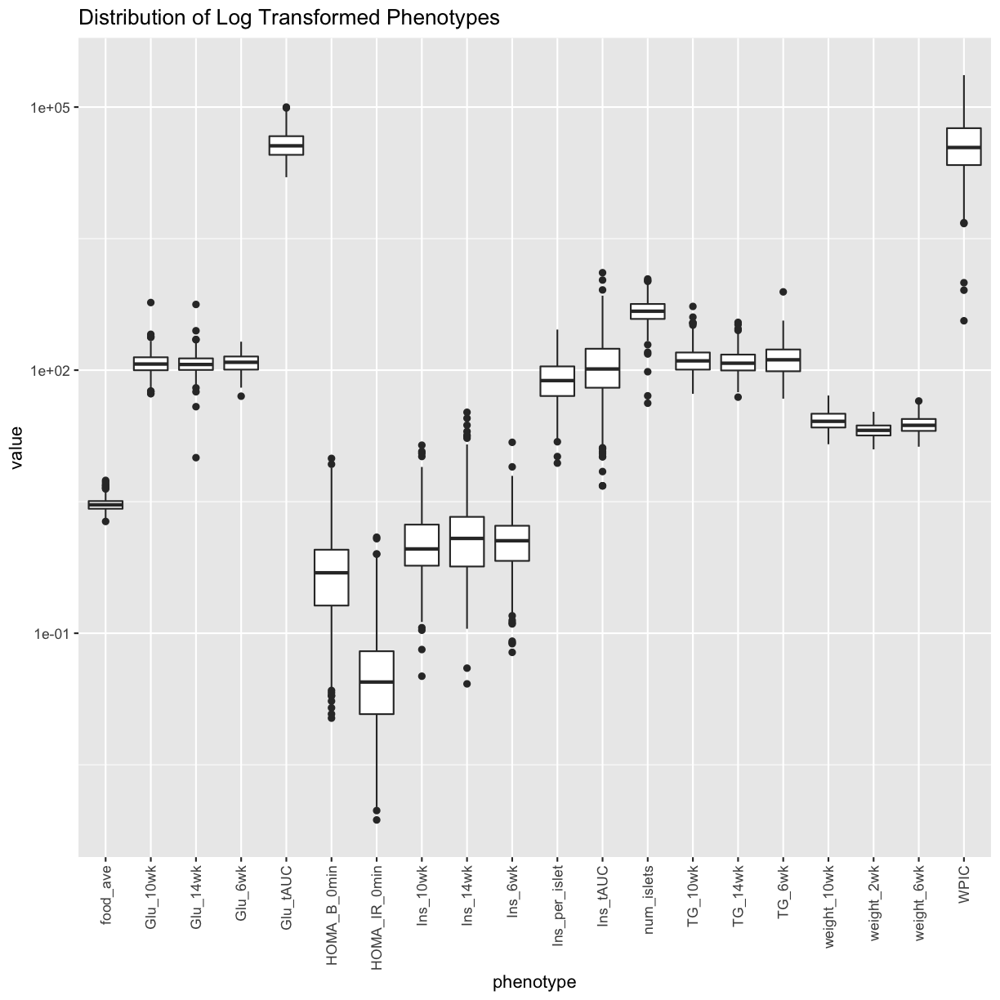

Subset the phenotypes to include only those analyzed in the paper.

~~~
# convert sex and DO wave (batch) to factors
pheno_clin$sex = factor(pheno_clin$sex)
pheno_clin$DOwave = factor(pheno_clin$DOwave)
~~~
{: .language-r}

### Figure 1 Boxplots

~~~
pheno_clin %>%
  select(mouse, sex, starts_with("weight")) %>%
  gather(week, value, -mouse, -sex) %>%
  separate(week, c("tmp", "week")) %>%
  mutate(week = factor(week, levels = c("2wk", "6wk", "10wk"))) %>%
  ggplot(aes(week, value, fill = sex)) +
    geom_boxplot() +
    scale_y_log10() +
    labs(title = "Body Weight", y = "Weight")
~~~
{: .language-r}

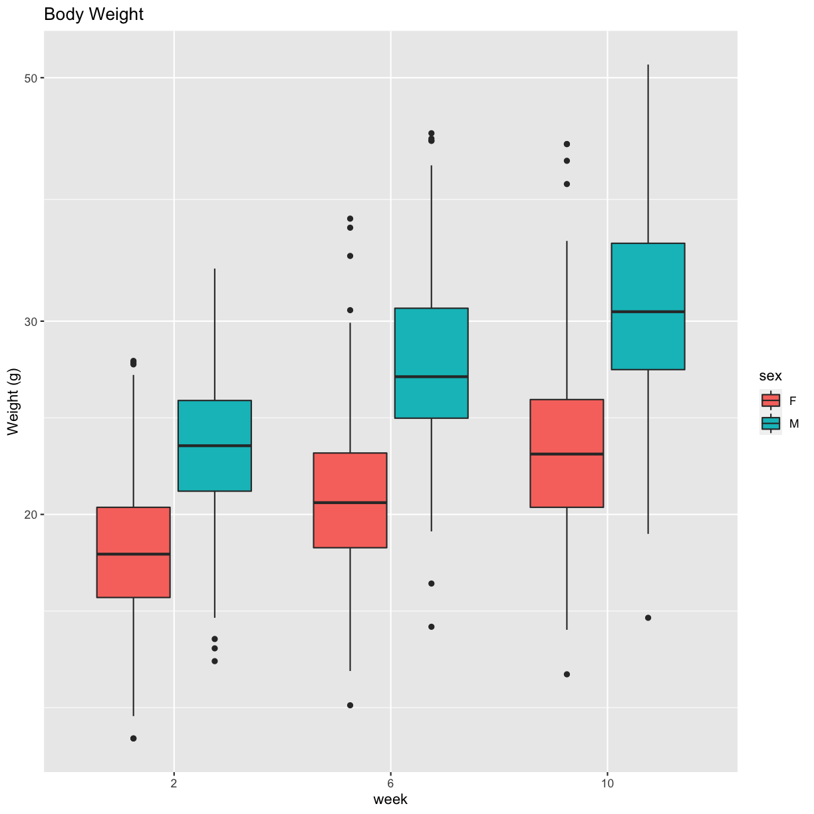

~~~
pheno_clin %>%
  select(mouse, sex, starts_with("Glu")) %>%
  select(mouse, sex, ends_with("wk")) %>%
  gather(week, value, -mouse, -sex) %>%
  separate(week, c("tmp", "week")) %>%
  mutate(week = factor(week, levels = c("6wk", "10wk", "14wk"))) %>%
  ggplot(aes(week, value, fill = sex)) +
    geom_boxplot() +
    scale_y_log10() +
    labs(title = "Glucose", y = "Glucose")
~~~
{: .language-r}

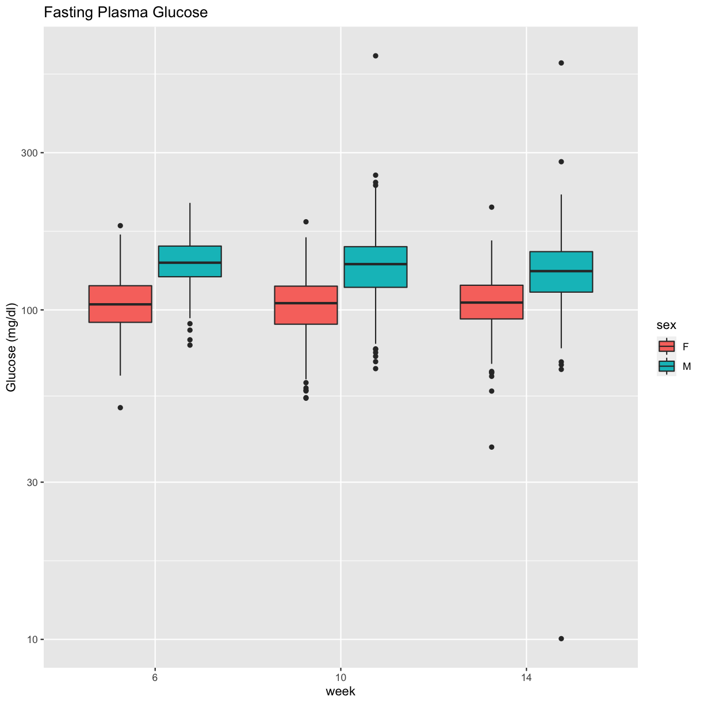

~~~
pheno_clin %>%
  select(mouse, sex, starts_with("Ins")) %>%
  select(mouse, sex, ends_with("wk")) %>%
  gather(week, value, -mouse, -sex) %>%
  separate(week, c("tmp", "week")) %>%
  mutate(week = factor(week, levels = c("6wk", "10wk", "14wk"))) %>%
  ggplot(aes(week, value, fill = sex)) +
    geom_boxplot() +
    scale_y_log10() +
    labs(title = "Insulin", y = "Insulin")
~~~
{: .language-r}

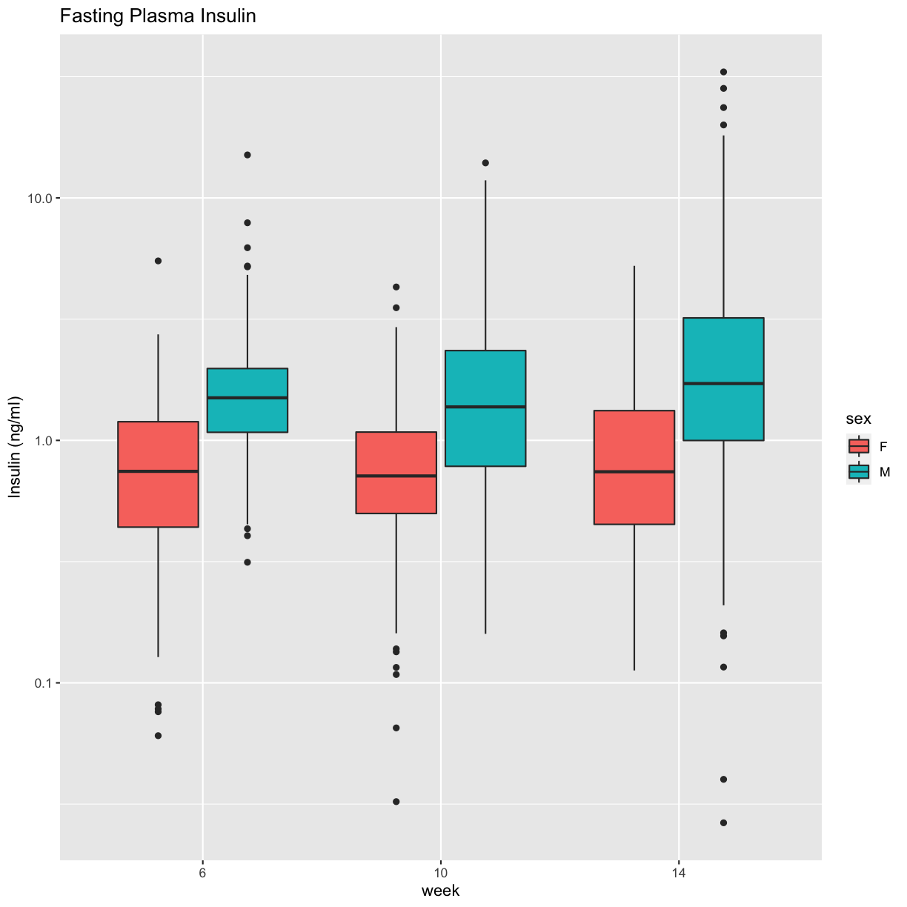

~~~
pheno_clin %>%
  select(mouse, sex, starts_with("TG")) %>%
  select(mouse, sex, ends_with("wk")) %>%
  gather(week, value, -mouse, -sex) %>%
  separate(week, c("tmp", "week")) %>%
  mutate(week = factor(week, levels = c("6wk", "10wk", "14wk"))) %>%
  ggplot(aes(week, value, fill = sex)) +
    geom_boxplot() +
    scale_y_log10() +
    labs(title = "TG", y = "TG")
~~~
{: .language-r}

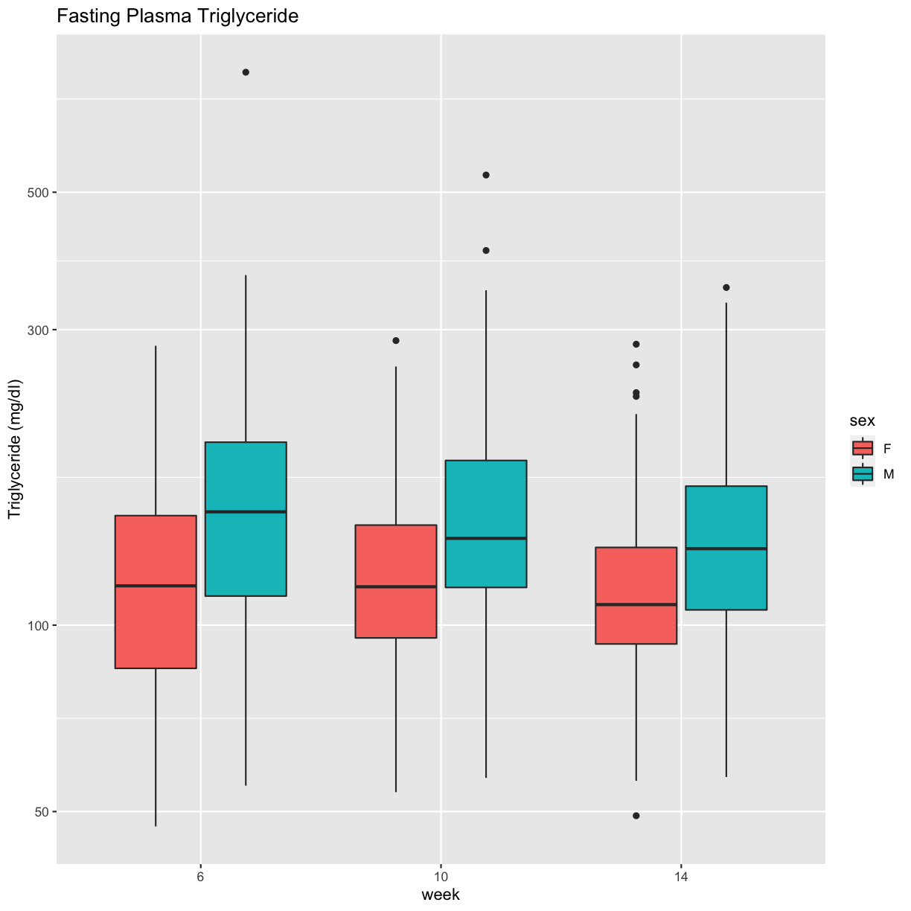

~~~
pheno_clin %>%
  select(mouse, sex, num_islets:Ins_tAUC, food_ave) %>%
  gather(phenotype, value, -mouse, -sex) %>%
  ggplot(aes(sex, value, fill = sex)) +
    geom_boxplot() +
    scale_y_log10() +
    facet_wrap(~phenotype, scales = "free_y")
~~~
{: .language-r}

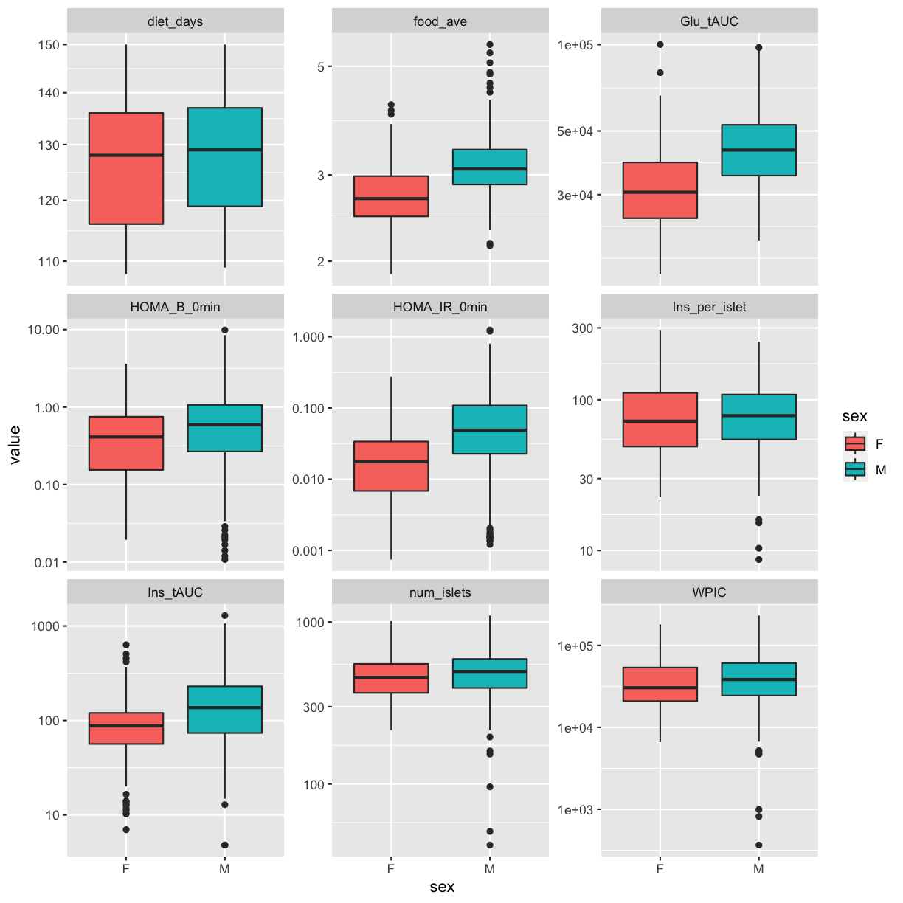

### QA/QC

#### Proportion Missing Data

~~~
tmp = pheno_clin %>% 
  mutate_all(is.na) %>% 
  summarize_all(mean) %>%
  gather(phenotype, value)
kable(tmp, caption = "Proportion of Missing Data")
~~~
{: .language-r}

Table: Proportion of Missing Data

|phenotype          | value|
|:------------------|-----:|
|mouse              | 0.000|
|sex                | 0.000|
|sac_date           | 0.222|
|partial_inflation  | 0.994|
|coat_color         | 0.000|
|oGTT_date          | 0.010|
|FAD_NAD_paired     | 0.814|
|FAD_NAD_filter_set | 0.814|
|crumblers          | 0.962|
|birthdate          | 0.034|
|diet_days          | 0.034|
|num_islets         | 0.034|
|Ins_per_islet      | 0.036|
|WPIC               | 0.036|
|HOMA_IR_0min       | 0.010|
|HOMA_B_0min        | 0.016|
|Glu_tAUC           | 0.010|
|Ins_tAUC           | 0.010|
|Glu_6wk            | 0.000|
|Ins_6wk            | 0.000|
|TG_6wk             | 0.000|
|Glu_10wk           | 0.002|
|Ins_10wk           | 0.002|
|TG_10wk            | 0.002|
|Glu_14wk           | 0.002|
|Ins_14wk           | 0.002|
|TG_14wk            | 0.002|
|food_ave           | 0.000|
|weight_2wk         | 0.000|
|weight_6wk         | 0.002|
|weight_10wk        | 0.002|
|DOwave             | 0.000|

The phenotypes that we're mapping (on the right) are mostly free of missing 
values. The highest are `Ins_per_islet` and WPIC at 3.6%.

Log transform and standardize each phenotype. Consider setting points that are 
more than 5 std. dev. from the mean to NA. Only do this if the final 
distribution doesn't look skewed.

~~~
pheno_clin_log = pheno_clin %>%
                   mutate_if(is.numeric, log)
pheno_clin_std = pheno_clin_log %>%
                   select(mouse, num_islets:weight_10wk) %>%
                   mutate_if(is.numeric, scale)
pheno_clin_std %>%
  select(num_islets:weight_10wk) %>%
  gather(phenotype, value) %>%
  ggplot(aes(x = phenotype, y = value)) +
    geom_boxplot() +
    theme(axis.text.x = element_text(angle = 90, vjust = 0.5, hjust = 1)) +
    labs(title = "Distribution of Standardized Phenotypes")
~~~
{: .language-r}

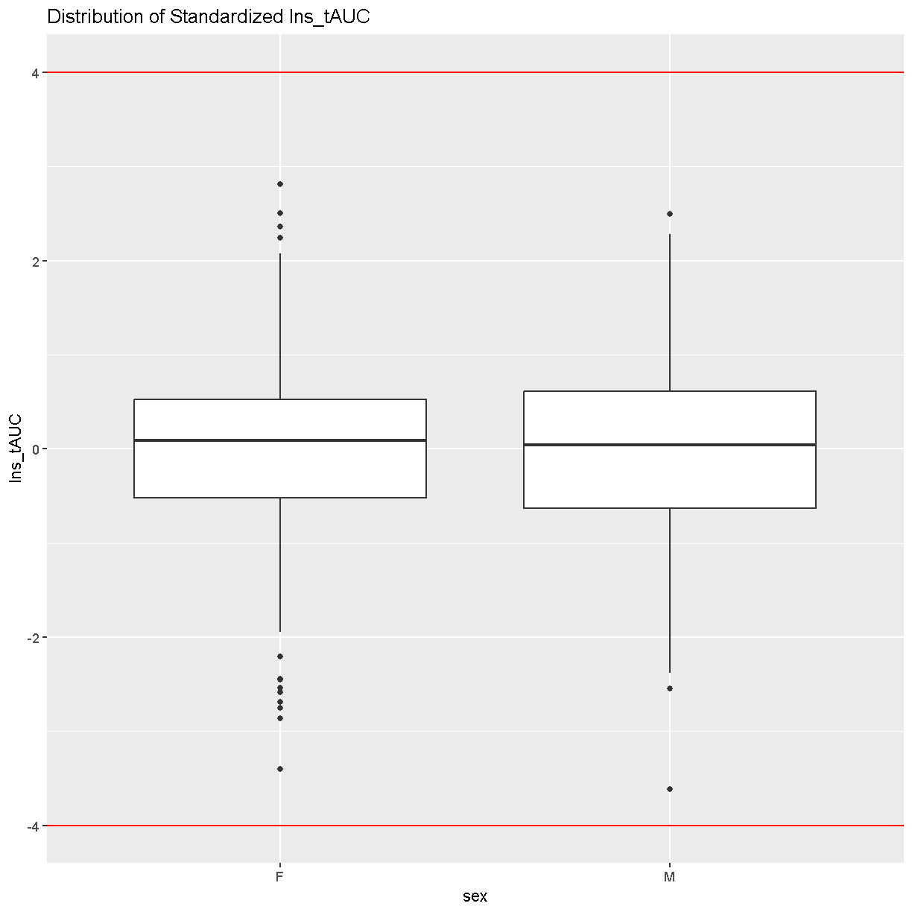

### Tests for sex, wave and diet_days.

~~~
tmp = pheno_clin_log %>%
        select(mouse, sex, DOwave, diet_days, num_islets:weight_10wk) %>%
        gather(phenotype, value, -mouse, -sex, -DOwave, -diet_days) %>%
        group_by(phenotype) %>%
        nest()
mod_fxn = function(df) {
  lm(value ~ sex + DOwave + diet_days, data = df)
}
tmp = tmp %>%
  mutate(model = map(data, mod_fxn)) %>%
  mutate(summ = map(model, tidy)) %>%
  unnest(summ)
# kable(tmp, caption = "Effects of Sex, Wave & Diet Days on Phenotypes")
~~~
{: .language-r}

~~~
tmp %>%
  filter(term != "(Intercept)") %>%
  mutate(neg.log.p = -log10(p.value)) %>%
  ggplot(aes(term, neg.log.p)) +
    geom_point() +
    facet_wrap(~phenotype) +
    labs(title = "Significance of Sex, Wave & Diet Days on Phenotypes") +
    theme(axis.text.x = element_text(angle = 90, hjust = 1, vjust = 0.5)) +
rm(tmp)
~~~
{: .language-r}

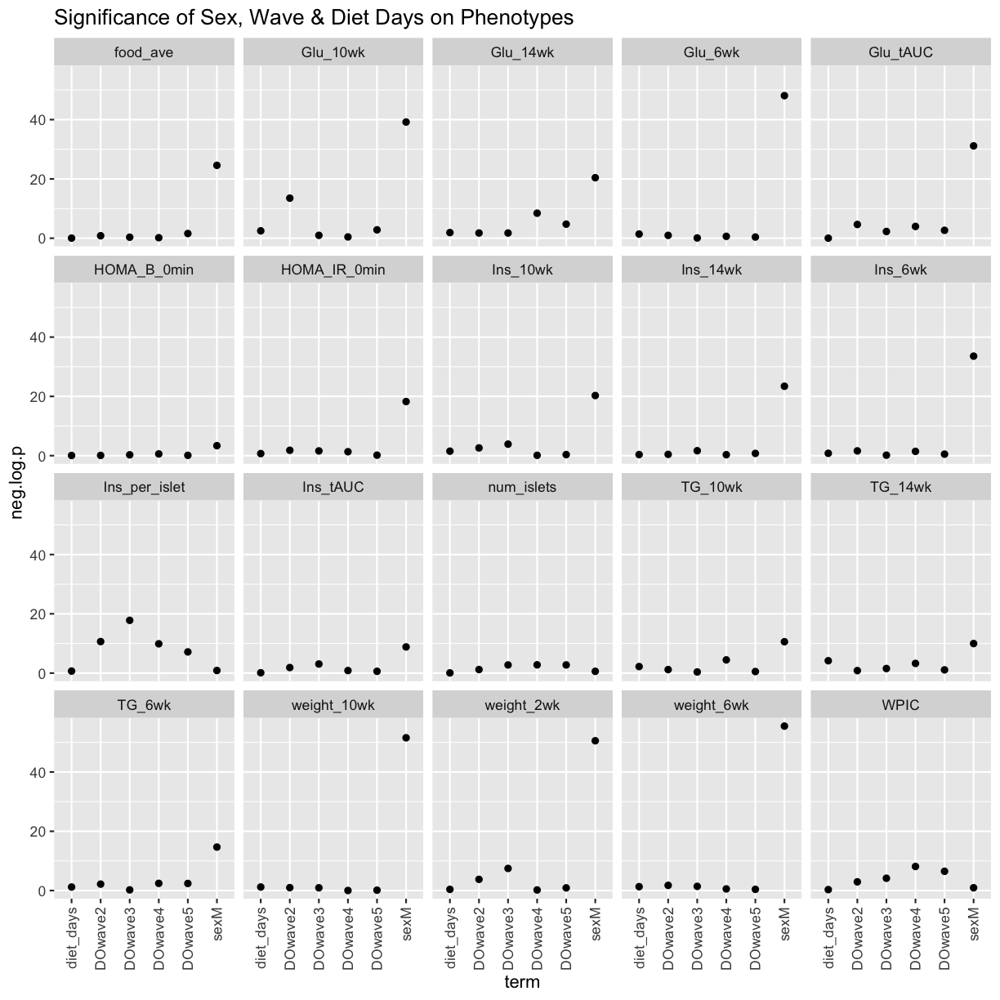

### Weight vs. Food Intake

~~~
pheno_clin_log %>%
  select(mouse, sex, food_ave:weight_10wk) %>%
  gather(phenotype, value, -mouse, -sex, -food_ave) %>%
  separate(phenotype, c("phenotype", "week")) %>%
  mutate(week = factor(week, levels = c("2wk", "6wk", "10wk"))) %>%
  ggplot(aes(food_ave, value, color = sex)) +
    geom_point() +
    geom_smooth(method = "lm") +
    labs(title = "Food Intake vs. Body Weight", y = "log(Body Weight)") + 
    facet_wrap(~week)
~~~
{: .language-r}

~~~
`geom_smooth()` using formula 'y ~ x'
~~~
{: .output}

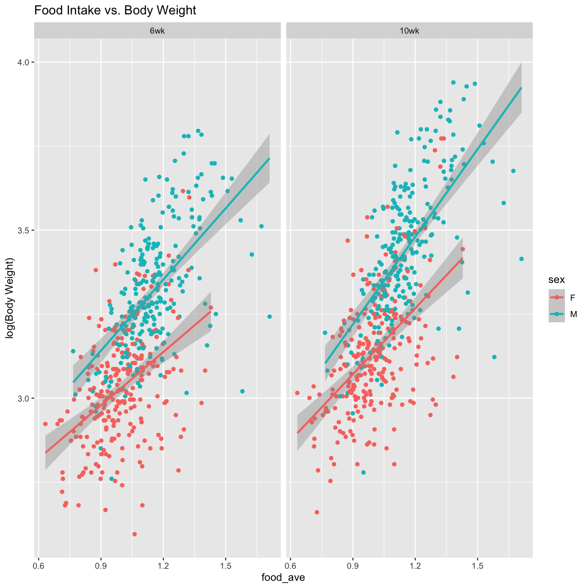

~~~
model_fxn = function(df) { lm(value ~ sex*food_ave, data = df) }
tmp = pheno_clin_log %>%
  select(mouse, sex, food_ave:weight_10wk) %>%
  gather(phenotype, value, -mouse, -sex, -food_ave) %>%
  separate(phenotype, c("phenotype", "week")) %>%
  mutate(week = factor(week, levels = c("2wk", "6wk", "10wk"))) %>%
  group_by(week) %>%
  nest() %>%
  mutate(model = map(data, model_fxn)) %>%
  mutate(summ = map(model, tidy)) %>%
  unnest(summ) %>%
  filter(term != "(Intercept)") %>%
  mutate(p.adj = p.adjust(p.value))
# kable(tmp, caption = "Effects of Sex and Food Intake on Body Weight")
~~~
{: .language-r}

### Correlation Plots

Females

~~~
tmp = pheno_clin_log %>% 
        filter(sex == "F") %>%
        select(num_islets:weight_10wk)
tmp = cor(tmp, use = "pairwise")
corrplot.mixed(tmp, upper = "ellipse", lower = "number", 
               main = "Female Clinical Phenotype Correlation")
corrplot.mixed(tmp, upper = "ellipse", lower = "number", 
               main = "Female Clinical Phenotype Correlation")
~~~
{: .language-r}

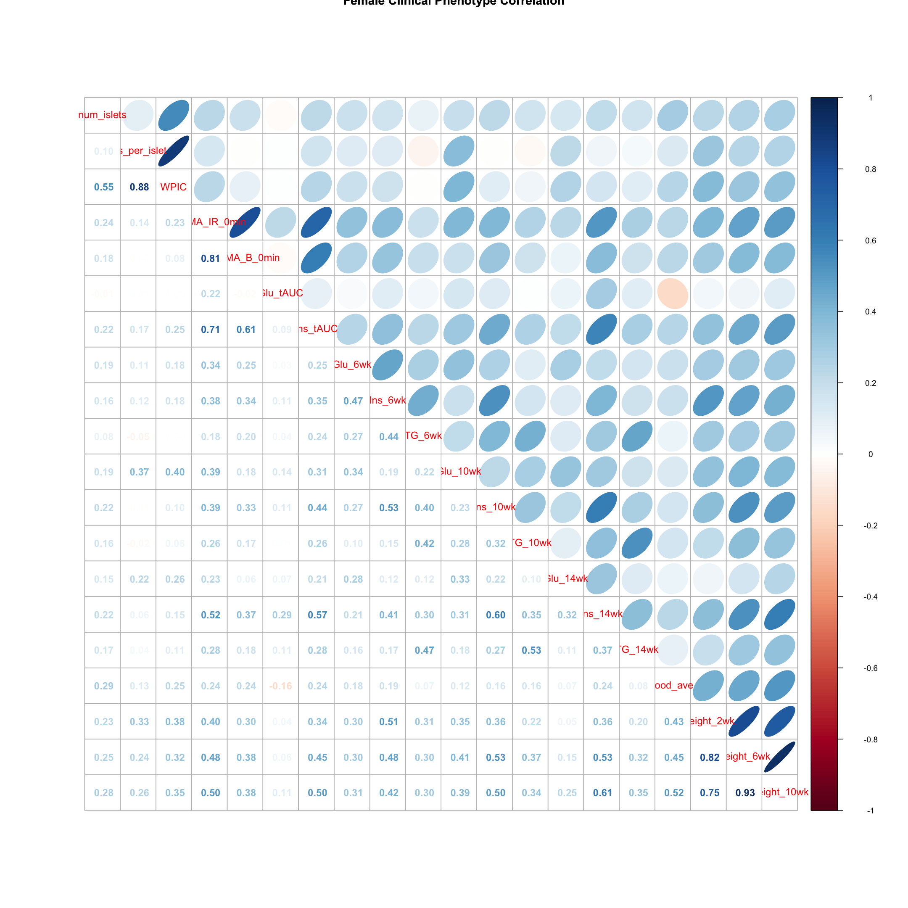

Males

~~~
tmp = pheno_clin_log %>% 
        filter(sex == "M") %>%
        select(num_islets:weight_10wk)
tmp = cor(tmp, use = "pairwise")
corrplot.mixed(tmp, upper = "ellipse", lower = "number", 
               main = "Male Clinical Phenotype Correlation")
corrplot.mixed(tmp, upper = "ellipse", lower = "number", 
               main = "Male Clinical Phenotype Correlation")
~~~
{: .language-r}

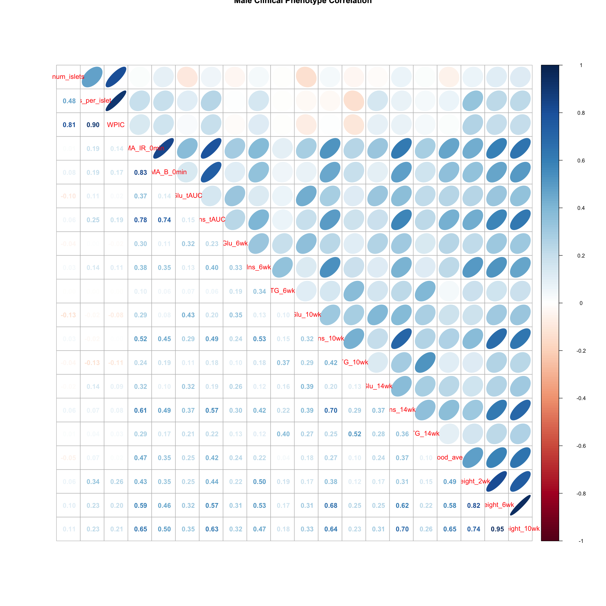

### QTL Scans

~~~
rownames(pheno_clin_log) = pheno_clin_log$mouse
covar = model.matrix(~sex + DOwave, data = pheno_clin_log)

qtl = scan1(genoprobs = genoprobs, 
            pheno = pheno_clin_log[,12:31, drop = FALSE], 
            kinship = K, 
            addcovar = covar, 
            cores = 2)
~~~
{: .language-r}

### QTL plots

~~~
par(mfrow=c(2,10))
for(i in 1:ncol(qtl)) {
  plot_scan1(x = qtl, map = map, lodcolumn = i, main = colnames(qtl)[i])
  abline(h = 6, col = 2, lwd = 2)
}
~~~
{: .language-r}

~~~
Error in min(x, na.rm = na.rm): invalid 'type' (list) of argument
~~~
{: .error}

### QTL Peaks

~~~
lod_threshold = 6
peaks = find_peaks(scan1_output = qtl, map = map, threshold = lod_threshold, peakdrop = 4, prob = 0.95)
~~~
{: .language-r}

~~~
Error in align_scan1_map(scan1_output, map): map should be a list
~~~
{: .error}

~~~
kable(peaks %>% dplyr::select (-lodindex) %>% arrange(chr, pos), caption = "Phenotype QTL Peaks with LOD >= 6")
~~~
{: .language-r}

~~~
Error in dplyr::select(., -lodindex): object 'peaks' not found
~~~
{: .error}

~~~
write_csv(peaks, file = "../data/pheno_clin_QTL_peaks.csv")
~~~
{: .language-r}

~~~
Error in is.data.frame(x): object 'peaks' not found
~~~
{: .error}

### QTL Peaks Figure

~~~
peaks = peaks %>%
          arrange(lodcolumn)
~~~
{: .language-r}

~~~
Error in arrange(., lodcolumn): object 'peaks' not found
~~~
{: .error}

~~~
plot_peaks(peaks, map, col = c("blue","red"), lwd = 3, tick.height = 0.8, gap = 0, main = "LOD > 6")
~~~
{: .language-r}

~~~
Error in plot_peaks(peaks, map, col = c("blue", "red"), lwd = 3, tick.height = 0.8, : object 'peaks' not found
~~~
{: .error}

~~~
box()
~~~
{: .language-r}

~~~
Error in box(): plot.new has not been called yet
~~~
{: .error}

~~~
plot_peaks(peaks, map, col = c("blue","red"), lwd = 3, tick_height = 0.8, gap = 0, main = "LOD > 6")
~~~
{: .language-r}

~~~
Error in plot_peaks(peaks, map, col = c("blue", "red"), lwd = 3, tick_height = 0.8, : object 'peaks' not found
~~~
{: .error}

~~~
box()
~~~
{: .language-r}

~~~
Error in box(): plot.new has not been called yet
~~~
{: .error}

~~~
ggplot_peaks(peaks, map, col = c("blue","red"), legend.title = "LOD > 6")
~~~
{: .language-r}

~~~
Error in nrow(peaks): object 'peaks' not found
~~~
{: .error}

~~~
source("../code/qtl_heatmap.R")
qtl_heatmap(qtl = qtl, map = map, low.thr = 3.5)
~~~
{: .language-r}

~~~
Error in FUN(X[[i]], ...): invalid 'type' (symbol) of argument
~~~
{: .error}

## Gene Expression Phenotypes

### summarized data, matrices w/sample annotation, exp data, gene annotation, 
### like bioconductor summarized experiment etc = whole set of rectangles

~~~
# load the expression data along with annotations and metadata
load("../data/dataset.islet.rnaseq.RData")

# look at raw counts
dataset.islet.rnaseq$raw[1:6,1:6]
~~~
{: .language-r}

~~~
      ENSMUSG00000000001 ENSMUSG00000000028 ENSMUSG00000000037
DO021              10247                108                 29
DO022              11838                187                 35
DO023              12591                160                 19
DO024              12424                216                 30
DO025              10906                 76                 21
DO026              12248                110                 34
      ENSMUSG00000000049 ENSMUSG00000000056 ENSMUSG00000000058
DO021                 15                120                703
DO022                 18                136                747
DO023                 18                275               1081
DO024                 81                160                761
DO025                  7                163                770
DO026                 18                204                644
~~~
{: .output}

~~~
# look at gene annotations
dataset.islet.rnaseq$annots[1:6,]
~~~
{: .language-r}

~~~
                              gene_id symbol chr     start       end strand
ENSMUSG00000000001 ENSMUSG00000000001  Gnai3   3 108.10728 108.14615     -1
ENSMUSG00000000028 ENSMUSG00000000028  Cdc45  16  18.78045  18.81199     -1
ENSMUSG00000000037 ENSMUSG00000000037  Scml2   X 161.11719 161.25821      1
ENSMUSG00000000049 ENSMUSG00000000049   Apoh  11 108.34335 108.41440      1
ENSMUSG00000000056 ENSMUSG00000000056   Narf  11 121.23725 121.25586      1
ENSMUSG00000000058 ENSMUSG00000000058   Cav2   6  17.28119  17.28911      1
                      middle nearest.marker.id        biotype      module
ENSMUSG00000000001 108.12671       3_108090236 protein_coding   darkgreen
ENSMUSG00000000028  18.79622       16_18817262 protein_coding        grey
ENSMUSG00000000037 161.18770       X_161182677 protein_coding        grey
ENSMUSG00000000049 108.37887      11_108369225 protein_coding greenyellow
ENSMUSG00000000056 121.24655      11_121200487 protein_coding       brown
ENSMUSG00000000058  17.28515        6_17288298 protein_coding       brown
                   hotspot
ENSMUSG00000000001    <NA>
ENSMUSG00000000028    <NA>
ENSMUSG00000000037    <NA>
ENSMUSG00000000049    <NA>
ENSMUSG00000000056    <NA>
ENSMUSG00000000058    <NA>
~~~
{: .output}

~~~
# look at sample metadata
# mouse sex, birth dates and DO waves
table(dataset.islet.rnaseq$samples[, c("sex", "birthdate")])
~~~
{: .language-r}

~~~
   birthdate
sex 2014-05-29 2014-10-15 2015-02-25 2015-09-22
  F         46         46         49         47
  M         45         48         50         47
~~~
{: .output}

~~~
table(dataset.islet.rnaseq$samples[, c("sex", "DOwave")])
~~~
{: .language-r}

~~~
   DOwave
sex  1  2  3  4  5
  F 46 46 49 47  0
  M 45 48 50 47  0
~~~
{: .output}

~~~
# look at raw counts
dataset.islet.rnaseq$raw[1:6,1:6]
~~~
{: .language-r}

~~~
      ENSMUSG00000000001 ENSMUSG00000000028 ENSMUSG00000000037
DO021              10247                108                 29
DO022              11838                187                 35
DO023              12591                160                 19
DO024              12424                216                 30
DO025              10906                 76                 21
DO026              12248                110                 34
      ENSMUSG00000000049 ENSMUSG00000000056 ENSMUSG00000000058
DO021                 15                120                703
DO022                 18                136                747
DO023                 18                275               1081
DO024                 81                160                761
DO025                  7                163                770
DO026                 18                204                644
~~~
{: .output}

~~~
# look at normalized counts
dataset.islet.rnaseq$expr[1:6,1:6]
~~~
{: .language-r}

~~~
      ENSMUSG00000000001 ENSMUSG00000000028 ENSMUSG00000000037
DO021        -0.09858728         0.19145703          0.5364855
DO022         0.97443030         2.41565800          1.1599398
DO023         0.75497867         1.62242658         -0.4767954
DO024         1.21299720         2.79216889          0.7205211
DO025         1.62242658        -0.27918258          0.3272808
DO026         0.48416010         0.03281516          0.8453674
      ENSMUSG00000000049 ENSMUSG00000000056 ENSMUSG00000000058
DO021         0.67037652         -1.4903750          0.6703765
DO022         1.03980755         -1.1221937          0.9744303
DO023         0.89324170          0.2317220          1.8245906
DO024         2.15179362         -0.7903569          0.9957498
DO025        -0.03281516         -0.2587715          1.5530179
DO026         0.86427916         -0.3973634          0.2791826
~~~
{: .output}

~~~
# look at LOD peaks
dataset.islet.rnaseq$lod.peaks[1:6,]
~~~
{: .language-r}

~~~
            annot.id   marker.id chrom        pos       lod
1 ENSMUSG00000037922 3_136728699     3 136.728699 11.976856
2 ENSMUSG00000037926 2_164758936     2 164.758936  7.091543
3 ENSMUSG00000037926 5_147178504     5 147.178504  6.248598
4 ENSMUSG00000037933 5_147253583     5 147.253583  8.581871
5 ENSMUSG00000037933  13_6542783    13   6.542783  6.065497
6 ENSMUSG00000037935 11_99340415    11  99.340415  8.089051
~~~
{: .output}

~~~
# look at a region of interest
chr11_peaks <- dataset.islet.rnaseq$annots %>% 
   select(gene_id, chr) %>% 
   filter(chr=="11") %>%
   left_join(dataset.islet.rnaseq$lod.peaks, 
             by = c("chr" = "chrom", "gene_id" = "annot.id")) 

# look at the first several rows of chromosome 11 peaks
head(chr11_peaks)
~~~
{: .language-r}

~~~
             gene_id chr    marker.id       pos       lod
1 ENSMUSG00000000049  11 11_109408556 109.40856  8.337996
2 ENSMUSG00000000056  11 11_121434933 121.43493 11.379449
3 ENSMUSG00000000093  11  11_74732783  74.73278  9.889119
4 ENSMUSG00000000120  11  11_95962181  95.96218 11.257591
5 ENSMUSG00000000125  11         <NA>        NA        NA
6 ENSMUSG00000000126  11  11_26992236  26.99224  6.013533
~~~
{: .output}

~~~
# how many rows?
dim(chr11_peaks)
~~~
{: .language-r}

~~~
[1] 1810    5
~~~
{: .output}

~~~
# how many rows have LOD scores?
chr11_peaks %>% filter(!is.na(lod)) %>% dim()
~~~
{: .language-r}

~~~
[1] 1208    5
~~~
{: .output}

~~~
# sort chromosome 11 peaks by LOD score
chr11_peaks %>% arrange(desc(lod)) %>% head()
~~~
{: .language-r}

~~~
             gene_id chr   marker.id      pos      lod
1 ENSMUSG00000020268  11 11_55073940 55.07394 189.2332
2 ENSMUSG00000020333  11 11_53961279 53.96128 147.8134
3 ENSMUSG00000017404  11 11_98062374 98.06237 136.0430
4 ENSMUSG00000093483  11 11_83104215 83.10421 135.1067
5 ENSMUSG00000058546  11 11_78204410 78.20441 132.3365
6 ENSMUSG00000078695  11 11_97596132 97.59613 131.8005
~~~
{: .output}

~~~
# range of LOD scores and positions
range(chr11_peaks$lod, na.rm = TRUE)
~~~
{: .language-r}

~~~
[1]   6.000975 189.233211
~~~
{: .output}

~~~
range(chr11_peaks$pos, na.rm = TRUE)
~~~
{: .language-r}

~~~
[1]   3.126009 122.078650
~~~
{: .output}
