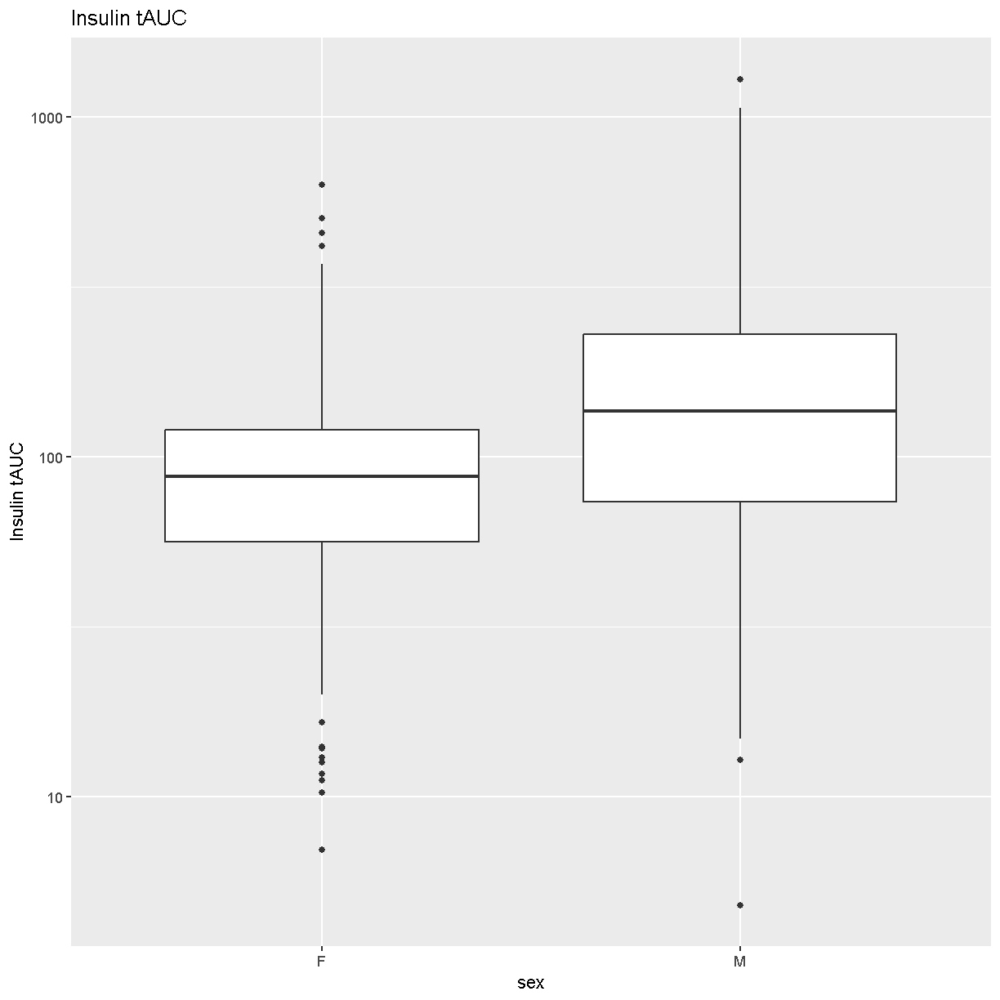
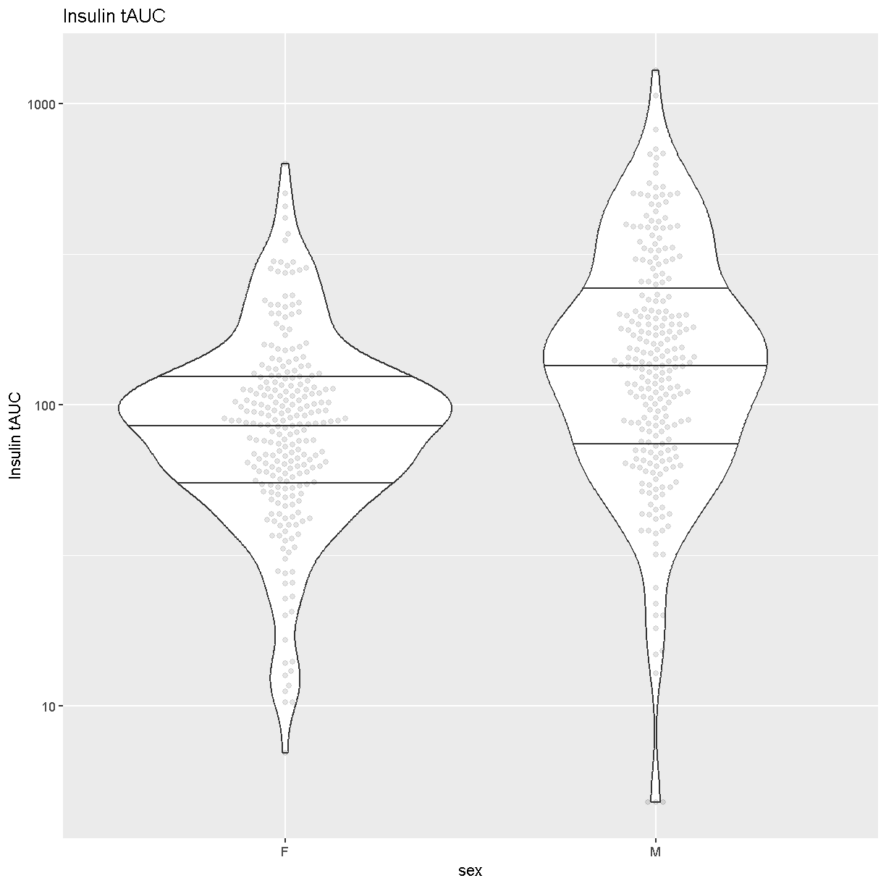
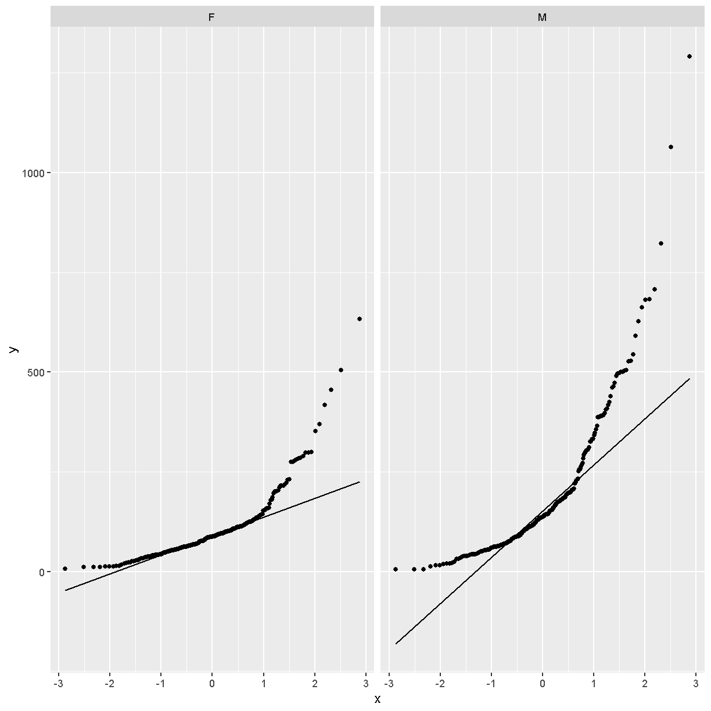
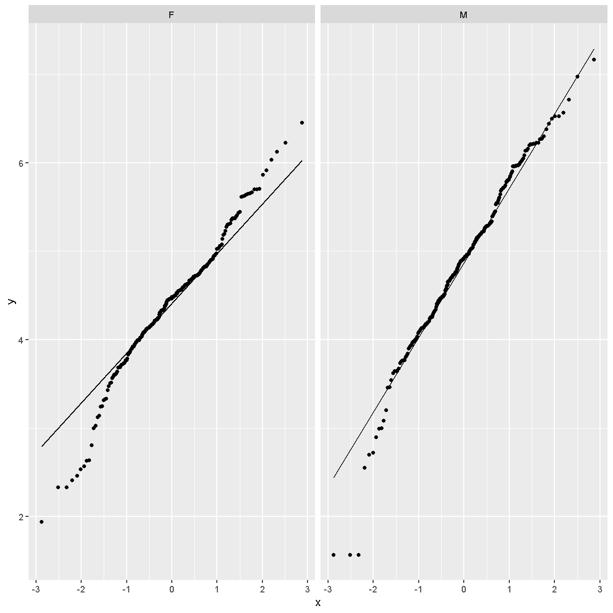
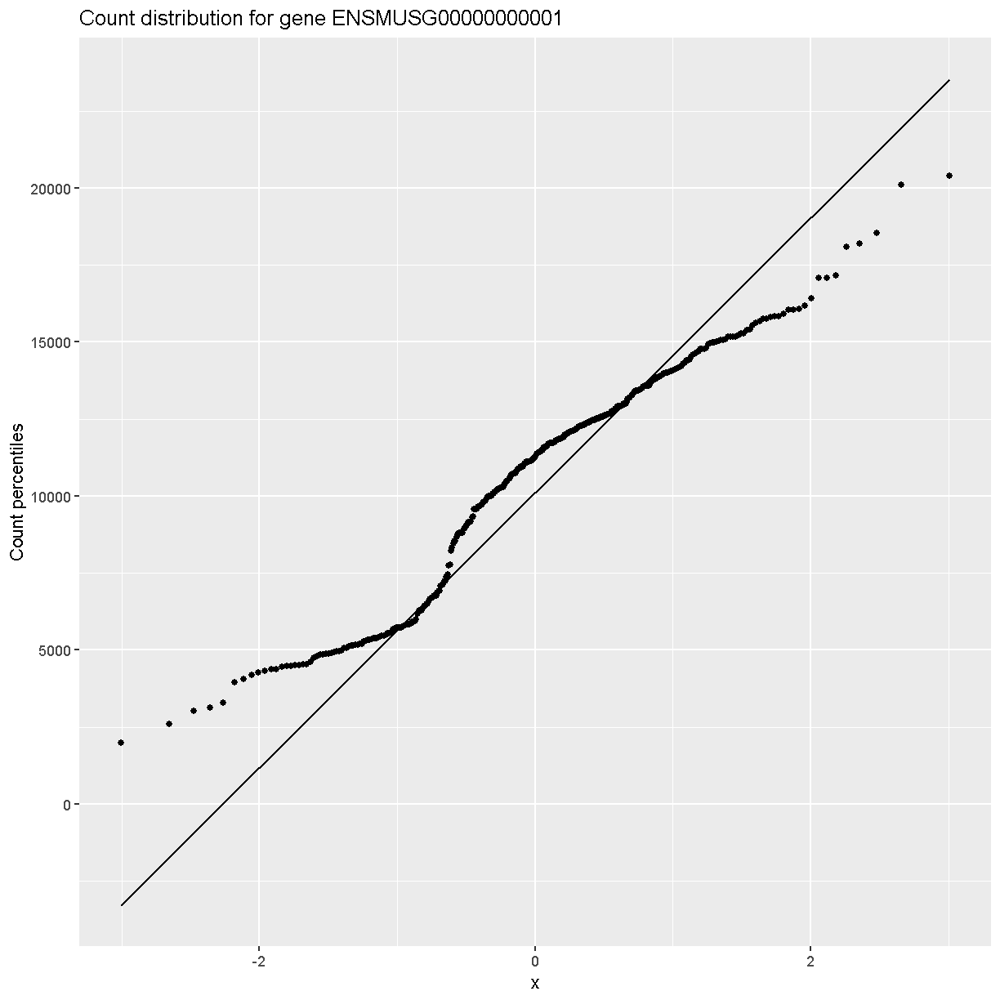
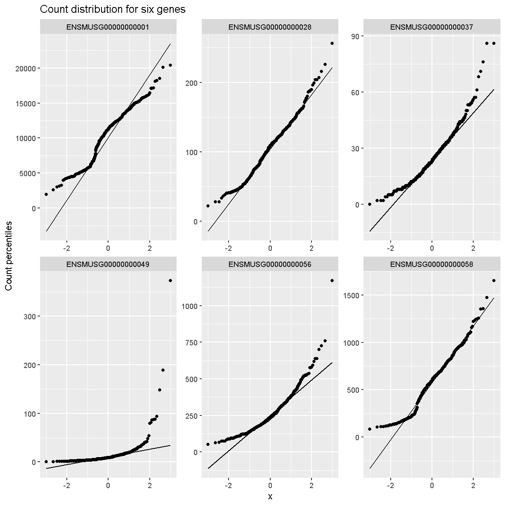
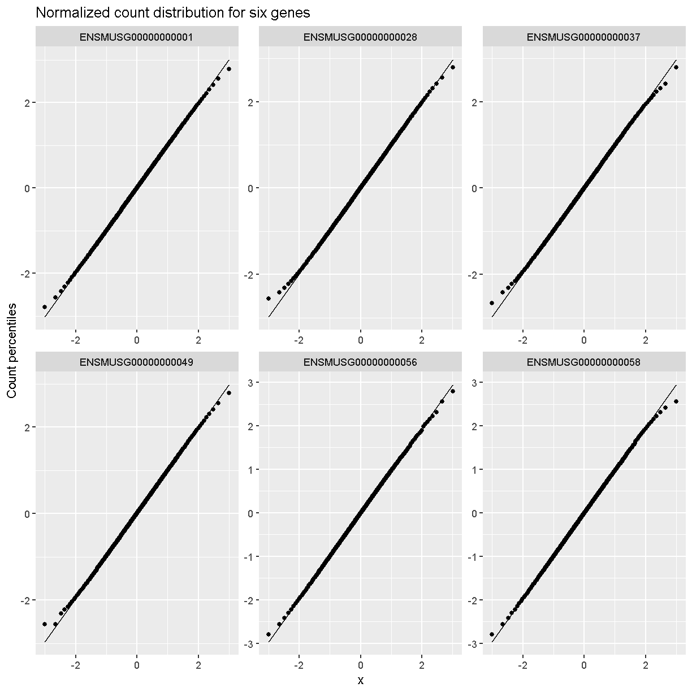
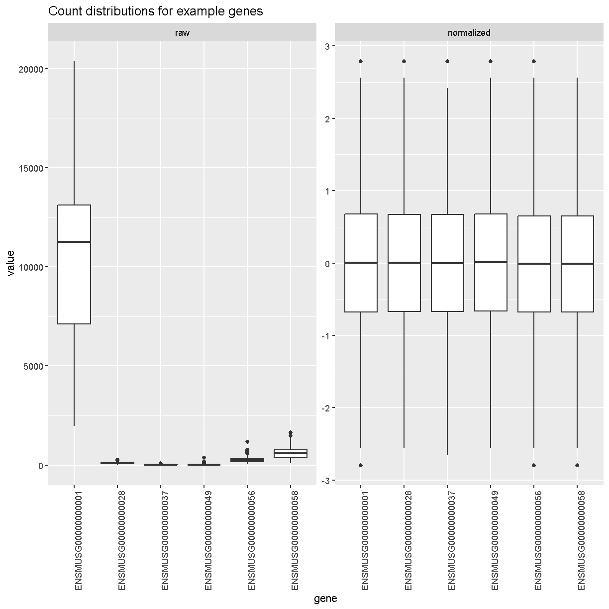
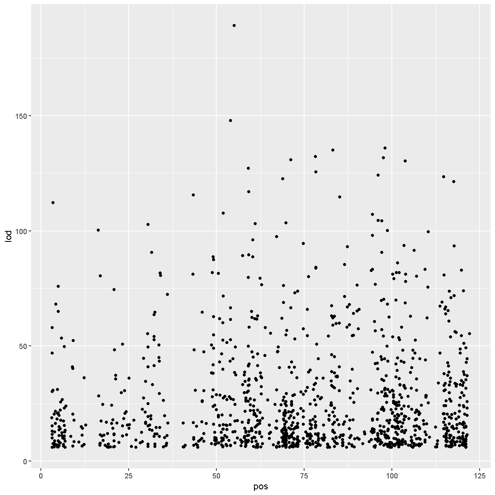

---
# Please do not edit this file directly; it is auto generated.
# Instead, please edit 03-load-explore-data.md in _episodes_rmd/
title: "Load and explore the data"
teaching: 15
exercises: 30
questions:
- "What data are required for eqtl mapping?"
objectives:
- To provide an example and exploration of data used for eqtl mapping.
keypoints:
- ""
source: Rmd
---

Load the libraries.

~~~
library(ggbeeswarm)
library(tidyverse)
library(knitr)
library(corrplot)
# the following analysis is derived from supplementary 
# File S1 Attie_eQTL_paper_physiology.Rmd 
# by Daniel Gatti. See Data Dryad entry for more information.
~~~
{: .language-r}

## Physiological Phenotypes

The complete data used in these analyses are available from 
[Data Dryad](https://doi.org/10.5061/dryad.pj105). 

Load in the clinical phenotypes.

~~~
# load the data
load("../data/attie_DO500_clinical.phenotypes.RData")
~~~
{: .language-r}

See the [data dictionary](../data/Attie-232_Attie_DO_Islets-dictionary.csv) to 
see a description of each of these phenotypes. You can also view a table of
the data dictionary.

~~~
pheno_clin_dict %>% 
  select(description, formula) %>% 
  kable()
~~~
{: .language-r}

|                   |description                                                                                                                                                                                                                                             |formula                          |
|:------------------|:-------------------------------------------------------------------------------------------------------------------------------------------------------------------------------------------------------------------------------------------------------|:--------------------------------|
|mouse              |Animal identifier.                                                                                                                                                                                                                                      |NA                               |
|sex                |Male (M) or female (F).                                                                                                                                                                                                                                 |NA                               |
|sac_date           |Date when mouse was sacrificed; used to compute days on diet, using birth dates.                                                                                                                                                                        |NA                               |
|partial_inflation  |Some mice showed a partial pancreatic inflation which would negatively effect the total number of islets collected from these mice.                                                                                                                     |NA                               |
|coat_color         |Visual inspection by Kathy Schuler on coat color.                                                                                                                                                                                                       |NA                               |
|oGTT_date          |Date the oGTT was performed.                                                                                                                                                                                                                            |NA                               |
|FAD_NAD_paired     |A change in the method that was used to make this measurement by Matt Merrins' lab. Paired was the same islet for the value at 3.3mM vs. 8.3mM glucose; unpaired was where averages were used for each glucose concentration and used to compute ratio. |NA                               |
|FAD_NAD_filter_set |A different filter set was used on the microscope to make the fluorescent measurement; may have influenced the values.                                                                                                                                  |NA                               |
|crumblers          |Some mice store food in their bedding (hoarders) which would be incorrectly interpreted as consumed.                                                                                                                                                    |NA                               |
|birthdate          |Birth date                                                                                                                                                                                                                                              |NA                               |
|diet_days          |Number of days.                                                                                                                                                                                                                                         |NA                               |
|num_islets         |Total number of islets harvested per mouse; negatively impacted by those with partial inflation.                                                                                                                                                        |NA                               |
|Ins_per_islet      |Amount of insulin per islet in units of ng/ml/islet.                                                                                                                                                                                                    |NA                               |
|WPIC               |Derived number; equal to total number of islets times insulin content per islet.                                                                                                                                                                        |Ins_per_islet * num_islets       |
|HOMA_IR_0min       |glucose*insulin/405 at time t=0 for the oGTT                                                                                                                                                                                                            |Glu_0min * Ins_0min / 405        |
|HOMA_B_0min        |360 * Insulin / (Glucose - 63) at time t=0 for the oGTT                                                                                                                                                                                                 |360 * Ins_0min / (Glu_0min - 63) |
|Glu_tAUC           |Area under the curve (AUC) calculation without any correction for baseline differences.                                                                                                                                                                 |complicated                      |
|Ins_tAUC           |Area under the curve (AUC) calculation without any correction for baseline differences.                                                                                                                                                                 |complicated                      |
|Glu_6wk            |Plasma glucose with units of mg/dl; fasting.                                                                                                                                                                                                            |NA                               |
|Ins_6wk            |Plasma insulin with units of ng/ml; fasting.                                                                                                                                                                                                            |NA                               |
|TG_6wk             |Plasma triglyceride (TG) with units of mg/dl; fasting.                                                                                                                                                                                                  |NA                               |
|Glu_10wk           |Plasma glucose with units of mg/dl; fasting.                                                                                                                                                                                                            |NA                               |
|Ins_10wk           |Plasma insulin with units of ng/ml; fasting.                                                                                                                                                                                                            |NA                               |
|TG_10wk            |Plasma triglyceride (TG) with units of mg/dl; fasting.                                                                                                                                                                                                  |NA                               |
|Glu_14wk           |Plasma glucose with units of mg/dl; fasting.                                                                                                                                                                                                            |NA                               |
|Ins_14wk           |Plasma insulin with units of ng/ml; fasting.                                                                                                                                                                                                            |NA                               |
|TG_14wk            |Plasma triglyceride (TG) with units of mg/dl; fasting.                                                                                                                                                                                                  |NA                               |
|food_ave           |Average food consumption over the measurements made for each mouse.                                                                                                                                                                                     |complicated                      |
|weight_2wk         |Body weight at indicated date; units are gm.                                                                                                                                                                                                            |NA                               |
|weight_6wk         |Body weight at indicated date; units are gm.                                                                                                                                                                                                            |NA                               |
|weight_10wk        |Body weight at indicated date; units are gm.                                                                                                                                                                                                            |NA                               |
|DOwave             |Wave (i.e., batch) of DO mice                                                                                                                                                                                                                           |NA                               |

### Phenotype Distributions

Boxplots are a great way to view the distribution of the data and to identify 
any outliers. We will be using the total area under the curve of insulin from 
the glucose tolerance test (Ins_tAUC). We will also log-transform the data 
using the [scale_y_log10()][scale_y_log10] function.

~~~
# plot Insulin on a log 10 scale
ggplot(pheno_clin, aes(sex, Ins_tAUC)) +
  geom_boxplot() +
  scale_y_log10() +
  labs(title = "Insulin tAUC", y = "Insulin tAUC")
~~~
{: .language-r}

Another visualization that has become popular is the 
[Violin Plot][https://en.wikipedia.org/wiki/Violin_plot]. We can create one
using ggplot's [geom_violin][https://ggplot2.tidyverse.org/reference/geom_violin.html].
Whereas the boxplot automatically adds the median, we must tell `geom_violin()`
which quantiles that we want to draw using the argument 
"draw_quantiles = c(0.25, 0.5, 0.75)". We have also overlaid the data points 
using ggbeeswarm's
[geom_beeswarm][https://www.rdocumentation.org/packages/ggbeeswarm/versions/0.5.3/topics/geom_beeswarm].
We have told `geom_beeswarm()` to plot the points using the argument 
"alpha = 0.1". The alpha argument ranges between 0 (completely transparent) to
1 (completely opaque). A value of 0.1 means mostly transparent.

~~~
# plot Insulin on a log 10 scale
ggplot(pheno_clin, aes(sex, Ins_tAUC)) +
  geom_violin(draw_quantiles = c(0.25, 0.5, 0.75)) +
  geom_beeswarm(alpha = 0.1) +
  scale_y_log10() +
  labs(title = "Insulin tAUC", y = "Insulin tAUC")
~~~
{: .language-r}

> ## Challenge 1
> How many orders of magnitude (powers of 10) does Insulin tAUC span?  
>
> > ## Solution
> > Insulin tAUC spans three orders of magnitude, from near 10 to over 1000.  
> {: .solution}
{: .challenge}
  
  
> ## Challenge 2
> Which sex has higher median Insulin tAUC values?  
>
> > ## Solution
> > Males have higher Insulin tAUC than females.  
> {: .solution}
{: .challenge}

Both of the boxplot and the violin plot are useful visualizations which you can
use to get some sense of the distribution of your data.

### Quality Control of Data

Many statistical tests rely upon the data having a "normal" (or Gaussian) 
distribution. Many biological phenotypes do not follow this distribution and
must be transformed before analysis. This is why we log-transformed the data
in the plots above. 

While we can "eyeball" the distributions in the violin plot, it would be 
better to use a "quantile-quantile" plot. 

~~~
pheno_clin %>% 
  ggplot(aes(sample = Ins_tAUC)) +
    stat_qq() +
    geom_qq_line() +
    facet_wrap(~sex)
~~~
{: .language-r}

In these plots, the "quantiles" of the normal distribution are plotted on the
X-axis and the data are plotted on the Y-axis. The line indicates the 
quantiles that would be followed by a normal distribution. The untransformed
data do **not** follow a normal distribution because the points are far from
the line.  

Next, we will loag-transform the data and then create a quantile-quantile plot.

~~~
pheno_clin %>% 
  mutate(Ins_tAUC = log(Ins_tAUC)) %>% 
  ggplot(aes(sample = Ins_tAUC)) +
    stat_qq() +
    geom_qq_line() +
    facet_wrap(~sex)
~~~
{: .language-r}

> ## Challenge 3
> Does the log transformation make the data more normally distributed? Explain 
> your answer.
>
> > ## Solution
> > Yes. The log transformation makes the data more normally distributed because
> > the data points follow the normality line more closely.  
> {: .solution}
{: .challenge}
  
  
> ## Challenge 4
> Do any data points look suspicious to you? Explain your answer.
>
> > ## Solution
> > The data points that deviate from the normality line would be worth
> > investigating. All data deviates somewhat from normality, but the three
> > lowest points in the male data plot would be worth investigating. They may
> > be real, but there may also have been mishap in the assay.
> {: .solution}
{: .challenge}

Another way to identify outliers is to standardize the data and look for data 
points that are more than four standard deviations from the mean.

To do this, we will log transform and standardize Insulin tAUC. 

~~~
ins_tauc = pheno_clin %>% 
             select(mouse, sex, Ins_tAUC) %>%
             group_by(sex) %>% 
             mutate(Ins_tAUC = log(Ins_tAUC),
                    Ins_tAUC = scale(Ins_tAUC))

ins_tauc %>% 
  ggplot(aes(x = sex, y = Ins_tAUC)) +
    geom_boxplot() +
    geom_hline(aes(yintercept = -4), color = 'red') +
    geom_hline(aes(yintercept =  4), color = 'red') +
    labs(title = "Distribution of Standardized Ins_tAUC")
~~~
{: .language-r}

There are no data points outside of the four standard deviation limits.

## Gene Expression Phenotypes

~~~
# load the expression data along with annotations and metadata
load("../data/dataset.islet.rnaseq.RData")
names(dataset.islet.rnaseq)
~~~
{: .language-r}

~~~
[1] "annots"        "covar"         "covar.factors" "datatype"     
[5] "display.name"  "expr"          "lod.peaks"     "raw"          
[9] "samples"      
~~~
{: .output}

~~~
# look at gene annotations
dataset.islet.rnaseq$annots[1:6,]
~~~
{: .language-r}

~~~
                              gene_id symbol chr     start       end strand
ENSMUSG00000000001 ENSMUSG00000000001  Gnai3   3 108.10728 108.14615     -1
ENSMUSG00000000028 ENSMUSG00000000028  Cdc45  16  18.78045  18.81199     -1
ENSMUSG00000000037 ENSMUSG00000000037  Scml2   X 161.11719 161.25821      1
ENSMUSG00000000049 ENSMUSG00000000049   Apoh  11 108.34335 108.41440      1
ENSMUSG00000000056 ENSMUSG00000000056   Narf  11 121.23725 121.25586      1
ENSMUSG00000000058 ENSMUSG00000000058   Cav2   6  17.28119  17.28911      1
                      middle nearest.marker.id        biotype      module
ENSMUSG00000000001 108.12671       3_108090236 protein_coding   darkgreen
ENSMUSG00000000028  18.79622       16_18817262 protein_coding        grey
ENSMUSG00000000037 161.18770       X_161182677 protein_coding        grey
ENSMUSG00000000049 108.37887      11_108369225 protein_coding greenyellow
ENSMUSG00000000056 121.24655      11_121200487 protein_coding       brown
ENSMUSG00000000058  17.28515        6_17288298 protein_coding       brown
                   hotspot
ENSMUSG00000000001    <NA>
ENSMUSG00000000028    <NA>
ENSMUSG00000000037    <NA>
ENSMUSG00000000049    <NA>
ENSMUSG00000000056    <NA>
ENSMUSG00000000058    <NA>
~~~
{: .output}

~~~
# look at raw counts
dataset.islet.rnaseq$raw[1:6,1:6]
~~~
{: .language-r}

~~~
      ENSMUSG00000000001 ENSMUSG00000000028 ENSMUSG00000000037
DO021              10247                108                 29
DO022              11838                187                 35
DO023              12591                160                 19
DO024              12424                216                 30
DO025              10906                 76                 21
DO026              12248                110                 34
      ENSMUSG00000000049 ENSMUSG00000000056 ENSMUSG00000000058
DO021                 15                120                703
DO022                 18                136                747
DO023                 18                275               1081
DO024                 81                160                761
DO025                  7                163                770
DO026                 18                204                644
~~~
{: .output}

~~~
# look at sample metadata
# summarize mouse sex, birth dates and DO waves
table(dataset.islet.rnaseq$samples[, c("sex", "birthdate")])
~~~
{: .language-r}

~~~
   birthdate
sex 2014-05-29 2014-10-15 2015-02-25 2015-09-22
  F         46         46         49         47
  M         45         48         50         47
~~~
{: .output}

~~~
table(dataset.islet.rnaseq$samples[, c("sex", "DOwave")])
~~~
{: .language-r}

~~~
   DOwave
sex  1  2  3  4  5
  F 46 46 49 47  0
  M 45 48 50 47  0
~~~
{: .output}

In order to make reasonable gene comparisons between samples, the count data 
need to be normalized. In the quantile-quantile (Q-Q) plot below, count data for 
the first gene are plotted over a diagonal line tracing a normal distribution 
for those counts. Notice that most of the count data values lie off of this 
line, indicating that these gene counts are not normally distributed. 

Q-Q plots for the first six genes show that count data for these genes are not
normally distributed. They are also not on the same scale. The y-axis values for
each subplot range to 20,000 counts in the first subplot, 250 in the second, 90
in the third, and so on. 

~~~
dataset.islet.rnaseq$raw %>% 
  as.data.frame() %>%
  select(ENSMUSG00000000001:ENSMUSG00000000058) %>% 
  pivot_longer(cols = everything(), names_to = 'gene', values_to = 'value') %>% 
  ggplot(aes(sample = value)) +
    stat_qq() +
    geom_qq_line() +
    facet_wrap(~gene, scales = 'free') +
    labs(title = 'Count distribution for six genes',
         xlab = 'Normal percentiles', y = 'Count percentiles')
~~~
{: .language-r}

Q-Q plots of the normalized expression data for the first six genes show that 
the data values match the diagonal line well, meaning that they are now normally
distributed. They are also all on the same scale now as well.

~~~
dataset.islet.rnaseq$expr %>% 
  as.data.frame() %>%
  select(ENSMUSG00000000001:ENSMUSG00000000058) %>% 
  pivot_longer(cols = everything(), names_to = 'gene', values_to = 'value') %>% 
  ggplot(aes(sample = value)) +
    stat_qq() +
    geom_qq_line() +
    facet_wrap(~gene, scales = 'free') +
    labs(title = 'Normalized count distribution for six genes',
         xlab = 'Normal percentiles', y = 'Count percentiles')
~~~
{: .language-r}

Boxplots of raw counts for six example genes are shown at left below. Notice that 
the median count values (horizontal black bar in each boxplot) are not 
comparable between the genes because the counts are not on the same scale. At
right, boxplots for the same genes show normalized count data on the same 
scale.

~~~
raw = dataset.islet.rnaseq$raw %>% 
        as.data.frame() %>% 
        select(ENSMUSG00000000001:ENSMUSG00000000058) %>% 
        pivot_longer(cols = everything(), names_to = 'gene', values_to = 'value') %>% 
        mutate(type = 'raw')

norm = dataset.islet.rnaseq$expr %>% 
         as.data.frame() %>% 
         select(ENSMUSG00000000001:ENSMUSG00000000058) %>% 
         pivot_longer(cols = everything(), names_to = 'gene', values_to = 'value') %>% 
         mutate(type = 'normalized')

bind_rows(raw, norm) %>%
  mutate(type = factor(type, levels = c('raw', 'normalized'))) %>% 
  ggplot(aes(gene, value)) +
    geom_boxplot() +
    facet_wrap(~type, scales = 'free') +
    labs(title = 'Count distributions for example genes') +
    theme(axis.text.x = element_text(angle = 90, hjust = 0.5, vjust = 1))
~~~
{: .language-r}

~~~
rm(raw, norm)
~~~
{: .language-r}

Have a look at the first several rows of normalized count data.

~~~
# look at normalized counts
dataset.islet.rnaseq$expr[1:6,1:6]
~~~
{: .language-r}

~~~
      ENSMUSG00000000001 ENSMUSG00000000028 ENSMUSG00000000037
DO021        -0.09858728         0.19145703          0.5364855
DO022         0.97443030         2.41565800          1.1599398
DO023         0.75497867         1.62242658         -0.4767954
DO024         1.21299720         2.79216889          0.7205211
DO025         1.62242658        -0.27918258          0.3272808
DO026         0.48416010         0.03281516          0.8453674
      ENSMUSG00000000049 ENSMUSG00000000056 ENSMUSG00000000058
DO021         0.67037652         -1.4903750          0.6703765
DO022         1.03980755         -1.1221937          0.9744303
DO023         0.89324170          0.2317220          1.8245906
DO024         2.15179362         -0.7903569          0.9957498
DO025        -0.03281516         -0.2587715          1.5530179
DO026         0.86427916         -0.3973634          0.2791826
~~~
{: .output}

The expression data loaded provides LOD peaks for the eQTL analyses performed in
this study. As a preview of what you will be doing next, look at the first 
several rows of LOD peak values and extract the LOD peaks for chromosome 11.

~~~
# look at LOD peaks
dataset.islet.rnaseq$lod.peaks[1:6,]
~~~
{: .language-r}

~~~
            annot.id   marker.id chrom        pos       lod
1 ENSMUSG00000037922 3_136728699     3 136.728699 11.976856
2 ENSMUSG00000037926 2_164758936     2 164.758936  7.091543
3 ENSMUSG00000037926 5_147178504     5 147.178504  6.248598
4 ENSMUSG00000037933 5_147253583     5 147.253583  8.581871
5 ENSMUSG00000037933  13_6542783    13   6.542783  6.065497
6 ENSMUSG00000037935 11_99340415    11  99.340415  8.089051
~~~
{: .output}

~~~
# look at chromosome 11 LOD peaks
chr11_peaks <- dataset.islet.rnaseq$annots %>% 
   select(gene_id, chr) %>% 
   filter(chr=="11") %>%
   left_join(dataset.islet.rnaseq$lod.peaks, 
             by = c("chr" = "chrom", "gene_id" = "annot.id")) 

# look at the first several rows of chromosome 11 peaks
head(chr11_peaks)
~~~
{: .language-r}

~~~
             gene_id chr    marker.id       pos       lod
1 ENSMUSG00000000049  11 11_109408556 109.40856  8.337996
2 ENSMUSG00000000056  11 11_121434933 121.43493 11.379449
3 ENSMUSG00000000093  11  11_74732783  74.73278  9.889119
4 ENSMUSG00000000120  11  11_95962181  95.96218 11.257591
5 ENSMUSG00000000125  11         <NA>        NA        NA
6 ENSMUSG00000000126  11  11_26992236  26.99224  6.013533
~~~
{: .output}

~~~
# how many rows?
dim(chr11_peaks)
~~~
{: .language-r}

~~~
[1] 1810    5
~~~
{: .output}

~~~
# how many rows have LOD scores?
chr11_peaks %>% filter(!is.na(lod)) %>% dim()
~~~
{: .language-r}

~~~
[1] 1208    5
~~~
{: .output}

~~~
# sort chromosome 11 peaks by LOD score
chr11_peaks %>% arrange(desc(lod)) %>% head()
~~~
{: .language-r}

~~~
             gene_id chr   marker.id      pos      lod
1 ENSMUSG00000020268  11 11_55073940 55.07394 189.2332
2 ENSMUSG00000020333  11 11_53961279 53.96128 147.8134
3 ENSMUSG00000017404  11 11_98062374 98.06237 136.0430
4 ENSMUSG00000093483  11 11_83104215 83.10421 135.1067
5 ENSMUSG00000058546  11 11_78204410 78.20441 132.3365
6 ENSMUSG00000078695  11 11_97596132 97.59613 131.8005
~~~
{: .output}

~~~
# range of LOD scores and positions
range(chr11_peaks$lod, na.rm = TRUE)
~~~
{: .language-r}

~~~
[1]   6.000975 189.233211
~~~
{: .output}

~~~
range(chr11_peaks$pos, na.rm = TRUE)
~~~
{: .language-r}

~~~
[1]   3.126009 122.078650
~~~
{: .output}

~~~
# view LOD scores by position
chr11_peaks %>% arrange(desc(lod)) %>% 
  ggplot(aes(pos, lod)) + geom_point()
~~~
{: .language-r}

