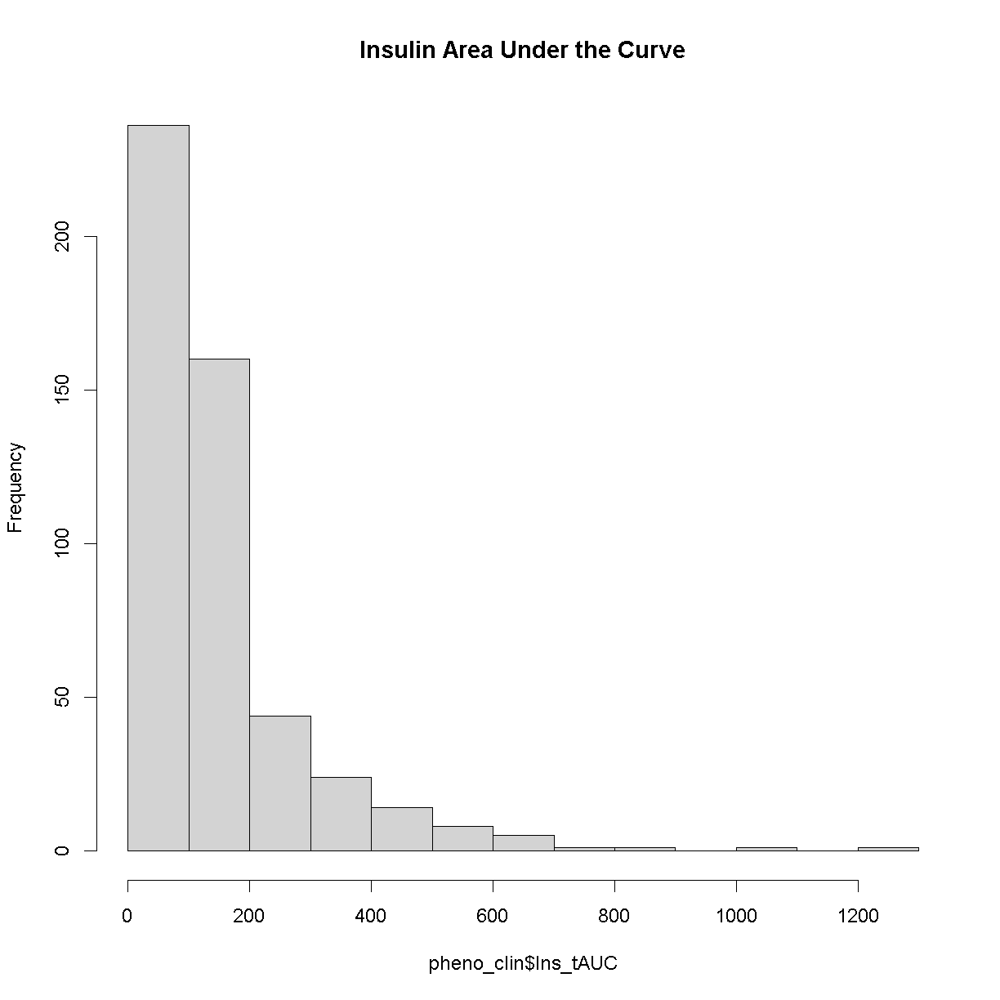

---
# Please do not edit this file directly; it is auto generated.
# Instead, please edit 04-review-mapping-steps.md in _episodes_rmd/
title: "Review Mapping Steps"
teaching: 30
exercises: 30
questions:
- "What are the steps involved in running QTL mapping in Diversity Outbred mice?"
objectives:
- "Reviewing the QTL mapping steps learnt in the first two days"
keypoints:
- "To understand the key steps running a QTL mapping analysis"
source: Rmd
---

### Load Libraries  

~~~
library(tidyverse)
library(knitr)
library(GGally)
library(corrplot)
library(broom)
library(qtl2)
library(qtl2convert)
library(qtl2ggplot)
library(RColorBrewer)
~~~
{: .language-r}

Before we begin to run QTL mapping on gene expression data to find eQTLs, let's 
review the main QTL mapping steps.

### Load Data

For this review, we are using data from the Keller et al. [paper](https://academic.oup.com/genetics/article/209/1/335/5931013?login=false) 
that are freely available to [download](doi:10.5061/dryad.pj105).  Here we are 
loading in the phenotypes & mapping as well as the genoprobs.   If available, a 
link is provided to the original lesson in case you need a little more help. 

Let's load the data.  Hopefully you have already downloaded these beforehand and 
saved them in a directory called `data` created under `eQTL.Mapping.Course`.

~~~
##phenotypes
load("../data/attie_DO500_clinical.phenotypes.RData")

##mapping data
load("../data/attie_DO500_mapping.data.RData")

##genoprobs
probs = readRDS("../data/attie_DO500_genoprobs_v5.rds")
~~~
{: .language-r}

### Phenotypes

In this data set, we have 20 phenotypes for 500 Diversity Outbred mice. Since 
the paper is interested in type 2 diabetes and insulin secretion, let's choose 
`insulin tAUC` (area under the curve) for this review.   
Before going ahead to perform QTL mapping, we need the check the phenotypes 
distribution as r/qtl2 assumes a normal distribution of the phenotype. 

~~~
hist(pheno_clin$Ins_tAUC, main = "insulin tAUC")
~~~
{: .language-r}

Now, let's apply the `log()` function to this data to corect the distribution.

~~~
pheno_clin$Ins_tAUC_log <- log(pheno_clin$Ins_tAUC)
~~~
{: .language-r}

Now, let's make a histogram of the log-transformed data.

~~~
hist(pheno_clin$Ins_tAUC_log, main = "insulin tAUC (log-transformed)")
~~~
{: .language-r}

This looks much better!

### The Marker Map  

The marker map for each chromosome is stored in the `map` object. This is used 
to plot the LOD scores calculated at each marker during QTL mapping.  Here we 
are using the 69K grid marker file.

### Genotype probabilities  

We have already calculated genotype probabilities which we loaded above called 
`probs`.  This contains the 8 state genotype probabilities using the 69k grid 
map of the same 500 DO mice that also have clinical phenotypes. 

~~~
dim(probs[[1]])
~~~
{: .language-r}

~~~
[1]  500    8 4711
~~~
{: .output}

~~~
plot_genoprob(probs, map, ind = 1, chr = 1)
~~~
{: .language-r}

### [Kinship Matrix](https://smcclatchy.github.io/mapping/04-calc-kinship/)

The kinship matrix has already been calculated and loaded in above

~~~
n_samples <- 50
heatmap(K[[1]][1:n_samples, 1:n_samples])
~~~
{: .language-r}

### Covariates    

Now, let's add the necessary covariates. For these analysis, let's see which 
covariates are significant. In the data set we have `sex`, `DOwave` (or batch) 
and `diet_days` to test whether there are any gender, batch or diet effects.

~~~
### Tests for sex, wave and diet_days.

tmp = pheno_clin %>%
        select(mouse, sex, DOwave, diet_days, Ins_tAUC_log) %>%
        gather(phenotype, value, -mouse, -sex, -DOwave, -diet_days) %>%
        group_by(phenotype) %>%
        nest()
mod_fxn = function(df) {
  lm(value ~ sex + DOwave + diet_days, data = df)
}
tmp = tmp %>%
  mutate(model = map(data, mod_fxn)) %>%
  mutate(summ = map(model, tidy)) %>%
  unnest(summ) 
#  kable(tmp, caption = "Effects of Sex, Wave & Diet Days on Phenotypes")

tmp %>%
  filter(term != "(Intercept)") %>%
  mutate(neg.log.p = -log10(p.value)) %>%
  ggplot(aes(term, neg.log.p)) +
    geom_point() +
    facet_wrap(~phenotype) +
    labs(title = "Significance of Sex, Wave & Diet Days on Phenotypes") +
    theme(axis.text.x = element_text(angle = 90, hjust = 1, vjust = 0.5)) +
rm(tmp)
~~~
{: .language-r}

We can see that sex and DOwave (especially the third batch) are significant.  
Here DOwave is the group or batch number as not all mice were submitted for 
genotyping at the same time.  Because of this, we now have to correct for it.

~~~
# convert sex and DO wave (batch) to factors
pheno_clin$sex = factor(pheno_clin$sex)
pheno_clin$DOwave = factor(pheno_clin$DOwave)

covar = model.matrix(~sex + DOwave, data = pheno_clin)
~~~
{: .language-r}

### [Performing a genome scan](https://smcclatchy.github.io/mapping/06-perform-genome-scan/) 

Now let's perform the genome scan!

~~~
qtl = scan1(genoprobs = probs, 
            pheno = pheno_clin[,"Ins_tAUC_log", drop = FALSE], 
            kinship = K, 
            addcovar = covar)
~~~
{: .language-r}

Lets plot it

~~~
plot_scan1(x = qtl, map = map, lodcolumn = "Ins_tAUC_log")
  abline(h = 6, col = 2, lwd = 2)
~~~
{: .language-r}

### [Finding LOD peaks](https://smcclatchy.github.io/mapping/07-find-lod-peaks/)

Lets find LOD peaks.  Here we are choosing to find peaks with a LOD score 
greater than 6. 

~~~
lod_threshold = 6
peaks = find_peaks(scan1_output = qtl, map = map, 
                   threshold = lod_threshold, 
                   peakdrop = 4, 
                   prob = 0.95)

kable(peaks %>% select (-lodindex) %>% 
        arrange(chr, pos), caption = "Phenotype QTL Peaks with LOD >= 6")
~~~
{: .language-r}

Table: Phenotype QTL Peaks with LOD >= 6

|lodcolumn    |chr |      pos|      lod|    ci_lo|    ci_hi|
|:------------|:---|--------:|--------:|--------:|--------:|
|Ins_tAUC_log |11  | 83.59467| 11.25884| 83.58553| 84.95444|

> ## Challenge
> Now choose another phenotype in `pheno_clin` and perform the same steps.  
> 1). Check the distribution. Does it need transforming?  
> 2). Are there any sex, batch, diet effects?  
> 3). Run a genome scan with the genotype probabilities and kinship provided.   
> 4). Plot the genome scan for this phenotype.  
> 5). Find the peaks above LOD score of 6. 
>
> > ## Solution
> > 
> > 
> > ~~~
> > # 1). Check the distribution. Does it need transforming?
> > 
> > 
> > # 2). Are there any sex, batch, diet effects?
> > 
> > 
> > # 3). Run a genome scan with the genotype probabilities and kinship provided.
> > 
> > # 4). Plot the genome scan for this phenotype.
> > 
> > # 5). Find the peaks above LOD score of 6. 
> > ~~~
> > {: .language-r}
> {: .solution}
{: .challenge}
