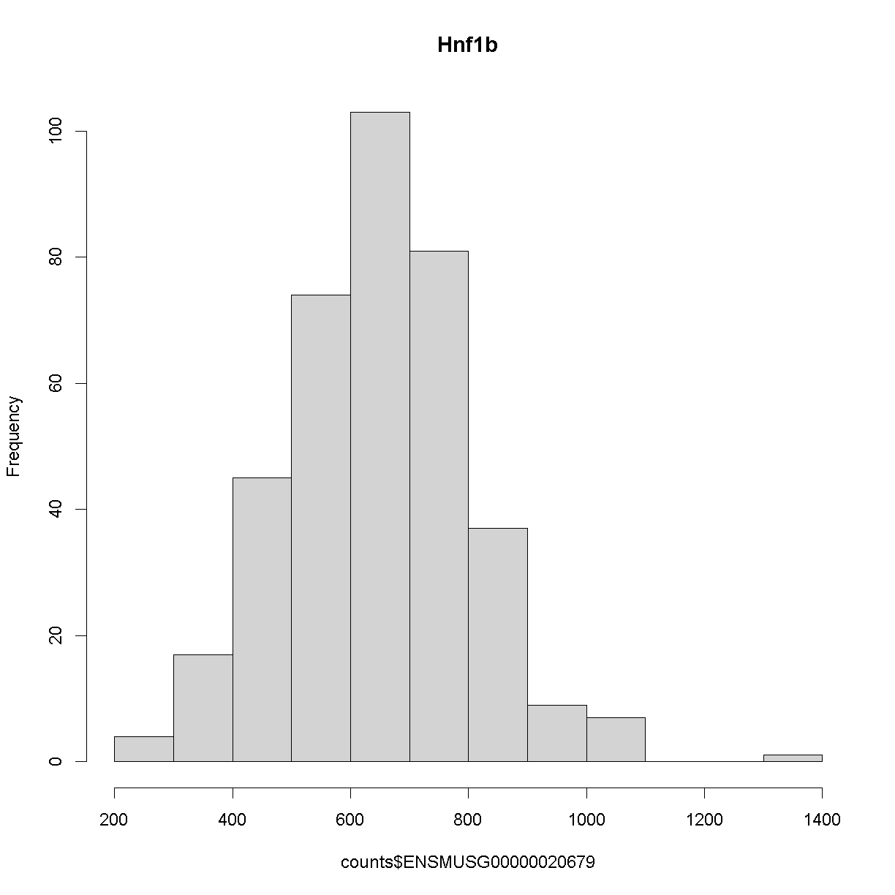

---
# Please do not edit this file directly; it is auto generated.
# Instead, please edit 05-map-one-eqtl.md in _episodes_rmd/
title: "Mapping A Single Gene Expression Trait"
teaching: 30
exercises: 30
questions:
- "How do I map one gene expression trait?"
objectives:
- "QTL mapping of an expression data set"
keypoints:
- "To run a QTL analysis for expression data"
source: Rmd
---

### Load Libraries  

~~~
library(tidyverse)
library(qtl2)
library(qtl2convert)
library(GGally)
library(broom)
library(corrplot)
library(RColorBrewer)
library(knitr)
~~~
{: .language-r}

### Load Data

Let's load the data. This time we are loading gene expression for `21,771` genes.  

~~~
#expression data
load("../data/attie_DO500_expr.datasets.RData")

##phenotypes
load("../data/attie_DO500_clinical.phenotypes.RData")

##mapping data
load("../data/attie_DO500_mapping.data.RData")

probs = readRDS("../data/genotypes/attie_DO500_genoprobs_v5.rds")
~~~
{: .language-r}

~~~
Warning in gzfile(file, "rb"): cannot open compressed file '../data/genotypes/
attie_DO500_genoprobs_v5.rds', probable reason 'No such file or directory'
~~~
{: .warning}

~~~
Error in gzfile(file, "rb"): cannot open the connection
~~~
{: .error}

### Expression Data

Gene expression information is in the `counts` data object. Because we are working with `insulin tAUC` phenotype, let's map the expression counts for `Hnf1b` which is known to influence this phenotype is these data. Before we do, let's check the distribution for `Hnf1b` expression data.

~~~
hist(counts$ENSMUSG00000020679, main = "Hnf1b")
~~~
{: .language-r}

The histogram indicates that distribution of these counts are normalised.

### The Marker Map  

The marker map for each chromosome is stored in the `map` object. This is used to plot the LOD scores calculated at each marker during QTL mapping.  Here we are using the 69K grid marker file.  

We are using the same marker map as in the previous [lesson](https://smcclatchy.github.io/gene-expression-qtl/05-review-mapping-steps/index.html#the-marker-map)

### Genotype probabilities  

We have already calculated genotype probabilities which we loaded above called `probs`.  This contains the 8 state genotype probabilities using the 69k grid map of the same 500 DO mice that also have clinical phenotypes. 

We have explored this earlier in th previous [lesson](https://smcclatchy.github.io/gene-expression-qtl/05-review-mapping-steps/index.html#genotype-probabilities)

### [Kinship Matrix](https://smcclatchy.github.io/mapping/04-calc-kinship/)

The kinship matrix has already been calculated and loaded in above.  Again, we have explored this in the previous [lesson](https://smcclatchy.github.io/gene-expression-qtl/05-review-mapping-steps/index.html#kinship-matrix)

### Covariates    

Now let's add the necessary covariates. For `Hnf1b` expression data, let's see which covariates are significant.

~~~
###merging covariate data and expression data to test for sex, wave and diet_days.

cov.counts <- merge(covar, counts, by=c("row.names"), sort=F)

#testing covairates on expression data

tmp = cov.counts %>%
        select(mouse, sex, DOwave, diet_days, ENSMUSG00000020679) %>%
        gather(expression, value, -mouse, -sex, -DOwave, -diet_days) %>%
        group_by(expression) %>%
        nest()
mod_fxn = function(df) {
  lm(value ~ sex + DOwave + diet_days, data = df)
}
tmp = tmp %>%
  mutate(model = map(data, mod_fxn)) %>%
  mutate(summ = map(model, tidy)) %>%
  unnest(summ)
# kable(tmp, caption = "Effects of Sex, Wave & Diet Days on Expression")

tmp %>%
  filter(term != "(Intercept)") %>%
  mutate(neg.log.p = -log10(p.value)) %>%
  ggplot(aes(term, neg.log.p)) +
    geom_point() +
    facet_wrap(~expression) +
    labs(title = "Significance of Sex, Wave & Diet Days on Expression") +
    theme(axis.text.x = element_text(angle = 90, hjust = 1, vjust = 0.5)) +
rm(tmp)
~~~
{: .language-r}

We can see that sex DOwave and diet are significant.  Here DOwave is the group or batch number as not all mice were submitted for genotyping at the same time.  Because of this, we now have to correct for it.

~~~
# convert sex and DO wave (batch) to factors
pheno_clin$sex = factor(pheno_clin$sex)
pheno_clin$DOwave = factor(pheno_clin$DOwave)
pheno_clin$diet_days = factor(pheno_clin$DOwave)

covar = model.matrix(~sex + DOwave + diet_days, data = pheno_clin)
~~~
{: .language-r}

### [Performing a genome scan](https://smcclatchy.github.io/mapping/06-perform-genome-scan/) 

Now let's perform the genome scan!

~~~
qtl = scan1(genoprobs = probs, 
            pheno = counts[,"ENSMUSG00000020679", drop = FALSE], 
            kinship = K, 
            addcovar = covar, 
            cores = 2)
~~~
{: .language-r}

~~~
Error in scan1(genoprobs = probs, pheno = counts[, "ENSMUSG00000020679", : object 'probs' not found
~~~
{: .error}

Let's plot it

~~~
plot_scan1(x = qtl, 
           map = map, 
           lodcolumn = "ENSMUSG00000020679", 
           main = colnames(qtl))
~~~
{: .language-r}

~~~
Error in plot_scan1(x = qtl, map = map, lodcolumn = "ENSMUSG00000020679", : object 'qtl' not found
~~~
{: .error}

~~~
abline(h = 6, col = 2, lwd = 2)
~~~
{: .language-r}

~~~
Error in int_abline(a = a, b = b, h = h, v = v, untf = untf, ...): plot.new has not been called yet
~~~
{: .error}

### [Finding LOD peaks](https://smcclatchy.github.io/mapping/07-find-lod-peaks/)

Let's find LOD peaks

~~~
lod_threshold = 6
peaks = find_peaks(scan1_output = qtl, 
                   map = map, 
                   threshold = lod_threshold, 
                   peakdrop = 4, prob = 0.95)
~~~
{: .language-r}

~~~
Error in align_scan1_map(scan1_output, map): object 'qtl' not found
~~~
{: .error}

~~~
kable(peaks %>% 
        dplyr::select(-lodindex) %>% 
        arrange(chr, pos), caption = "Phenotype QTL Peaks with LOD >= 6")
~~~
{: .language-r}

~~~
Error in dplyr::select(., -lodindex): object 'peaks' not found
~~~
{: .error}

> ## Challenge
> Now choose another gene expression trait in `counts` data object and peform the same steps
> 1). Check the distribution. Does it need transforming? 
> 2). Are there any sex, batch, diet effects? 
> 3). Run a genome scan with the genotype probabilities and kinship provided.  
> 4). Plot the genome scan for this gene.
> 5). Find the peaks above LOD score of 6.   
{: .challenge}
