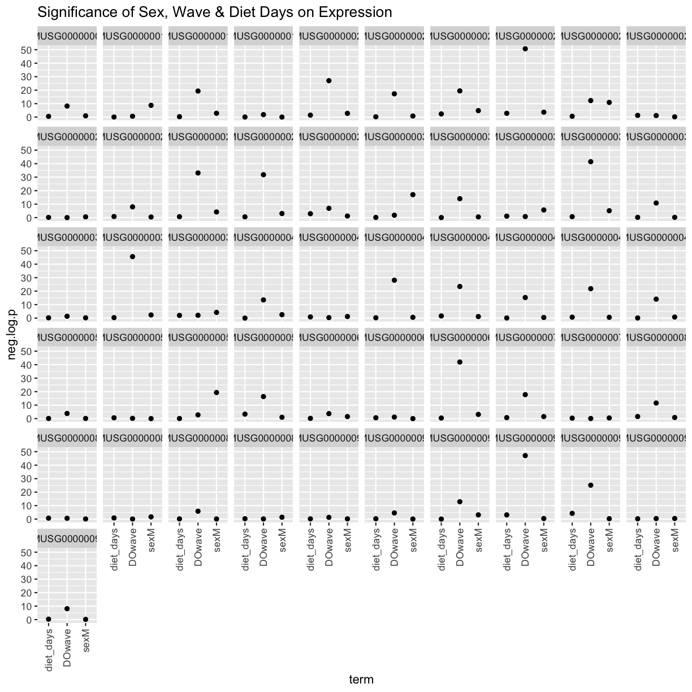

---
# Please do not edit this file directly; it is auto generated.
# Instead, please edit 06-map-many-eqtls.md in _episodes_rmd/
title: "Mapping Many Gene Expression Traits"
teaching: 30
exercises: 30
questions:
- "How do I map many genes?"
objectives:
- "To map several genes at the same time"
source: Rmd
---

### Load Libraries  

~~~
library(tidyverse)
library(knitr)
library(broom)
library(qtl2)
library(qtl2ggplot)
library(RColorBrewer)

source("../code/gg_transcriptome_map.R")
source("../code/qtl_heatmap.R")
~~~
{: .language-r}

Before we begin this lesson, we need to create another directory called `results` in our main directory.  You can do this by clicking on the "Files" tab and navigate into the main directory.  Then select "New Folder" and name it "results".

### Load Data

~~~
# expression data
load("../data/attie_DO500_expr.datasets.RData")

# data from paper
load("../data/dataset.islet.rnaseq.RData")

# phenotypes
load("../data/attie_DO500_clinical.phenotypes.RData")

# mapping data
load("../data/attie_DO500_mapping.data.RData")

# genotype probabilities
probs = readRDS("../data/attie_DO500_genoprobs_v5.rds")
~~~
{: .language-r}

### Data Selection

For this lesson, lets choose a random set of 50 gene expression phenotypes.

~~~
genes = colnames(norm)

sams <- sample(length(genes), 50, replace = FALSE, prob = NULL)
genes <- genes[sams]

gene.info <- dataset.islet.rnaseq$annots[genes,]
rownames(gene.info) = NULL
kable(gene.info)
~~~
{: .language-r}

|gene_id            |symbol        |chr |      start|        end| strand|     middle|nearest.marker.id |biotype              |module      |hotspot |
|:------------------|:-------------|:---|----------:|----------:|------:|----------:|:-----------------|:--------------------|:-----------|:-------|
|ENSMUSG00000020323 |Prss57        |10  |  79.781474|  79.790961|     -1|  79.786218|10_79788790       |protein_coding       |grey        |NA      |
|ENSMUSG00000025949 |Pikfyve       |1   |  65.186750|  65.274012|      1|  65.230381|1_65285084        |protein_coding       |pink        |chr13   |
|ENSMUSG00000085666 |Gm9855        |10  |  42.052561|  42.055414|     -1|  42.053988|10_42061181       |pseudogene           |grey        |NA      |
|ENSMUSG00000082651 |Gm14001       |2   | 121.401145| 121.401391|     -1| 121.401268|2_121538726       |pseudogene           |grey        |NA      |
|ENSMUSG00000026037 |Orc2          |1   |  58.462771|  58.505109|     -1|  58.483940|1_58277394        |protein_coding       |turquoise   |NA      |
|ENSMUSG00000038354 |Ankrd35       |3   |  96.670131|  96.691009|      1|  96.680570|3_96673140        |protein_coding       |orange      |NA      |
|ENSMUSG00000031400 |G6pdx         |X   |  74.409483|  74.429194|     -1|  74.419338|X_74411553        |protein_coding       |turquoise   |NA      |
|ENSMUSG00000085151 |1110018N20Rik |2   | 167.188702| 167.192808|      1| 167.190755|2_167142758       |processed_transcript |brown       |NA      |
|ENSMUSG00000019795 |Pcmt1         |10  |   7.629373|   7.681136|     -1|   7.655254|10_7567820        |protein_coding       |turquoise   |NA      |
|ENSMUSG00000061702 |Tmem91        |7   |  25.669139|  25.675166|     -1|  25.672152|7_25668949        |protein_coding       |grey        |NA      |
|ENSMUSG00000070687 |Htr1d         |4   | 136.423524| 136.444398|      1| 136.433961|4_136432920       |protein_coding       |grey        |NA      |
|ENSMUSG00000000365 |Rnf17         |14  |  56.402697|  56.525032|      1|  56.463864|14_56493150       |protein_coding       |grey        |NA      |
|ENSMUSG00000074782 |4833422C13Rik |13  |  91.701665|  91.741872|     -1|  91.721768|13_91697610       |antisense            |turquoise   |NA      |
|ENSMUSG00000041488 |Stx3          |19  |  11.775119|  11.819403|     -1|  11.797261|19_11834277       |protein_coding       |darkgreen   |NA      |
|ENSMUSG00000078370 |Gm6316        |12  |  69.920472|  69.921491|     -1|  69.920982|12_69857235       |pseudogene           |grey        |NA      |
|ENSMUSG00000056943 |Gm10015       |8   |  61.364019|  61.364483|     -1|  61.364251|8_61412377        |pseudogene           |grey        |NA      |
|ENSMUSG00000070995 |Gm6313        |6   | 148.606786| 148.614309|     -1| 148.610548|6_148614529       |lincRNA              |grey        |NA      |
|ENSMUSG00000031924 |Cyb5b         |8   | 107.150661| 107.187470|      1| 107.169066|8_107188415       |protein_coding       |white       |NA      |
|ENSMUSG00000014852 |Adamts13      |2   |  26.973416|  27.009628|      1|  26.991522|2_26983717        |protein_coding       |grey        |NA      |
|ENSMUSG00000029141 |Slc4a1ap      |5   |  31.526995|  31.554042|      1|  31.540518|5_31526123        |protein_coding       |turquoise   |NA      |
|ENSMUSG00000042426 |Dhx29         |13  | 112.927730| 112.969431|      1| 112.948580|13_112927057      |protein_coding       |white       |NA      |
|ENSMUSG00000062896 |Rpl31-ps11    |3   |  94.604408|  94.604784|     -1|  94.604596|3_94563337        |pseudogene           |blue        |NA      |
|ENSMUSG00000022248 |Rad1          |15  |  10.486018|  10.499063|      1|  10.492540|15_10446174       |protein_coding       |green       |NA      |
|ENSMUSG00000046605 |B3gntl1       |11  | 121.616197| 121.673153|     -1| 121.644675|11_121520864      |protein_coding       |tan         |NA      |
|ENSMUSG00000024943 |Smc5          |19  |  23.206441|  23.273897|     -1|  23.240169|19_23342789       |protein_coding       |pink        |NA      |
|ENSMUSG00000049036 |Tmem121       |12  | 113.185903| 113.189520|      1| 113.187712|12_113172991      |protein_coding       |blue        |NA      |
|ENSMUSG00000067586 |S1pr3         |13  |  51.408618|  51.422797|      1|  51.415708|13_51366266       |protein_coding       |lightyellow |NA      |
|ENSMUSG00000097906 |Gm9625        |13  |  67.810246|  67.811200|      1|  67.810723|13_67808823       |pseudogene           |brown       |NA      |
|ENSMUSG00000003051 |Elf3          |1   | 135.253574| 135.258472|     -1| 135.256023|1_135169602       |protein_coding       |royalblue   |NA      |
|ENSMUSG00000098024 |Gm27003       |2   | 126.675916| 126.683805|      1| 126.679860|2_126678042       |antisense            |grey        |NA      |
|ENSMUSG00000032020 |Ubash3b       |9   |  41.011098|  41.161697|     -1|  41.086398|9_41062166        |protein_coding       |darkgreen   |NA      |
|ENSMUSG00000097698 |Gm26906       |12  | 109.568628| 109.571723|     -1| 109.570176|12_109570446      |lincRNA              |grey        |NA      |
|ENSMUSG00000061615 |Hist1h2ab     |13  |  23.751088|  23.751593|      1|  23.751340|13_23729793       |protein_coding       |blue        |NA      |
|ENSMUSG00000028292 |Rars2         |4   |  34.614957|  34.660167|      1|  34.637562|4_34715713        |protein_coding       |turquoise   |NA      |
|ENSMUSG00000036943 |Rab8b         |9   |  66.843672|  66.919705|     -1|  66.881688|9_66922076        |protein_coding       |magenta     |NA      |
|ENSMUSG00000078612 |1700024P16Rik |4   | 104.913456| 105.016863|      1| 104.965160|4_104952833       |protein_coding       |grey        |NA      |
|ENSMUSG00000008435 |Rdh13         |7   |   4.424770|   4.445649|     -1|   4.435210|7_4397113         |protein_coding       |grey        |NA      |
|ENSMUSG00000090472 |Gm3047        |14  |   4.555405|   4.562747|      1|   4.559076|14_4551935        |protein_coding       |grey        |NA      |
|ENSMUSG00000031226 |Pbdc1         |X   | 105.079756| 105.117090|      1| 105.098423|X_105098458       |protein_coding       |darkgreen   |NA      |
|ENSMUSG00000039680 |Mrps6         |16  |  92.058270|  92.112227|      1|  92.085248|16_92199266       |protein_coding       |blue        |NA      |
|ENSMUSG00000037022 |Mmaa          |8   |  79.266424|  79.294956|     -1|  79.280690|8_79285726        |protein_coding       |turquoise   |NA      |
|ENSMUSG00000037552 |Plekhg2       |7   |  28.359604|  28.372599|     -1|  28.366102|7_28554246        |protein_coding       |black       |NA      |
|ENSMUSG00000033953 |Ppp3r1        |11  |  17.159263|  17.200375|      1|  17.179819|11_17165927       |protein_coding       |darkgreen   |NA      |
|ENSMUSG00000032598 |Nckipsd       |9   | 108.808380| 108.818366|      1| 108.813373|9_108742906       |protein_coding       |purple      |NA      |
|ENSMUSG00000002661 |Alkbh7        |17  |  56.997339|  56.999322|      1|  56.998330|17_57015114       |protein_coding       |lightcyan   |NA      |
|ENSMUSG00000026778 |Prkcq         |2   |  11.172113|  11.301226|      1|  11.236670|2_11207176        |protein_coding       |pink        |NA      |
|ENSMUSG00000013701 |Timm23        |14  |  32.180162|  32.201898|     -1|  32.191030|14_32119989       |protein_coding       |blue        |NA      |
|ENSMUSG00000020621 |Rdh14         |12  |  10.390780|  10.395562|      1|  10.393171|12_10394446       |protein_coding       |tan         |NA      |
|ENSMUSG00000097779 |4833407H14Rik |19  |  53.460631|  53.462723|      1|  53.461677|19_53464752       |lincRNA              |grey        |NA      |
|ENSMUSG00000071866 |Ppia          |11  |   6.415443|   6.419817|      1|   6.417630|11_6422827        |protein_coding       |turquoise   |NA      |

### Expression Data

Lets check the distribution for the first 20 gene expression phenotypes. If you would like to check the distribution of all 50 genes, change `for(gene in genes[1:20])` in the code below to `for(gene in genes)`.

~~~
par(mfrow=c(3,4))
for(gene in genes[1:20]){
  hist(norm[,gene], main = gene)
  }
~~~
{: .language-r}

The histogram indicates that distribution of these counts are normalised (as they should be).

### The Marker Map  

We are using the same marker map as in the previous [lesson](https://smcclatchy.github.io/gene-expression-qtl/04-review-mapping-steps/index.html#the-marker-map)

### Genotype probabilities  

We have explored this earlier in th previous [lesson](https://smcclatchy.github.io/gene-expression-qtl/04-review-mapping-steps/index.html#genotype-probabilities).  But, as a reminder, we have already calculated genotype probabilities which we loaded above called `probs`.  This contains the 8 state genotype probabilities using the 69k grid  map of the same 500 DO mice that also have clinical phenotypes. 

### [Kinship Matrix](https://smcclatchy.github.io/mapping/04-calc-kinship/)

We have explored the kinship matrix in the previous [lesson](https://smcclatchy.github.io/gene-expression-qtl/04-review-mapping-steps/index.html#kinship-matrix). It has already been calculated and loaded in above. 

### Covariates    

Now let's add the necessary covariates. For these 50 gene expression data, let's see which covariates are significant.

~~~
###merging covariate data and expression data to test for sex, wave and diet_days.

cov.counts <- merge(covar, norm[,genes], by=c("row.names"), sort=F)

#testing covairates on expression data

tmp = cov.counts %>%
        dplyr::select(mouse, sex, DOwave, diet_days, names(cov.counts[,genes])) %>%
        gather(expression, value, -mouse, -sex, -DOwave, -diet_days) %>%
        group_by(expression) %>%
        nest()
mod_fxn = function(df) {
  lm(value ~ sex + DOwave + diet_days, data = df)
}
tmp = tmp %>%
  mutate(model = map(data, mod_fxn)) %>%
  mutate(summ = map(model, tidy)) %>%
  unnest(summ) 
#  kable(tmp, caption = "Effects of Sex, Wave & Diet Days on Expression")

tmp
~~~
{: .language-r}

~~~
# A tibble: 200 x 8
# Groups:   expression [50]
   expression         data     model  term      estimate std.e~1 stati~2 p.value
   <chr>              <list>   <list> <chr>        <dbl>   <dbl>   <dbl>   <dbl>
 1 ENSMUSG00000020323 <tibble> <lm>   (Interce~  4.03e-1 0.599     0.672 5.02e-1
 2 ENSMUSG00000020323 <tibble> <lm>   sexM      -1.18e-1 0.0977   -1.20  2.29e-1
 3 ENSMUSG00000020323 <tibble> <lm>   DOwave     2.27e-1 0.0439    5.18  3.72e-7
 4 ENSMUSG00000020323 <tibble> <lm>   diet_days -7.10e-3 0.00458  -1.55  1.22e-1
 5 ENSMUSG00000025949 <tibble> <lm>   (Interce~  4.96e-1 0.593     0.836 4.04e-1
 6 ENSMUSG00000025949 <tibble> <lm>   sexM      -5.50e-1 0.0966   -5.70  2.50e-8
 7 ENSMUSG00000025949 <tibble> <lm>   DOwave    -1.17e-1 0.0434   -2.70  7.30e-3
 8 ENSMUSG00000025949 <tibble> <lm>   diet_days  6.91e-4 0.00453   0.153 8.79e-1
 9 ENSMUSG00000085666 <tibble> <lm>   (Interce~  3.40e-1 0.623     0.545 5.86e-1
10 ENSMUSG00000085666 <tibble> <lm>   sexM      -6.14e-2 0.101    -0.605 5.45e-1
# ... with 190 more rows, and abbreviated variable names 1: std.error,
#   2: statistic
~~~
{: .output}

~~~
tmp %>%
  filter(term != "(Intercept)") %>%
  mutate(neg.log.p = -log10(p.value)) %>%
  ggplot(aes(term, neg.log.p)) +
    geom_point() +
    facet_wrap(~expression, ncol=10) +
    labs(title = "Significance of Sex, Wave & Diet Days on Expression") +
    theme(axis.text.x = element_text(angle = 90, hjust = 1, vjust = 0.5)) +
rm(tmp)
~~~
{: .language-r}

We can see that `DOwave` is the most significant.  However, given that a few are influenced by `sex` and `diet_days`, we will have to correct for those as well. 

~~~
# convert sex and DO wave (batch) to factors
pheno_clin$sex = factor(pheno_clin$sex)
pheno_clin$DOwave = factor(pheno_clin$DOwave)
pheno_clin$diet_days = factor(pheno_clin$DOwave)

covar = model.matrix(~sex + DOwave + diet_days, data = pheno_clin)
~~~
{: .language-r}

### [Performing a genome scan](https://smcclatchy.github.io/mapping/06-perform-genome-scan/) 

Now lets perform the genome scan!  We are also going to save our qtl results in an `Rdata` file to be used in further lessons. 

### QTL Scans

~~~
qtl.file = "../results/gene.norm_qtl_cis.trans.Rdata"

if(file.exists(qtl.file)) {
  load(qtl.file)
  } else {
    qtl = scan1(genoprobs = probs, 
                pheno = norm[,genes, drop = FALSE],
                kinship = K, 
                addcovar = covar, 
                cores = 2)
    save(qtl, file = qtl.file)
    }
~~~
{: .language-r}

### QTL plots

Let's plot the first 20 gene expression phenotypes.  If you would like to plot all 50, change `for(i in 1:20)` in the code below to `for(i in 1:ncol(qtl))`.

~~~
par(mfrow=c(3,4))
for(i in 1:20) {
  plot_scan1(x = qtl, 
             map = map, 
             lodcolumn = i, 
             main = colnames(qtl)[i])
  abline(h = 6, col = 2, lwd = 2)
  }
~~~
{: .language-r}

### QTL Peaks

We are also going to save our peak results so we can use these again else where.  First, lets get out peaks with a LOD score greater than 6. 

~~~
lod_threshold = 6
peaks = find_peaks(scan1_output = qtl, 
                   map = map, 
                   threshold = lod_threshold, 
                   peakdrop = 4, 
                   prob = 0.95)
~~~
{: .language-r}

We will save these peaks into a csv file. 

~~~
kable(peaks %>% 
        dplyr::select(-lodindex) %>% 
        arrange(chr, pos), caption = "Expression QTL (eQTL) Peaks with LOD >= 6")

write_csv(peaks, "../results/gene.norm_qtl_peaks_cis.trans.csv")
~~~
{: .language-r}

Table: Phenotype QTL Peaks with LOD >= 6

|lodcolumn          |chr |        pos|        lod|      ci_lo|      ci_hi|
|:------------------|:---|----------:|----------:|----------:|----------:|
|ENSMUSG00000072964 |1   |  66.331797|   6.180628|  22.874710|  70.871705|
|ENSMUSG00000036620 |1   | 127.373960|   6.680857|  23.388518| 143.594958|
|ENSMUSG00000006005 |1   | 151.321243|  17.373460| 149.133136| 151.727169|
|ENSMUSG00000090946 |1   | 153.940027|   7.235766| 150.851285| 154.500934|
|ENSMUSG00000060985 |1   | 156.528284|  27.526378| 156.014528| 156.714143|
|ENSMUSG00000087719 |1   | 186.887602|   6.078944| 182.881051| 189.826738|
|ENSMUSG00000058420 |1   | 190.002808|   6.531293| 135.481336| 191.897374|
|ENSMUSG00000006471 |2   |  25.628738|  14.924170|  19.865960|  25.811217|
|ENSMUSG00000026888 |2   |  65.164778|  69.578435|  65.138216|  65.419095|
|ENSMUSG00000001053 |2   |  66.006451|   6.443357|  64.021169|  68.568918|
|ENSMUSG00000025171 |2   | 128.166016|   7.103504| 124.404221| 137.097951|
|ENSMUSG00000027624 |2   | 156.592548|  15.009719| 154.005531| 156.622174|
|ENSMUSG00000024029 |2   | 164.022416|  16.375239| 163.413317| 164.022416|
|ENSMUSG00000094234 |3   |  30.772704|   6.195233|  26.484992| 128.536959|
|ENSMUSG00000067869 |3   | 119.715888|   6.050436| 117.349572| 138.846020|
|ENSMUSG00000033453 |3   | 150.692232|   6.224801| 149.810334| 160.017104|
|ENSMUSG00000082676 |4   |  12.567859|  51.732839|  12.007708|  12.567859|
|ENSMUSG00000001053 |4   |  15.105455|   6.547027|  11.549507|  23.994941|
|ENSMUSG00000080997 |4   |  22.449744|   8.449069|  22.238759|  23.972132|
|ENSMUSG00000061132 |4   | 151.200228|   6.066043| 143.466088| 156.009474|
|ENSMUSG00000026888 |4   | 154.504379|   6.002961| 154.264609| 155.960768|
|ENSMUSG00000067724 |5   |  24.361593|   8.459163|  23.861324|  24.584674|
|ENSMUSG00000061132 |5   |  71.871223|   6.786073|  68.434940|  89.510076|
|ENSMUSG00000001053 |5   |  97.517407|   6.146795|  75.712158| 144.617027|
|ENSMUSG00000034265 |5   |  98.798460|   6.503880|  97.517407|  99.181584|
|ENSMUSG00000039220 |5   | 115.528863|   6.108756|  16.373417| 116.546348|
|ENSMUSG00000090946 |5   | 125.050278|   6.441167| 122.010143| 125.544310|
|ENSMUSG00000033453 |5   | 144.365599|   9.063552| 143.175989| 144.705848|
|ENSMUSG00000047417 |6   |  34.782235|   6.217411|  29.184841|  53.871754|
|ENSMUSG00000059182 |6   |  52.091084|  33.168066|  51.799514|  52.182429|
|ENSMUSG00000038535 |6   |  53.519017|   6.968609|  34.958286|  53.905634|
|ENSMUSG00000063975 |6   | 142.593512|  52.022955| 141.731367| 142.613428|
|ENSMUSG00000087719 |6   | 144.238831|   6.564583| 143.054033| 144.463381|
|ENSMUSG00000038535 |6   | 147.651776|   6.074375|  96.814224| 149.721874|
|ENSMUSG00000092574 |7   |  10.310291|  10.047354|   6.891153|  13.038750|
|ENSMUSG00000024029 |7   |  46.326762|   6.031936|  31.065202|  66.190494|
|ENSMUSG00000058420 |7   | 118.237771|  29.916509| 117.782005| 118.459217|
|ENSMUSG00000030884 |7   | 119.274302|   9.841569| 119.175287| 120.823535|
|ENSMUSG00000032262 |7   | 131.208016|   6.353148| 130.289425| 133.449318|
|ENSMUSG00000091315 |8   |   5.222420|   6.026910|   3.000000|   7.634015|
|ENSMUSG00000080969 |8   |  31.803112|   7.512055|  30.110709|  32.885064|
|ENSMUSG00000025171 |8   | 103.910733|   6.715374|  18.962172| 106.414542|
|ENSMUSG00000092574 |9   |  69.749511|   7.064238|  67.116208|  71.557379|
|ENSMUSG00000032262 |9   |  83.877613|  84.814877|  83.691262|  83.897860|
|ENSMUSG00000092097 |9   | 108.484256|   6.790090| 108.301387| 111.305369|
|ENSMUSG00000087288 |9   | 111.738356|   6.405425| 107.688302| 114.448932|
|ENSMUSG00000081695 |9   | 115.476162|   7.251329|  26.894119| 115.791374|
|ENSMUSG00000039220 |9   | 122.919511|   6.164063|  66.922076| 123.908478|
|ENSMUSG00000020009 |10  |  17.933953|  55.778202|  17.725269|  17.957466|
|ENSMUSG00000020009 |10  |  19.447723| 107.791633|  19.429490|  19.681980|
|ENSMUSG00000059456 |10  | 111.542130|   8.688526| 111.027164| 112.872469|
|ENSMUSG00000080951 |11  |  48.633050|   7.546812|  47.571364|  49.631634|
|ENSMUSG00000036620 |11  |  49.972042|  27.185229|  49.799163|  50.207998|
|ENSMUSG00000001053 |11  |  51.467011|   9.597256|  50.555493|  52.490021|
|ENSMUSG00000036819 |11  |  59.261557|  14.251128|  59.159525|  59.361854|
|ENSMUSG00000090946 |12  |  33.226705|   9.255890|  31.455326|  36.115728|
|ENSMUSG00000033453 |12  |  54.861100|   6.985971|  46.668722|  57.532802|
|ENSMUSG00000058420 |12  |  84.148297|   6.072393|  80.160035| 117.400738|
|ENSMUSG00000030884 |12  |  90.140257|   6.489622|  36.008770|  91.612679|
|ENSMUSG00000033453 |13  |   5.728883|   7.471665|   3.000000|   9.333258|
|ENSMUSG00000015478 |13  |  20.120894|   7.166756|  19.967159|  26.333994|
|ENSMUSG00000021576 |13  |  75.118877|   9.358970|  73.475498|  83.792912|
|ENSMUSG00000092574 |13  |  84.390415|   6.335540|  31.065796|  95.264098|
|ENSMUSG00000092097 |13  |  93.932255|   6.733262|  54.845446|  95.854826|
|ENSMUSG00000080969 |13  | 100.640919|  48.017140| 100.586394| 101.015714|
|ENSMUSG00000080969 |13  | 101.293130|  23.888136| 101.284085| 101.784859|
|ENSMUSG00000059456 |14  |  47.911929|   6.314979|  46.503464|  54.092808|
|ENSMUSG00000059456 |14  |  66.558666|  25.308803|  66.461688|  66.630537|
|ENSMUSG00000080969 |14  |  94.715764|   6.725636|  86.190835|  97.977210|
|ENSMUSG00000061132 |14  | 117.533896|   6.998556| 115.747424| 117.979040|
|ENSMUSG00000092574 |15  |  68.964101|   6.135713|   4.570600| 102.258615|
|ENSMUSG00000059182 |15  |  76.432307|   6.737697|  76.237397|  77.722472|
|ENSMUSG00000079605 |16  |   3.568663|   6.031667|   3.000000|   9.760011|
|ENSMUSG00000090946 |16  |   9.976988|   6.207907|   5.847550|  44.747807|
|ENSMUSG00000022754 |16  |  56.923013|  22.369078|  56.269056|  57.542681|
|ENSMUSG00000090946 |16  |  72.925124|   6.094102|  72.352422|  74.282232|
|ENSMUSG00000034265 |17  |   5.676395|  15.452311|   4.055378|   5.683928|
|ENSMUSG00000087288 |17  |  14.168264|   6.360987|  12.648057|  68.416532|
|ENSMUSG00000088856 |17  |  25.579736|   9.313857|  25.402466|  26.273089|
|ENSMUSG00000079605 |17  |  27.010000|  20.223918|  26.555609|  27.117327|
|ENSMUSG00000038677 |17  |  28.402716|  13.230720|  27.378790|  28.445744|
|ENSMUSG00000034265 |17  |  77.120789|   6.696226|  76.417423|  77.541627|
|ENSMUSG00000033453 |17  |  90.143826|   6.261870|  89.194307|  90.362150|
|ENSMUSG00000021576 |18  |   4.864090|   6.382616|   3.833020|   9.577966|
|ENSMUSG00000092097 |18  |   8.863908|  11.810480|   5.424580|  10.130481|
|ENSMUSG00000025616 |18  |  38.254377|   6.103068|  21.533016|  42.428370|
|ENSMUSG00000015478 |18  |  75.447450|   7.502477|  74.202968|  75.953513|
|ENSMUSG00000020163 |19  |  38.759348|   6.236879|  36.145379|  41.709489|
|ENSMUSG00000061132 |19  |  40.763753|  57.181526|  40.702444|  40.908613|
|ENSMUSG00000025171 |19  |  41.707002|  10.216804|  40.763753|  42.515214|
|ENSMUSG00000040463 |X   |  14.952046|   7.127053|  12.331943|  52.599806|
|ENSMUSG00000038535 |X   |  16.799279|   6.385619|   6.617106|  20.855833|
|ENSMUSG00000048249 |X   |  48.428243|   6.981848|  47.070413|  50.784033|
|ENSMUSG00000072964 |X   | 135.583586|  18.581247| 135.058523| 136.258035|
|ENSMUSG00000067724 |X   | 142.888105|   6.355525|  97.373574| 169.505007|
|ENSMUSG00000058420 |X   | 153.682008|   7.479411| 146.728544| 163.710755|

### QTL Peaks Figure

~~~
qtl_heatmap(qtl = qtl, map = map, low.thr = 3.5)
~~~
{: .language-r}

> ## Challenge
> What do the qtl scans for all gene exression traits look like? *Note:* Don't worry, we've done the qtl scans for you!!!
> You can read in this file, `../data/gene.norm_qtl_all.genes.Rdata`, which are the `scan1` results for all gene expression traits. 
>
> > ## Solution
> > 
> > 
> > ~~~
> > load("../data/gene.norm_qtl_all.genes.Rdata")
> > 
> > lod_threshold = 6
> > peaks = find_peaks(scan1_output = qtl, 
> >                map = map, 
> >                threshold = lod_threshold, 
> >                peakdrop = 4, 
> >                prob = 0.95)
> > write_csv(peaks, "../results/gene.norm_qtl_all.genes_peaks.csv")
> > 
> > ## Heat Map
> > qtl_heatmap(qtl = qtl, map = map, low.thr = 3.5)
> > ~~~
> > {: .language-r}
> {: .solution}
{: .challenge}
