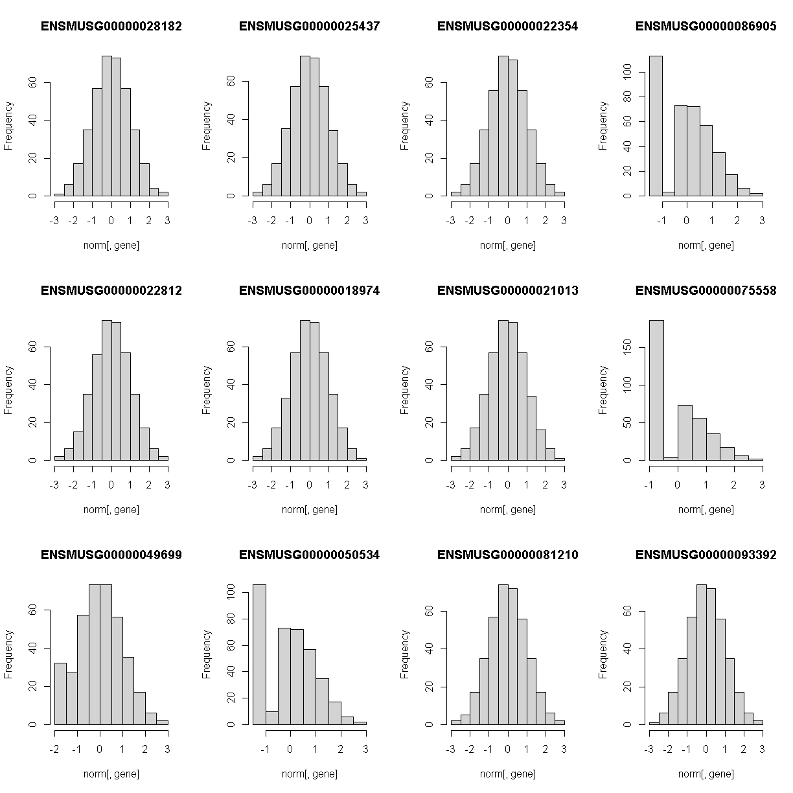

---
# Please do not edit this file directly; it is auto generated.
# Instead, please edit 06-map-many-eqtls.md in _episodes_rmd/
title: "Mapping Many Gene Expression Traits"
teaching: 30
exercises: 30
questions:
- "How do I map many genes?"
objectives:
- "To map several genes at the same time"
source: Rmd
---

### Load Libraries  

For this lesson, we need to install two more libraries and load them.  You can do this by typing the following code:

~~~
BiocManager::install(c("AnnotationHub","rtracklayer"))
~~~
{: .language-r}

Let's install our libraries, and source two other R scripts.

~~~
library(tidyverse)
library(knitr)
library(broom)
library(qtl2)
library(qtl2ggplot)
library(RColorBrewer)

source("../code/gg_transcriptome_map.R")
~~~
{: .language-r}

~~~
Error in library(AnnotationHub): there is no package called 'AnnotationHub'
~~~
{: .error}

~~~
source("../code/qtl_heatmap.R")
~~~
{: .language-r}

Before we begin this lesson, we need to create another directory called `results` in our main directory.  You can do this by clicking on the "Files" tab and navigate into the main directory.  Then select "New Folder" and name it "results".

### Load Data

~~~
# expression data
load("../data/attie_DO500_expr.datasets.RData")

# data from paper
load("../data/dataset.islet.rnaseq.RData")

# phenotypes
load("../data/attie_DO500_clinical.phenotypes.RData")

# mapping data
load("../data/attie_DO500_mapping.data.RData")

# genotype probabilities
probs = readRDS("../data/attie_DO500_genoprobs_v5.rds")
~~~
{: .language-r}

### Data Selection

For this lesson, lets choose a random set of 50 gene expression phenotypes.

~~~
genes = colnames(norm)

sams <- sample(length(genes), 50, replace = FALSE, prob = NULL)
genes <- genes[sams]

gene.info <- dataset.islet.rnaseq$annots[genes,]
rownames(gene.info) = NULL
kable(gene.info[1:10,])
~~~
{: .language-r}

|gene_id            |symbol        |chr |     start|       end| strand|    middle|nearest.marker.id |biotype              |module      |hotspot |
|:------------------|:-------------|:---|---------:|---------:|------:|---------:|:-----------------|:--------------------|:-----------|:-------|
|ENSMUSG00000001150 |Mcm3ap        |10  |  76.46897|  76.51586|      1|  76.49241|10_76348570       |protein_coding       |grey60      |NA      |
|ENSMUSG00000060377 |Rpl36a-ps1    |14  |  98.99398|  98.99430|     -1|  98.99414|14_99002274       |pseudogene           |grey        |NA      |
|ENSMUSG00000020463 |Smek2         |11  |  29.17289|  29.22080|      1|  29.19684|11_29272786       |protein_coding       |green       |NA      |
|ENSMUSG00000041741 |Pde3a         |6   | 141.24927| 141.49935|      1| 141.37431|6_141380097       |protein_coding       |yellow      |NA      |
|ENSMUSG00000087047 |1700110K17Rik |9   |  40.32343|  40.34356|      1|  40.33349|9_40336324        |processed_transcript |brown       |NA      |
|ENSMUSG00000002233 |Rhoc          |3   | 104.78901| 104.79446|      1| 104.79174|3_104735800       |protein_coding       |magenta     |NA      |
|ENSMUSG00000066000 |2610305D13Rik |4   | 147.61194| 147.64251|     -1| 147.62723|4_147608212       |protein_coding       |grey        |NA      |
|ENSMUSG00000002844 |Adprh         |16  |  38.44540|  38.45269|     -1|  38.44904|16_38447345       |protein_coding       |blue        |NA      |
|ENSMUSG00000001986 |Gria3         |X   |  41.40085|  41.67860|      1|  41.53973|X_41456110        |protein_coding       |greenyellow |NA      |
|ENSMUSG00000039307 |Hexdc         |11  | 121.20443| 121.22266|      1| 121.21354|11_121200487      |protein_coding       |royalblue   |NA      |

### Expression Data

Lets check the distribution for the first 20 gene expression phenotypes. If you would like to check the distribution of all 50 genes, change `for(gene in genes[1:20])` in the code below to `for(gene in genes)`.

~~~
par(mfrow=c(3,4))
for(gene in genes[1:20]){
  hist(norm[,gene], main = gene)
  }
~~~
{: .language-r}

Check the distributions.  Do they all have a normal distribution?

You will notice that the distribtion of some genes are skewed to the left.  This means that that only a small amount of samples have data and therefore, will need to be removed.  A suitable qc would be keeping expression data that have at least 5% of the samples with more than 10 reads.

~~~
genes_qc <- which(as.numeric(colSums(counts[,genes] > 10)) >= 0.05 * nrow(counts[,genes]))
genes <- genes[genes_qc]
~~~
{: .language-r}

### The Marker Map  

We are using the same marker map as in the previous [lesson](https://smcclatchy.github.io/gene-expression-qtl/04-review-mapping-steps/index.html#the-marker-map)

### Genotype probabilities  

We have explored this earlier in th previous [lesson](https://smcclatchy.github.io/gene-expression-qtl/04-review-mapping-steps/index.html#genotype-probabilities).  But, as a reminder, we have already calculated genotype probabilities which we loaded above called `probs`.  This contains the 8 state genotype probabilities using the 69k grid  map of the same 500 DO mice that also have clinical phenotypes. 

### [Kinship Matrix](https://smcclatchy.github.io/mapping/04-calc-kinship/)

We have explored the kinship matrix in the previous [lesson](https://smcclatchy.github.io/gene-expression-qtl/04-review-mapping-steps/index.html#kinship-matrix). It has already been calculated and loaded in above. 

### Covariates    

Now let's add the necessary covariates. For these 50 gene expression data, we will correct for `DOwave`,`sex` and `diet_days`.

~~~
# convert sex and DO wave (batch) to factors
pheno_clin$sex = factor(pheno_clin$sex)
pheno_clin$DOwave = factor(pheno_clin$DOwave)
pheno_clin$diet_days = factor(pheno_clin$DOwave)

covar = model.matrix(~sex + DOwave + diet_days, data = pheno_clin)
~~~
{: .language-r}

### [Performing a genome scan](https://smcclatchy.github.io/mapping/06-perform-genome-scan/) 

Now lets perform the genome scan!  We are also going to save our qtl results in an `Rdata` file to be used in further lessons. 

### QTL Scans

~~~
qtl.file = "../results/gene.norm_qtl_cis.trans.Rdata"

if(file.exists(qtl.file)) {
  load(qtl.file)
  } else {
    qtl = scan1(genoprobs = probs, 
                pheno = norm[,genes, drop = FALSE],
                kinship = K, 
                addcovar = covar, 
                cores = 2)
    save(qtl, file = qtl.file)
    }
~~~
{: .language-r}

~~~
Warning in gzfile(file, "wb"): cannot open compressed file '../results/
gene.norm_qtl_cis.trans.Rdata', probable reason 'Invalid argument'
~~~
{: .warning}

~~~
Error in gzfile(file, "wb"): cannot open the connection
~~~
{: .error}

### QTL plots

Let's plot the first 20 gene expression phenotypes.  If you would like to plot all 50, change `for(i in 1:20)` in the code below to `for(i in 1:ncol(qtl))`.

~~~
par(mfrow=c(3,4))
for(i in 1:20) {
  plot_scan1(x = qtl, 
             map = map, 
             lodcolumn = i, 
             main = colnames(qtl)[i])
  abline(h = 6, col = 2, lwd = 2)
  }
~~~
{: .language-r}

### QTL Peaks

We are also going to save our peak results so we can use these again else where.  First, lets get out peaks with a LOD score greater than 6. 

~~~
lod_threshold = 6
peaks = find_peaks(scan1_output = qtl, 
                   map = map, 
                   threshold = lod_threshold, 
                   peakdrop = 4, 
                   prob = 0.95)
~~~
{: .language-r}

We will save these peaks into a csv file. 

~~~
kable(peaks[1:10,] %>% 
        dplyr::select(-lodindex) %>% 
        arrange(chr, pos), caption = "Expression QTL (eQTL) Peaks with LOD >= 6")

write_csv(peaks, "../results/gene.norm_qtl_peaks_cis.trans.csv")
~~~
{: .language-r}

Table: Phenotype QTL Peaks with LOD >= 6

|lodcolumn          |chr |       pos|       lod|     ci_lo|     ci_hi|
|:------------------|:---|---------:|---------:|---------:|---------:|
|ENSMUSG00000002233 |2   |  26.27621|  6.145184|  25.78965| 145.82111|
|ENSMUSG00000087047 |2   | 180.12269|  7.620187| 179.84014| 182.10767|
|ENSMUSG00000041741 |6   | 142.77099| 20.519167| 140.91495| 142.86298|
|ENSMUSG00000087047 |9   |  40.08221| 14.455816|  39.58111|  40.35521|
|ENSMUSG00000060377 |9   | 123.88603|  8.153739| 123.35891| 123.92644|
|ENSMUSG00000001150 |10  |  76.34857| 11.948820|  76.34857|  78.35703|
|ENSMUSG00000020463 |11  |  28.68441| 12.252424|  27.00223|  29.27279|
|ENSMUSG00000060377 |11  |  96.03498|  6.022818|  41.49478| 122.07865|
|ENSMUSG00000041741 |12  | 112.93229|  8.309546| 112.53616| 113.01113|
|ENSMUSG00000087047 |15  | 102.26587|  6.083713|  23.72111| 102.71487|

~~~
Error: Cannot open file for writing:
* '../results/gene.norm_qtl_peaks_cis.trans.csv'
~~~
{: .error}

### QTL Peaks Figure

~~~
qtl_heatmap(qtl = qtl, map = map, low.thr = 3.5)
~~~
{: .language-r}

> ## Challenge
> What do the qtl scans for all gene exression traits look like? *Note:* Don't worry, we've done the qtl scans for you!!!
> You can read in this file, `../data/gene.norm_qtl_all.genes.Rdata`, which are the `scan1` results for all gene expression traits. 
>
> > ## Solution
> > 
> > 
> > ~~~
> > load("../data/gene.norm_qtl_all.genes.Rdata")
> > 
> > lod_threshold = 6
> > peaks = find_peaks(scan1_output = qtl.all, 
> >                map = map, 
> >                threshold = lod_threshold, 
> >                peakdrop = 4, 
> >                prob = 0.95)
> > write_csv(peaks, "../results/gene.norm_qtl_all.genes_peaks.csv")
> > 
> > ## Heat Map
> > qtl_heatmap(qtl = qtl, map = map, low.thr = 3.5)
> > ~~~
> > {: .language-r}
> {: .solution}
{: .challenge}
