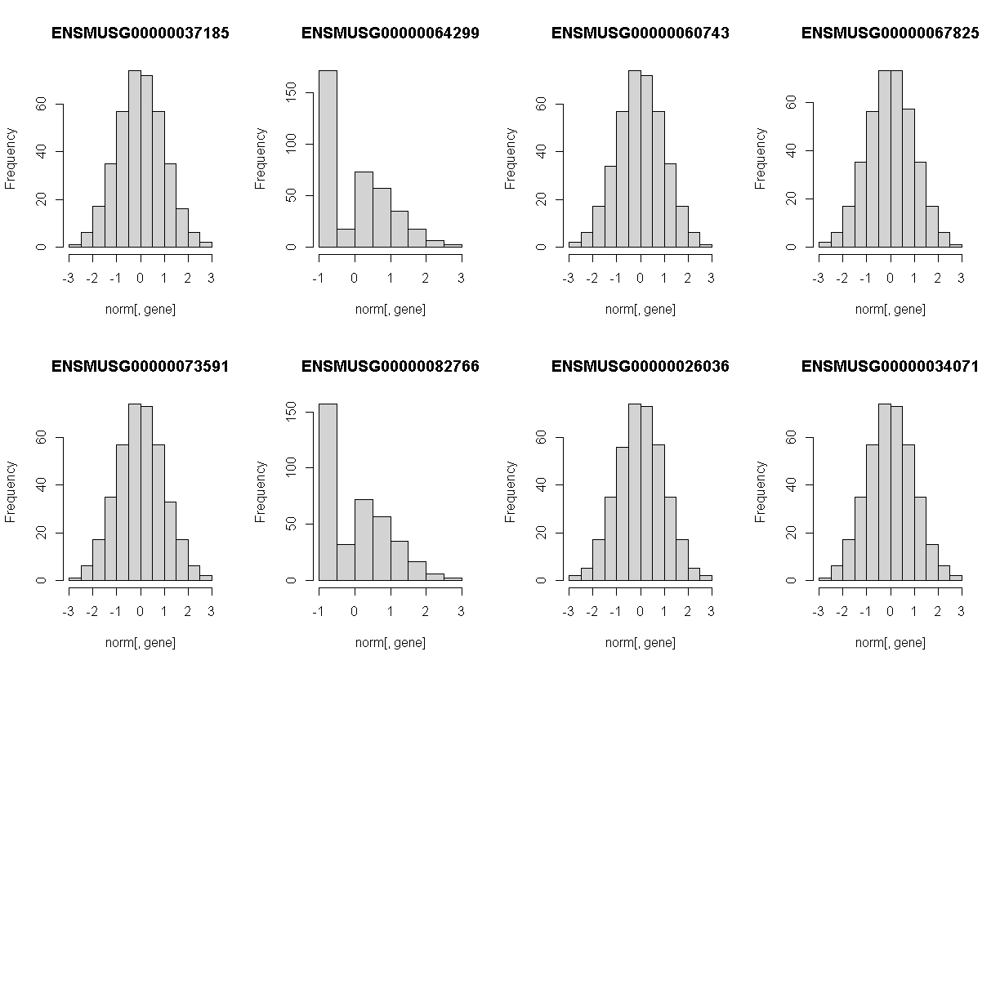

---
# Please do not edit this file directly; it is auto generated.
# Instead, please edit 06-map-many-eqtls.md in _episodes_rmd/
title: "Mapping Many Gene Expression Traits"
teaching: 30
exercises: 30
questions:
- "How do I map many genes?"
objectives:
- "To map several genes at the same time"
source: Rmd
---

### Load Libraries  

~~~
library(tidyverse)
library(knitr)
library(broom)
library(qtl2)
library(qtl2ggplot)
library(RColorBrewer)

source("../code/gg_transcriptome_map.R")
~~~
{: .language-r}

~~~
Error in library(AnnotationHub): there is no package called 'AnnotationHub'
~~~
{: .error}

~~~
source("../code/qtl_heatmap.R")
~~~
{: .language-r}

Before we begin this lesson, we need to create another directory called `results` in our main directory.  You can do this by clicking on the "Files" tab and navigate into the main directory.  Then select "New Folder" and name it "results".

### Load Data

~~~
# expression data
load("../data/attie_DO500_expr.datasets.RData")

# data from paper
load("../data/dataset.islet.rnaseq.RData")

# phenotypes
load("../data/attie_DO500_clinical.phenotypes.RData")

# mapping data
load("../data/attie_DO500_mapping.data.RData")

# genotype probabilities
probs = readRDS("../data/attie_DO500_genoprobs_v5.rds")
~~~
{: .language-r}

### Data Selection

For this lesson, lets choose a random set of 50 gene expression phenotypes.

~~~
genes = colnames(norm)

sams <- sample(length(genes), 50, replace = FALSE, prob = NULL)
genes <- genes[sams]

gene.info <- dataset.islet.rnaseq$annots[genes,]
rownames(gene.info) = NULL
kable(gene.info)
~~~
{: .language-r}

|gene_id            |symbol        |chr |      start|        end| strand|     middle|nearest.marker.id |biotype        |module        |hotspot |
|:------------------|:-------------|:---|----------:|----------:|------:|----------:|:-----------------|:--------------|:-------------|:-------|
|ENSMUSG00000026896 |Ifih1         |2   |  62.595798|  62.646255|     -1|  62.621026|2_62604221        |protein_coding |magenta       |NA      |
|ENSMUSG00000019945 |1700040L02Rik |10  |  68.430953|  68.541896|     -1|  68.486424|10_68436555       |protein_coding |brown         |NA      |
|ENSMUSG00000004896 |Rrnad1        |3   |  87.922601|  87.930717|     -1|  87.926659|3_87914369        |protein_coding |red           |NA      |
|ENSMUSG00000071036 |Gm10309       |17  |  86.497732|  86.505232|     -1|  86.501482|17_86503807       |protein_coding |grey          |NA      |
|ENSMUSG00000035186 |Ubd           |17  |  37.193892|  37.196095|      1|  37.194994|17_37070613       |protein_coding |magenta       |NA      |
|ENSMUSG00000030560 |Ctsc          |7   |  88.278085|  88.310888|      1|  88.294486|7_88272997        |protein_coding |cyan          |NA      |
|ENSMUSG00000097773 |Gm10614       |8   | 120.589531| 120.593801|      1| 120.591666|8_120581689       |lincRNA        |brown         |NA      |
|ENSMUSG00000043602 |Zfp3          |11  |  70.764209|  70.772928|      1|  70.768568|11_70772323       |protein_coding |turquoise     |NA      |
|ENSMUSG00000046876 |Atxn1         |13  |  45.549758|  45.964991|     -1|  45.757374|13_45764991       |protein_coding |red           |NA      |
|ENSMUSG00000045757 |Zfp764        |7   | 127.403668| 127.406822|     -1| 127.405245|7_127400553       |protein_coding |turquoise     |NA      |
|ENSMUSG00000005873 |Reep5         |18  |  34.344889|  34.373415|     -1|  34.359152|18_34371004       |protein_coding |darkmagenta   |NA      |
|ENSMUSG00000020523 |Fam114a2      |11  |  57.482993|  57.518617|     -1|  57.500805|11_57509394       |protein_coding |brown         |NA      |
|ENSMUSG00000021179 |Nrde2         |12  | 100.125452| 100.159653|     -1| 100.142552|12_100194506      |protein_coding |brown         |NA      |
|ENSMUSG00000027709 |Mccc1         |3   |  35.959312|  36.000678|     -1|  35.979995|3_35942371        |protein_coding |tan           |NA      |
|ENSMUSG00000041544 |Ptchd2        |4   | 148.240264| 148.287965|     -1| 148.264114|4_148259313       |protein_coding |greenyellow   |NA      |
|ENSMUSG00000050201 |Otop2         |11  | 115.307163| 115.332303|      1| 115.319733|11_115309983      |protein_coding |red           |NA      |
|ENSMUSG00000009640 |Dmap1         |4   | 117.674681| 117.682273|     -1| 117.678477|4_117691147       |protein_coding |turquoise     |NA      |
|ENSMUSG00000028111 |Ctsk          |3   |  95.499286|  95.509362|      1|  95.504324|3_95516024        |protein_coding |cyan          |NA      |
|ENSMUSG00000071107 |4732465J04Rik |10  |  95.792571|  95.794980|      1|  95.793776|10_95847015       |protein_coding |grey          |NA      |
|ENSMUSG00000091747 |D17H6S56E-5   |17  |  34.996736|  35.000958|     -1|  34.998847|17_35002329       |protein_coding |grey          |NA      |
|ENSMUSG00000084024 |Gm15937       |15  |   5.208913|   5.210147|      1|   5.209530|15_5074889        |pseudogene     |grey          |NA      |
|ENSMUSG00000084858 |Gm1980        |2   | 176.298827| 176.302568|      1| 176.300698|2_176320517       |pseudogene     |turquoise     |NA      |
|ENSMUSG00000028088 |Fmo5          |3   |  97.628804|  97.655282|      1|  97.642043|3_97515759        |protein_coding |grey          |NA      |
|ENSMUSG00000040177 |2310057M21Rik |7   | 131.342718| 131.362698|     -1| 131.352708|7_131353393       |protein_coding |red           |NA      |
|ENSMUSG00000059040 |Gm5506        |18  |  48.045335|  48.048378|      1|  48.046856|18_48051112       |protein_coding |grey          |NA      |
|ENSMUSG00000036499 |Eea1          |10  |  95.940663|  96.045518|      1|  95.993090|10_95950217       |protein_coding |pink          |NA      |
|ENSMUSG00000086191 |1110035M17Rik |11  |  95.700106|  95.712754|     -1|  95.706430|11_95789085       |antisense      |grey          |NA      |
|ENSMUSG00000073400 |Trim10        |17  |  36.869574|  36.877825|      1|  36.873700|17_37069438       |protein_coding |grey          |NA      |
|ENSMUSG00000047631 |Apof          |10  | 128.267997| 128.270151|      1| 128.269074|10_128282522      |protein_coding |magenta       |NA      |
|ENSMUSG00000040856 |Dlk1          |12  | 109.452823| 109.463336|      1| 109.458080|12_109457270      |protein_coding |steelblue     |NA      |
|ENSMUSG00000031372 |Trex2         |X   |  73.433705|  73.435344|     -1|  73.434524|X_73411737        |protein_coding |grey          |NA      |
|ENSMUSG00000096912 |Gm9046        |10  | 118.342011| 118.343255|     -1| 118.342633|10_118370173      |pseudogene     |grey          |NA      |
|ENSMUSG00000028194 |Ddah1         |3   | 145.758675| 145.894277|      1| 145.826476|3_145854045       |protein_coding |greenyellow   |NA      |
|ENSMUSG00000024902 |Mrpl11        |19  |   4.962306|   4.966995|      1|   4.964650|19_4978110        |protein_coding |salmon        |NA      |
|ENSMUSG00000040447 |Spns2         |11  |  72.451638|  72.489904|     -1|  72.470771|11_72471305       |protein_coding |orange        |NA      |
|ENSMUSG00000031023 |Akip1         |7   | 109.703690| 109.712189|      1| 109.707940|7_109618242       |protein_coding |tan           |NA      |
|ENSMUSG00000013495 |Tmem175       |5   | 108.629770| 108.647770|      1| 108.638770|5_108630809       |protein_coding |grey          |NA      |
|ENSMUSG00000026077 |Npas2         |1   |  39.193731|  39.363234|      1|  39.278482|1_39264881        |protein_coding |royalblue     |NA      |
|ENSMUSG00000039512 |Uhrf1bp1      |17  |  27.856490|  27.900040|      1|  27.878265|17_27845090       |protein_coding |skyblue       |NA      |
|ENSMUSG00000093418 |Vmn1r-ps50    |7   |  10.604765|  10.605138|     -1|  10.604952|7_10720577        |pseudogene     |grey          |NA      |
|ENSMUSG00000086189 |Gm15462       |3   |  30.686085|  30.692366|      1|  30.689226|3_30701554        |antisense      |grey          |NA      |
|ENSMUSG00000022801 |Lrch3         |16  |  32.914100|  33.015647|      1|  32.964874|16_32852323       |protein_coding |red           |NA      |
|ENSMUSG00000099081 |TUG1_4        |11  |   3.644776|   3.644952|     -1|   3.644864|11_3719355        |misc_RNA       |grey          |NA      |
|ENSMUSG00000027175 |Tcp11l1       |2   | 104.657288| 104.712169|     -1| 104.684728|2_104701016       |protein_coding |grey          |NA      |
|ENSMUSG00000005338 |Cadm3         |1   | 173.334254| 173.367695|     -1| 173.350974|1_173374205       |protein_coding |paleturquoise |NA      |
|ENSMUSG00000026944 |Abca2         |2   |  25.428703|  25.448540|      1|  25.438622|2_25350212        |protein_coding |black         |NA      |
|ENSMUSG00000082675 |Gm6382        |X   | 142.210884| 142.211825|      1| 142.211354|X_142062063       |pseudogene     |grey          |NA      |
|ENSMUSG00000034349 |Smc4          |3   |  69.004738|  69.034623|      1|  69.019680|3_68955604        |protein_coding |green         |NA      |
|ENSMUSG00000024330 |Col11a2       |17  |  34.039437|  34.066685|      1|  34.053061|17_34105743       |protein_coding |yellow        |NA      |
|ENSMUSG00000031995 |St14          |9   |  31.089402|  31.131853|     -1|  31.110628|9_31102709        |protein_coding |grey          |NA      |

### Expression Data

Lets check the distribution for the first 20 gene expression phenotypes. If you would like to check the distribution of all 50 genes, change `for(gene in genes[1:20])` in the code below to `for(gene in genes)`.

~~~
par(mfrow=c(3,4))
for(gene in genes[1:20]){
  hist(norm[,gene], main = gene)
  }
~~~
{: .language-r}

Check the distributions.  Do they all have a normal distribution?

You will notice that the distribtion of some genes are skewed to the left.  This means that that only a small amount of samples have data and therefore, will need to be removed. 

~~~
limit = nrow(norm) * 0.25

genes0 = which(as.numeric(colSums(counts[,genes] == 0)) > limit) 

genes <- genes[-genes0]
~~~
{: .language-r}

### The Marker Map  

We are using the same marker map as in the previous [lesson](https://smcclatchy.github.io/gene-expression-qtl/04-review-mapping-steps/index.html#the-marker-map)

### Genotype probabilities  

We have explored this earlier in th previous [lesson](https://smcclatchy.github.io/gene-expression-qtl/04-review-mapping-steps/index.html#genotype-probabilities).  But, as a reminder, we have already calculated genotype probabilities which we loaded above called `probs`.  This contains the 8 state genotype probabilities using the 69k grid  map of the same 500 DO mice that also have clinical phenotypes. 

### [Kinship Matrix](https://smcclatchy.github.io/mapping/04-calc-kinship/)

We have explored the kinship matrix in the previous [lesson](https://smcclatchy.github.io/gene-expression-qtl/04-review-mapping-steps/index.html#kinship-matrix). It has already been calculated and loaded in above. 

### Covariates    

Now let's add the necessary covariates. For these 50 gene expression data, we will correct for `DOwave`,`sex` and `diet_days`.

~~~
###merging covariate data and expression data to test for sex, wave and diet_days.

cov.counts <- merge(covar, norm[,genes], by=c("row.names"), sort=F)

#testing covairates on expression data

tmp = cov.counts %>%
        dplyr::select(mouse, sex, DOwave, diet_days, names(cov.counts[,genes])) %>%
        gather(expression, value, -mouse, -sex, -DOwave, -diet_days) %>%
        group_by(expression) %>%
        nest()
mod_fxn = function(df) {
  lm(value ~ sex + DOwave + diet_days, data = df)
}
tmp = tmp %>%
  mutate(model = map(data, mod_fxn)) %>%
  mutate(summ = map(model, tidy)) %>%
  unnest(summ) 
#  kable(tmp, caption = "Effects of Sex, Wave & Diet Days on Expression")

tmp

tmp %>%
  filter(term != "(Intercept)") %>%
  mutate(neg.log.p = -log10(p.value)) %>%
  ggplot(aes(term, neg.log.p)) +
    geom_point() +
    facet_wrap(~expression, ncol=10) +
    labs(title = "Significance of Sex, Wave & Diet Days on Expression") +
    theme(axis.text.x = element_text(angle = 90, hjust = 1, vjust = 0.5)) +
rm(tmp)

We can see that `DOwave` is the most significant.  However, given that a few are influenced by `sex` and `diet_days`, we will have to correct for those as well. 
~~~
{: .language-r}

~~~
# convert sex and DO wave (batch) to factors
pheno_clin$sex = factor(pheno_clin$sex)
pheno_clin$DOwave = factor(pheno_clin$DOwave)
pheno_clin$diet_days = factor(pheno_clin$DOwave)

covar = model.matrix(~sex + DOwave + diet_days, data = pheno_clin)
~~~
{: .language-r}

### [Performing a genome scan](https://smcclatchy.github.io/mapping/06-perform-genome-scan/) 

Now lets perform the genome scan!  We are also going to save our qtl results in an `Rdata` file to be used in further lessons. 

### QTL Scans

~~~
qtl.file = "../results/gene.norm_qtl_cis.trans.Rdata"

if(file.exists(qtl.file)) {
  load(qtl.file)
  } else {
    qtl = scan1(genoprobs = probs, 
                pheno = norm[,genes, drop = FALSE],
                kinship = K, 
                addcovar = covar, 
                cores = 2)
    save(qtl, file = qtl.file)
    }
~~~
{: .language-r}

~~~
Warning in gzfile(file, "wb"): cannot open compressed file '../results/
gene.norm_qtl_cis.trans.Rdata', probable reason 'Invalid argument'
~~~
{: .warning}

~~~
Error in gzfile(file, "wb"): cannot open the connection
~~~
{: .error}

### QTL plots

Let's plot the first 20 gene expression phenotypes.  If you would like to plot all 50, change `for(i in 1:20)` in the code below to `for(i in 1:ncol(qtl))`.

~~~
par(mfrow=c(3,4))
for(i in 1:20) {
  plot_scan1(x = qtl, 
             map = map, 
             lodcolumn = i, 
             main = colnames(qtl)[i])
  abline(h = 6, col = 2, lwd = 2)
  }
~~~
{: .language-r}

### QTL Peaks

We are also going to save our peak results so we can use these again else where.  First, lets get out peaks with a LOD score greater than 6. 

~~~
lod_threshold = 6
peaks = find_peaks(scan1_output = qtl, 
                   map = map, 
                   threshold = lod_threshold, 
                   peakdrop = 4, 
                   prob = 0.95)
~~~
{: .language-r}

We will save these peaks into a csv file. 

~~~
kable(peaks %>% 
        dplyr::select(-lodindex) %>% 
        arrange(chr, pos), caption = "Expression QTL (eQTL) Peaks with LOD >= 6")

write_csv(peaks, "../results/gene.norm_qtl_peaks_cis.trans.csv")
~~~
{: .language-r}

Table: Phenotype QTL Peaks with LOD >= 6

|lodcolumn          |chr |        pos|       lod|      ci_lo|      ci_hi|
|:------------------|:---|----------:|---------:|----------:|----------:|
|ENSMUSG00000071036 |1   |  34.453134|  6.823950|  33.894837|  42.487510|
|ENSMUSG00000097773 |1   |  68.915096|  7.144020|  66.339374|  71.002575|
|ENSMUSG00000021179 |2   |  19.863404|  6.043825|  17.915688|  70.935438|
|ENSMUSG00000026944 |2   |  20.611809| 13.566712|  20.513027|  25.666402|
|ENSMUSG00000026896 |2   |  62.655510| 16.231326|  61.308551|  62.655686|
|ENSMUSG00000019945 |2   |  72.077418|  6.609965|  17.713445| 169.289664|
|ENSMUSG00000027175 |2   | 104.621679| 50.191450| 104.414731| 105.094878|
|ENSMUSG00000027175 |2   | 164.027702|  6.279857| 163.025166| 166.407404|
|ENSMUSG00000084858 |2   | 175.550761| 15.183984| 175.069664| 178.813387|
|ENSMUSG00000024330 |2   | 180.122688| 18.297458| 180.070157| 181.081025|
|ENSMUSG00000005873 |3   |  27.757301|  6.888111|  24.470199| 101.248940|
|ENSMUSG00000027709 |3   |  35.928964| 29.472383|  35.928964|  36.447890|
|ENSMUSG00000034349 |3   |  68.723766| 19.284559|  67.709984|  69.422795|
|ENSMUSG00000027709 |3   |  71.762287|  6.524142|  70.032233|  73.569331|
|ENSMUSG00000004896 |3   |  90.438761| 10.350234|  89.393239|  92.660692|
|ENSMUSG00000028111 |3   |  95.288924| 47.693584|  94.410481|  95.517834|
|ENSMUSG00000028088 |3   |  97.245786| 68.275259|  97.205850|  97.515759|
|ENSMUSG00000009640 |4   | 114.632990|  9.406023| 114.608979| 118.953013|
|ENSMUSG00000028088 |4   | 144.746067|  6.789470| 143.398009| 144.927354|
|ENSMUSG00000041544 |4   | 148.155114| 21.161487| 145.681071| 148.644546|
|ENSMUSG00000059040 |4   | 150.213906| 85.775900| 150.085500| 150.493742|
|ENSMUSG00000040177 |4   | 155.995635|  6.461446|  54.767810| 156.496071|
|ENSMUSG00000041544 |5   |  34.331827|  6.269063|  33.483618|  36.732553|
|ENSMUSG00000028088 |5   |  70.277460|  7.603730|  66.515301|  71.871223|
|ENSMUSG00000036499 |5   |  73.913619|  6.291045|  71.872446| 132.647919|
|ENSMUSG00000013495 |5   | 110.453343| 13.235675| 108.703183| 110.529160|
|ENSMUSG00000005338 |5   | 138.225635|  9.246434| 137.006393| 138.733765|
|ENSMUSG00000047631 |5   | 145.106694|  6.016810| 128.491640| 147.221814|
|ENSMUSG00000022801 |5   | 146.696722|  6.225219| 143.824436| 147.551736|
|ENSMUSG00000040177 |5   | 147.221814|  6.510247| 144.395332| 147.284644|
|ENSMUSG00000009640 |6   |  37.779408|  6.210923|  34.760495| 145.471673|
|ENSMUSG00000036499 |6   |  53.519017|  6.224551|  47.163125| 147.369914|
|ENSMUSG00000086189 |6   | 136.669787|  6.760585|  24.730440| 138.638711|
|ENSMUSG00000040856 |7   |  44.020771|  6.949809|  43.400566|  46.280163|
|ENSMUSG00000026896 |7   |  45.441513|  6.513153|  44.618941| 143.416023|
|ENSMUSG00000043602 |7   |  45.504585|  6.368756|  41.466542| 132.161829|
|ENSMUSG00000071107 |7   |  46.280163|  8.306678|  45.051425|  46.280163|
|ENSMUSG00000030560 |7   |  88.234655| 16.207132|  87.823302|  89.034143|
|ENSMUSG00000031023 |7   | 109.618242| 20.434282| 109.276592| 109.843736|
|ENSMUSG00000045757 |7   | 128.558835|  8.684539| 126.077753| 129.583639|
|ENSMUSG00000020523 |7   | 131.931228|  7.289675| 131.551983| 143.856368|
|ENSMUSG00000047631 |7   | 142.217766|  7.396587| 140.103758| 142.453894|
|ENSMUSG00000020523 |8   |  87.707235|  6.311776|  22.614071|  91.878629|
|ENSMUSG00000040856 |8   |  89.343160|  6.530668|  89.064180|  92.612190|
|ENSMUSG00000005873 |8   | 102.780994|  6.946524|  65.006863| 114.998152|
|ENSMUSG00000084858 |8   | 111.620769|  6.440191| 110.756372| 112.510627|
|ENSMUSG00000097773 |8   | 120.734871| 27.110734| 120.580478| 121.153935|
|ENSMUSG00000071107 |8   | 127.845139|  7.423220| 127.375906| 128.184685|
|ENSMUSG00000031995 |9   |  31.418320| 69.834240|  31.336078|  31.702544|
|ENSMUSG00000031995 |9   |  42.687202|  9.474048|  41.433921|  42.948280|
|ENSMUSG00000031372 |9   |  44.133775|  6.142056|  42.951772|  45.128094|
|ENSMUSG00000097773 |9   |  60.132733|  7.110794|  56.717040|  60.219539|
|ENSMUSG00000013495 |9   |  99.812810|  6.206744|  74.056275| 102.010035|
|ENSMUSG00000021179 |10  |  21.129321|  6.208863|  20.835881|  23.149354|
|ENSMUSG00000019945 |10  |  68.436555| 36.340070|  68.296752|  68.551295|
|ENSMUSG00000019945 |10  |  68.966184| 32.570583|  68.966184|  69.226915|
|ENSMUSG00000036499 |10  |  95.603798| 12.923954|  95.579331|  96.123731|
|ENSMUSG00000026896 |10  | 114.936720|  7.012803| 114.216395| 120.637041|
|ENSMUSG00000047631 |10  | 128.214230| 45.790343| 128.000237| 128.580052|
|ENSMUSG00000024330 |11  |  20.939938|  6.756598|   6.203862|  31.393072|
|ENSMUSG00000020523 |11  |  38.191935|  6.045038|  37.579995|  44.146098|
|ENSMUSG00000020523 |11  |  57.908990| 37.987338|  57.449816|  58.045870|
|ENSMUSG00000043602 |11  |  70.750402|  8.642857|  69.810287|  78.993273|
|ENSMUSG00000040447 |11  |  73.629401|  8.499816|  69.829176|  77.670110|
|ENSMUSG00000050201 |11  | 115.385104|  8.994922| 114.754290| 115.453870|
|ENSMUSG00000028088 |12  |  16.603119|  8.043020|  16.003042|  21.264897|
|ENSMUSG00000024902 |12  |  90.135792|  6.705443|  89.359501|  90.143008|
|ENSMUSG00000040856 |12  | 109.446956| 11.407821| 109.008168| 110.095992|
|ENSMUSG00000030560 |12  | 113.120585|  8.886539| 112.530069| 113.172991|
|ENSMUSG00000026077 |13  |  31.716878|  6.447233|  28.960280| 112.530500|
|ENSMUSG00000040856 |13  |  37.755078|  6.628854|  19.119778|  39.967180|
|ENSMUSG00000040856 |13  |  53.082596|  6.313128|  51.882813| 119.075762|
|ENSMUSG00000050201 |13  | 110.609526|  7.026386|  49.373360| 115.043552|
|ENSMUSG00000004896 |14  |  70.747575|  6.543100|  68.719978| 107.662887|
|ENSMUSG00000009640 |14  |  73.334815|  6.597747|  66.657026|  75.714255|
|ENSMUSG00000084024 |15  |   5.074889|  6.530398|   3.000000|   7.764726|
|ENSMUSG00000040177 |15  |  77.385675|  6.279492|  76.112162|  81.505996|
|ENSMUSG00000039512 |15  |  84.885882|  6.669282|  82.973207|  85.471236|
|ENSMUSG00000040856 |15  |  86.536242|  6.711175|  75.581790|  87.436117|
|ENSMUSG00000021179 |16  |  86.844872|  6.935500|  61.698213|  87.745455|
|ENSMUSG00000039512 |17  |  27.973229| 18.088685|  27.465127|  28.051583|
|ENSMUSG00000091747 |17  |  29.386387| 20.287723|  29.057679|  31.020114|
|ENSMUSG00000041544 |17  |  31.342886|  8.008980|  27.314134|  41.973770|
|ENSMUSG00000024330 |17  |  34.180166| 16.562685|  33.902544|  34.180942|
|ENSMUSG00000091747 |17  |  34.982579| 84.359720|  34.961498|  35.011942|
|ENSMUSG00000073400 |17  |  37.069438| 18.543768|  36.592715|  41.953736|
|ENSMUSG00000091747 |17  |  40.946231| 33.910741|  40.946231|  41.973770|
|ENSMUSG00000020523 |17  |  77.583898|  6.750453|  69.236971|  78.307724|
|ENSMUSG00000071036 |17  |  86.938012| 12.007999|  86.173056|  87.082700|
|ENSMUSG00000036499 |17  |  87.846998|  6.446688|  87.577455|  88.670823|
|ENSMUSG00000050201 |18  |   4.320108|  6.143894|   3.000000|  17.657266|
|ENSMUSG00000028194 |18  |  13.372739|  6.956632|  11.068080|  14.396241|
|ENSMUSG00000005873 |18  |  34.192080| 29.863020|  34.063704|  34.576246|
|ENSMUSG00000084024 |18  |  35.893188|  6.372961|  33.806951|  78.711871|
|ENSMUSG00000024902 |19  |   4.996241| 14.790494|   4.628265|   5.860626|
|ENSMUSG00000024902 |19  |  25.069550|  6.316469|  24.383620|  44.606158|
|ENSMUSG00000086189 |19  |  36.150671| 12.208861|  34.928124|  36.662639|
|ENSMUSG00000047631 |X   |  36.173268|  7.160162|  20.835587|  50.784033|
|ENSMUSG00000022801 |X   |  73.409621|  6.163122|  37.757258| 139.740103|
|ENSMUSG00000031372 |X   |  73.531646| 36.125171|  73.304859|  73.643471|
|ENSMUSG00000028194 |X   | 130.445969|  6.735256| 128.682833| 164.383559|
|ENSMUSG00000031995 |X   | 144.829680|  6.625055| 139.456973| 164.404709|

~~~
Error: Cannot open file for writing:
* '../results/gene.norm_qtl_peaks_cis.trans.csv'
~~~
{: .error}

### QTL Peaks Figure

~~~
qtl_heatmap(qtl = qtl, map = map, low.thr = 3.5)
~~~
{: .language-r}

> ## Challenge
> What do the qtl scans for all gene exression traits look like? *Note:* Don't worry, we've done the qtl scans for you!!!
> You can read in this file, `../data/gene.norm_qtl_all.genes.Rdata`, which are the `scan1` results for all gene expression traits. 
>
> > ## Solution
> > 
> > 
> > ~~~
> > load("../data/gene.norm_qtl_all.genes.Rdata")
> > 
> > lod_threshold = 6
> > peaks = find_peaks(scan1_output = qtl, 
> >                map = map, 
> >                threshold = lod_threshold, 
> >                peakdrop = 4, 
> >                prob = 0.95)
> > write_csv(peaks, "../results/gene.norm_qtl_all.genes_peaks.csv")
> > 
> > ## Heat Map
> > qtl_heatmap(qtl = qtl, map = map, low.thr = 3.5)
> > ~~~
> > {: .language-r}
> {: .solution}
{: .challenge}
