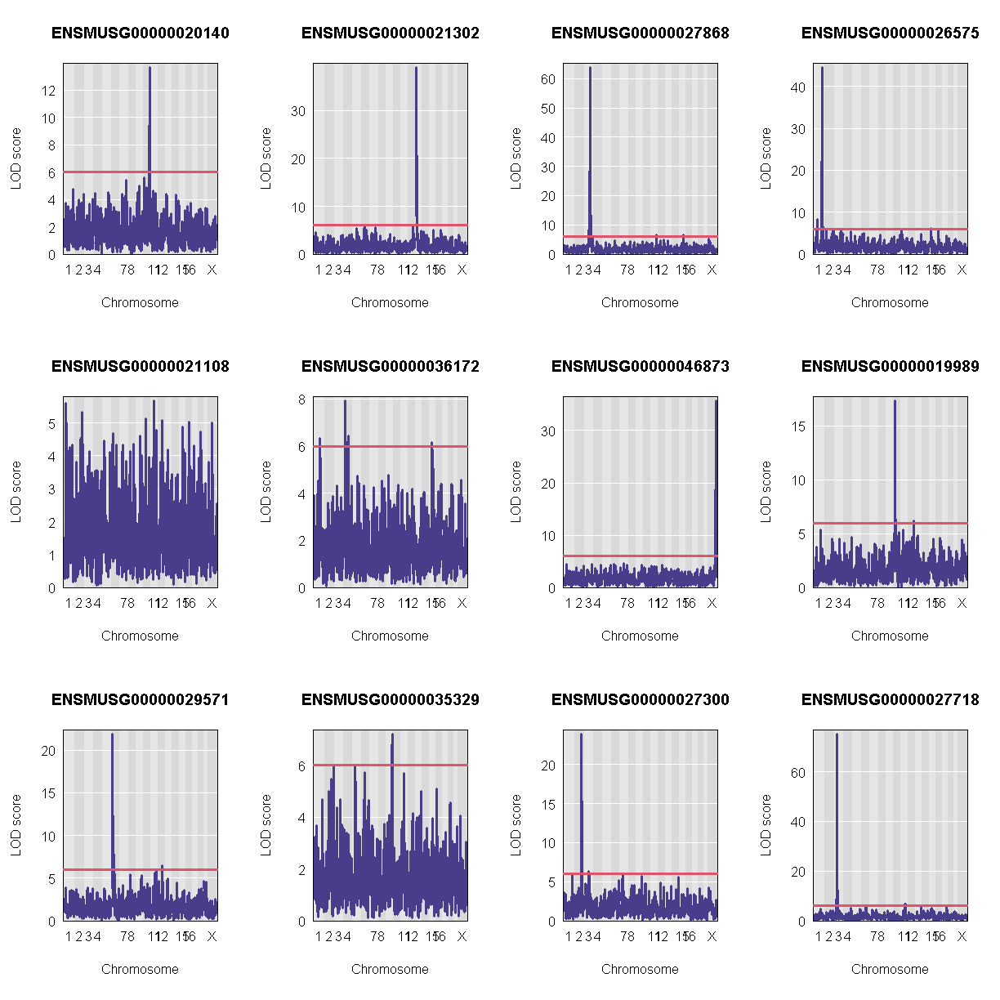

---
# Please do not edit this file directly; it is auto generated.
# Instead, please edit 06-map-many-eqtls.md in _episodes_rmd/
title: "Mapping Many Gene Expression Traits"
teaching: 30
exercises: 30
questions:
- "How do I map many genes?"
objectives:
- "To map several genes at the same time"
source: Rmd
---

### Load Libraries  

For this lesson, we need to install two more libraries and load them.  You can do this by typing the following code:

~~~
BiocManager::install(c("AnnotationHub","rtracklayer"))
~~~
{: .language-r}

Let's install our libraries, and source two other R scripts.

~~~
library(tidyverse)
library(knitr)
library(broom)
library(qtl2)
library(qtl2ggplot)
library(RColorBrewer)

source("../code/gg_transcriptome_map.R")
source("../code/qtl_heatmap.R")
~~~
{: .language-r}

Before we begin this lesson, we need to create another directory called `results` in our main directory.  You can do this by clicking on the "Files" tab and navigate into the main directory.  Then select "New Folder" and name it "results".

### Load Data

~~~
# expression data
load("../data/attie_DO500_expr.datasets.RData")

# data from paper
load("../data/dataset.islet.rnaseq.RData")

# phenotypes
load("../data/attie_DO500_clinical.phenotypes.RData")

# mapping data
load("../data/attie_DO500_mapping.data.RData")

# genotype probabilities
probs = readRDS("../data/attie_DO500_genoprobs_v5.rds")
~~~
{: .language-r}

### Data Selection

For this lesson, lets choose a random set of 50 gene expression phenotypes.

~~~
genes = colnames(norm)

sams <- sample(length(genes), 50, replace = FALSE, prob = NULL)
genes <- genes[sams]

gene.info <- dataset.islet.rnaseq$annots[genes,]
rownames(gene.info) = NULL
kable(gene.info[1:10,])
~~~
{: .language-r}

|gene_id            |symbol  |chr |     start|       end| strand|    middle|nearest.marker.id |biotype        |module      |hotspot |
|:------------------|:-------|:---|---------:|---------:|------:|---------:|:-----------------|:--------------|:-----------|:-------|
|ENSMUSG00000071713 |Csf2rb  |15  |  78.32599|  78.35100|      1|  78.33849|15_78454291       |protein_coding |darkorange  |NA      |
|ENSMUSG00000081281 |Gm6274  |X   |  36.66822|  36.66901|      1|  36.66862|X_36633623        |pseudogene     |grey        |NA      |
|ENSMUSG00000094151 |Gm7233  |14  |  43.17987|  43.18799|      1|  43.18393|14_43250273       |protein_coding |grey        |NA      |
|ENSMUSG00000062014 |Gmfb    |14  |  46.80815|  46.82224|     -1|  46.81520|14_46817858       |protein_coding |green       |NA      |
|ENSMUSG00000027313 |Chac1   |2   | 119.35123| 119.35438|      1| 119.35281|2_119169488       |protein_coding |skyblue     |NA      |
|ENSMUSG00000030653 |Pde2a   |7   | 101.42169| 101.51283|      1| 101.46726|7_101608964       |protein_coding |lightyellow |NA      |
|ENSMUSG00000035580 |Kcnh8   |17  |  52.60271|  52.97919|      1|  52.79095|17_52790159       |protein_coding |turquoise   |NA      |
|ENSMUSG00000080772 |Gm12543 |4   |  59.83368|  59.83422|      1|  59.83395|4_59832197        |pseudogene     |grey        |NA      |
|ENSMUSG00000018446 |C1qbp   |11  |  70.97784|  70.98303|     -1|  70.98043|11_71120660       |protein_coding |darkred     |NA      |
|ENSMUSG00000018593 |Sparc   |11  |  55.39450|  55.42008|     -1|  55.40729|11_55409101       |protein_coding |lightyellow |NA      |

### Expression Data

Lets check the distribution for the first 20 gene expression phenotypes. If you would like to check the distribution of all 50 genes, change `for(gene in genes[1:20])` in the code below to `for(gene in genes)`.

~~~
par(mfrow=c(3,4))
for(gene in genes[1:20]){
  hist(norm[,gene], main = gene)
  }
~~~
{: .language-r}

Check the distributions.  Do they all have a normal distribution?

You will notice that the distribtion of some genes are skewed to the left.  This means that that only a small amount of samples have data and therefore, will need to be removed.  A suitable qc would be keeping expression data that have at least 5% of that samples with more than 10 reads.

~~~
genes_qc <- which(as.numeric(colSums(counts[,genes] > 10)) >= 0.05 * nrow(counts[,genes]))
genes <- genes[genes_qc]
~~~
{: .language-r}

### The Marker Map  

We are using the same marker map as in the previous [lesson](https://smcclatchy.github.io/gene-expression-qtl/04-review-mapping-steps/index.html#the-marker-map)

### Genotype probabilities  

We have explored this earlier in th previous [lesson](https://smcclatchy.github.io/gene-expression-qtl/04-review-mapping-steps/index.html#genotype-probabilities).  But, as a reminder, we have already calculated genotype probabilities which we loaded above called `probs`.  This contains the 8 state genotype probabilities using the 69k grid  map of the same 500 DO mice that also have clinical phenotypes. 

### [Kinship Matrix](https://smcclatchy.github.io/mapping/04-calc-kinship/)

We have explored the kinship matrix in the previous [lesson](https://smcclatchy.github.io/gene-expression-qtl/04-review-mapping-steps/index.html#kinship-matrix). It has already been calculated and loaded in above. 

### Covariates    

Now let's add the necessary covariates. For these 50 gene expression data, we will correct for `DOwave`,`sex` and `diet_days`.

~~~
# convert sex and DO wave (batch) to factors
pheno_clin$sex = factor(pheno_clin$sex)
pheno_clin$DOwave = factor(pheno_clin$DOwave)
pheno_clin$diet_days = factor(pheno_clin$DOwave)

covar = model.matrix(~sex + DOwave + diet_days, data = pheno_clin)
~~~
{: .language-r}

### [Performing a genome scan](https://smcclatchy.github.io/mapping/06-perform-genome-scan/) 

Now lets perform the genome scan!  We are also going to save our qtl results in an `Rdata` file to be used in further lessons. 

### QTL Scans

~~~
qtl.file = "../results/gene.norm_qtl_cis.trans.Rdata"

if(file.exists(qtl.file)) {
  load(qtl.file)
  } else {
    qtl = scan1(genoprobs = probs, 
                pheno = norm[,genes, drop = FALSE],
                kinship = K, 
                addcovar = covar, 
                cores = 2)
    save(qtl, file = qtl.file)
    }
~~~
{: .language-r}

### QTL plots

Let's plot the first 20 gene expression phenotypes.  If you would like to plot all 50, change `for(i in 1:20)` in the code below to `for(i in 1:ncol(qtl))`.

~~~
par(mfrow=c(3,4))
for(i in 1:20) {
  plot_scan1(x = qtl, 
             map = map, 
             lodcolumn = i, 
             main = colnames(qtl)[i])
  abline(h = 6, col = 2, lwd = 2)
  }
~~~
{: .language-r}

### QTL Peaks

We are also going to save our peak results so we can use these again else where.  First, lets get out peaks with a LOD score greater than 6. 

~~~
lod_threshold = 6
peaks = find_peaks(scan1_output = qtl, 
                   map = map, 
                   threshold = lod_threshold, 
                   peakdrop = 4, 
                   prob = 0.95)
~~~
{: .language-r}

We will save these peaks into a csv file. 

~~~
kable(peaks[1:10,] %>% 
        dplyr::select(-lodindex) %>% 
        arrange(chr, pos), caption = "Expression QTL (eQTL) Peaks with LOD >= 6")

write_csv(peaks, "../results/gene.norm_qtl_peaks_cis.trans.csv")
~~~
{: .language-r}

Table: Phenotype QTL Peaks with LOD >= 6

|lodcolumn          |chr |       pos|       lod|     ci_lo|     ci_hi|
|:------------------|:---|---------:|---------:|---------:|---------:|
|ENSMUSG00000025997 |1   |  71.28936| 11.463933| 70.865231|  72.27892|
|ENSMUSG00000022946 |2   | 156.69942|  6.296416| 63.818489| 161.18852|
|ENSMUSG00000028468 |4   |  43.55901| 25.706600| 43.554301|  44.07278|
|ENSMUSG00000022946 |6   |  38.46705|  6.335678| 31.584037| 140.17979|
|ENSMUSG00000022946 |9   | 116.84036|  6.306425|  6.279555| 116.94145|
|ENSMUSG00000097828 |13  |  79.49712|  7.430048| 75.694789|  81.28496|
|ENSMUSG00000097828 |13  |  99.50293| 87.073387| 99.275890|  99.51644|
|ENSMUSG00000022871 |16  |  15.25272| 14.349866| 14.327274|  15.91839|
|ENSMUSG00000022946 |16  |  93.84631| 14.974706| 93.707536|  93.91750|
|ENSMUSG00000025997 |X   |  97.40981|  6.399558|  7.169823| 100.36223|

### QTL Peaks Figure

~~~
qtl_heatmap(qtl = qtl, map = map, low.thr = 3.5)
~~~
{: .language-r}

> ## Challenge
> What do the qtl scans for all gene exression traits look like? *Note:* Don't worry, we've done the qtl scans for you!!!
> You can read in this file, `../data/gene.norm_qtl_all.genes.Rdata`, which are the `scan1` results for all gene expression traits. 
>
> > ## Solution
> > 
> > 
> > ~~~
> > load("../data/gene.norm_qtl_all.genes.Rdata")
> > 
> > lod_threshold = 6
> > peaks = find_peaks(scan1_output = qtl.all, 
> >                map = map, 
> >                threshold = lod_threshold, 
> >                peakdrop = 4, 
> >                prob = 0.95)
> > write_csv(peaks, "../results/gene.norm_qtl_all.genes_peaks.csv")
> > 
> > ## Heat Map
> > qtl_heatmap(qtl = qtl, map = map, low.thr = 3.5)
> > ~~~
> > {: .language-r}
> {: .solution}
{: .challenge}
