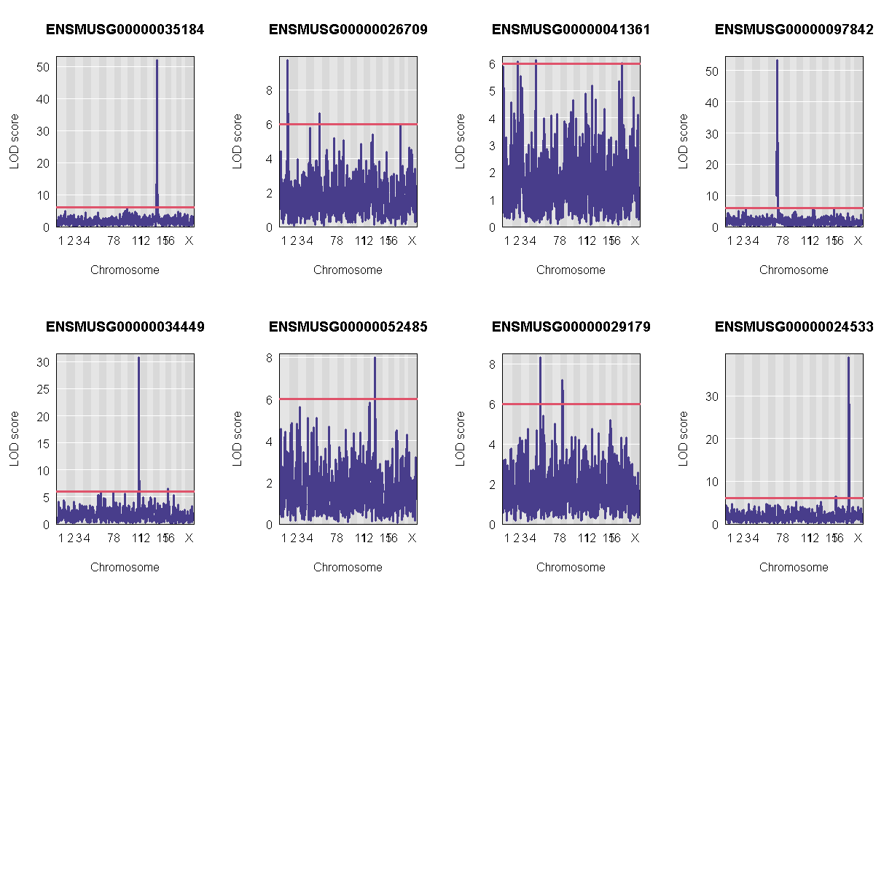

---
# Please do not edit this file directly; it is auto generated.
# Instead, please edit 06-map-many-eqtls.md in _episodes_rmd/
title: "Mapping Many Gene Expression Traits"
teaching: 30
exercises: 30
questions:
- "How do I map many genes?"
objectives:
- "To map several genes at the same time"
source: Rmd
---

### Load Libraries  

For this lesson, we need to install two more libraries and load them.  You can do this by typing the following code:

~~~
BiocManager::install(c("AnnotationHub","rtracklayer"))
~~~
{: .language-r}

Let's install our libraries, and source two other R scripts.

~~~
library(tidyverse)
library(knitr)
library(broom)
library(qtl2)
library(qtl2ggplot)
library(RColorBrewer)

source("../code/gg_transcriptome_map.R")
source("../code/qtl_heatmap.R")
~~~
{: .language-r}

Before we begin this lesson, we need to create another directory called `results` in our main directory.  You can do this by clicking on the "Files" tab and navigate into the main directory.  Then select "New Folder" and name it "results".

### Load Data

~~~
# expression data
load("../data/attie_DO500_expr.datasets.RData")

# data from paper
load("../data/dataset.islet.rnaseq.RData")

# phenotypes
load("../data/attie_DO500_clinical.phenotypes.RData")

# mapping data
load("../data/attie_DO500_mapping.data.RData")

# genotype probabilities
probs = readRDS("../data/attie_DO500_genoprobs_v5.rds")
~~~
{: .language-r}

### Data Selection

For this lesson, lets choose a random set of 50 gene expression phenotypes.

~~~
genes = colnames(norm)

sams <- sample(length(genes), 50, replace = FALSE, prob = NULL)
genes <- genes[sams]

gene.info <- dataset.islet.rnaseq$annots[genes,]
rownames(gene.info) = NULL
kable(gene.info[1:10,])
~~~
{: .language-r}

|gene_id            |symbol    |chr |      start|        end| strand|     middle|nearest.marker.id |biotype        |module    |hotspot |
|:------------------|:---------|:---|----------:|----------:|------:|----------:|:-----------------|:--------------|:---------|:-------|
|ENSMUSG00000008892 |Vdac3     |8   |  22.577075|  22.593813|     -1|  22.585444|8_22593439        |protein_coding |salmon    |NA      |
|ENSMUSG00000066693 |Gm7493    |1   |   8.962996|   8.963621|     -1|   8.963308|1_8951236         |pseudogene     |grey      |NA      |
|ENSMUSG00000078139 |AK157302  |13  |  21.495223|  21.497146|      1|  21.496184|13_21428754       |protein_coding |grey      |NA      |
|ENSMUSG00000041748 |Ackr4     |9   | 104.084157| 104.102560|     -1| 104.093358|9_104099717       |protein_coding |grey      |NA      |
|ENSMUSG00000000903 |Vpreb3    |10  |  75.943057|  75.949657|      1|  75.946357|10_75867786       |protein_coding |grey      |NA      |
|ENSMUSG00000046916 |Myct1     |10  |   5.593728|   5.606787|      1|   5.600258|10_5600518        |protein_coding |grey      |NA      |
|ENSMUSG00000025933 |Tmem14a   |1   |  21.218575|  21.230167|      1|  21.224371|1_21191742        |protein_coding |grey      |NA      |
|ENSMUSG00000023051 |Tarbp2    |15  | 102.518192| 102.523676|      1| 102.520934|15_102568068      |protein_coding |lightcyan |NA      |
|ENSMUSG00000058443 |Rpl10-ps3 |9   |  50.344240|  50.344981|     -1|  50.344610|9_50343295        |protein_coding |salmon    |NA      |
|ENSMUSG00000032602 |Slc25a20  |9   | 108.662098| 108.684641|      1| 108.673370|9_108728707       |protein_coding |brown     |NA      |

### Expression Data

Lets check the distribution for the first 20 gene expression phenotypes. If you would like to check the distribution of all 50 genes, change `for(gene in genes[1:20])` in the code below to `for(gene in genes)`.

~~~
par(mfrow=c(3,4))
for(gene in genes[1:20]){
  hist(norm[,gene], main = gene)
  }
~~~
{: .language-r}

Check the distributions.  Do they all have a normal distribution?

You will notice that the distribtion of some genes are skewed to the left.  This means that that only a small amount of samples have data and therefore, will need to be removed.  A suitable qc would be keeping expression data that have at least 5% of the samples with more than 10 reads.

~~~
genes_qc <- which(as.numeric(colSums(counts[,genes] > 10)) >= 0.05 * nrow(counts[,genes]))
genes <- genes[genes_qc]
~~~
{: .language-r}

### The Marker Map  

We are using the same marker map as in the previous [lesson](https://smcclatchy.github.io/gene-expression-qtl/04-review-mapping-steps/index.html#the-marker-map)

### Genotype probabilities  

We have explored this earlier in th previous [lesson](https://smcclatchy.github.io/gene-expression-qtl/04-review-mapping-steps/index.html#genotype-probabilities).  But, as a reminder, we have already calculated genotype probabilities which we loaded above called `probs`.  This contains the 8 state genotype probabilities using the 69k grid  map of the same 500 DO mice that also have clinical phenotypes. 

### [Kinship Matrix](https://smcclatchy.github.io/mapping/04-calc-kinship/)

We have explored the kinship matrix in the previous [lesson](https://smcclatchy.github.io/gene-expression-qtl/04-review-mapping-steps/index.html#kinship-matrix). It has already been calculated and loaded in above. 

### Covariates    

Now let's add the necessary covariates. For these 50 gene expression data, we will correct for `DOwave`,`sex` and `diet_days`.

~~~
# convert sex and DO wave (batch) to factors
pheno_clin$sex = factor(pheno_clin$sex)
pheno_clin$DOwave = factor(pheno_clin$DOwave)
pheno_clin$diet_days = factor(pheno_clin$DOwave)

covar = model.matrix(~sex + DOwave + diet_days, data = pheno_clin)[,-1]
~~~
{: .language-r}

### [Performing a genome scan](https://smcclatchy.github.io/mapping/06-perform-genome-scan/) 

Now lets perform the genome scan!  We are also going to save our qtl results in an `Rdata` file to be used in further lessons.  We will not perform permutations in this lesson as it will take too long.  Instead we will use 6, which is the LOD score used in the paper to determine significance.

### QTL Scans

~~~
qtl.file = "../results/gene.norm_qtl_cis.trans.Rdata"

if(file.exists(qtl.file)) {
  load(qtl.file)
  } else {
    qtl = scan1(genoprobs = probs, 
                pheno = norm[,genes, drop = FALSE],
                kinship = K, 
                addcovar = covar, 
                cores = 2)
    save(qtl, file = qtl.file)
    }
~~~
{: .language-r}

### QTL plots

Let's plot the first 20 gene expression phenotypes.  If you would like to plot all 50, change `for(i in 1:20)` in the code below to `for(i in 1:ncol(qtl))`.

~~~
par(mfrow=c(3,4))
for(i in 1:20) {
  plot_scan1(x = qtl, 
             map = map, 
             lodcolumn = i, 
             main = colnames(qtl)[i])
  abline(h = 6, col = 2, lwd = 2)
  }
~~~
{: .language-r}

### QTL Peaks

We are also going to save our peak results so we can use these again else where.  First, lets get out peaks with a LOD score greater than 6. 

~~~
lod_threshold = 6
peaks = find_peaks(scan1_output = qtl, 
                   map = map, 
                   threshold = lod_threshold, 
                   peakdrop = 4, 
                   prob = 0.95)
~~~
{: .language-r}

We will save these peaks into a csv file. 

~~~
kable(peaks[1:10,] %>% 
        dplyr::select(-lodindex) %>% 
        arrange(chr, pos), caption = "Expression QTL (eQTL) Peaks with LOD >= 6")

write_csv(peaks, "../results/gene.norm_qtl_peaks_cis.trans.csv")
~~~
{: .language-r}

Table: Phenotype QTL Peaks with LOD >= 6

|lodcolumn          |chr |       pos|       lod|      ci_lo|     ci_hi|
|:------------------|:---|---------:|---------:|----------:|---------:|
|ENSMUSG00000026575 |1   |  58.22118|  8.209107|  57.626420|  59.24670|
|ENSMUSG00000026575 |1   | 159.09013| 27.718407| 156.733003| 159.16100|
|ENSMUSG00000026575 |1   | 164.84588| 44.516456| 163.460361| 164.85502|
|ENSMUSG00000027868 |3   |  92.66069| 28.519024|  91.152799|  92.68765|
|ENSMUSG00000027868 |3   |  98.14651| 63.870847|  98.144249|  99.88818|
|ENSMUSG00000020140 |10  | 115.85360| 13.645956| 115.451100| 115.89945|
|ENSMUSG00000027868 |11  | 106.62472|  6.454471|   9.144667| 107.71252|
|ENSMUSG00000021302 |13  |  14.93271| 39.030453|  13.564744|  14.93875|
|ENSMUSG00000026575 |15  |  12.40748|  6.070807|   9.260173|  18.72732|
|ENSMUSG00000027868 |15  |  66.27724|  6.502607|  65.853995|  67.86561|

### QTL Peaks Figure

~~~
qtl_heatmap(qtl = qtl, map = map, low.thr = 3.5)
~~~
{: .language-r}

> ## Challenge
> What do the qtl scans for all gene exression traits look like? *Note:* Don't worry, we've done the qtl scans for you!!!
> You can read in this file, `../data/gene.norm_qtl_all.genes.Rdata`, which are the `scan1` results for all gene expression traits. 
>
> > ## Solution
> > 
> > 
> > ~~~
> > load("../data/gene.norm_qtl_all.genes.Rdata")
> > 
> > lod_threshold = 6
> > peaks = find_peaks(scan1_output = qtl.all, 
> >                map = map, 
> >                threshold = lod_threshold, 
> >                peakdrop = 4, 
> >                prob = 0.95)
> > write_csv(peaks, "../results/gene.norm_qtl_all.genes_peaks.csv")
> > 
> > ## Heat Map
> > qtl_heatmap(qtl = qtl, map = map, low.thr = 3.5)
> > ~~~
> > {: .language-r}
> {: .solution}
{: .challenge}
