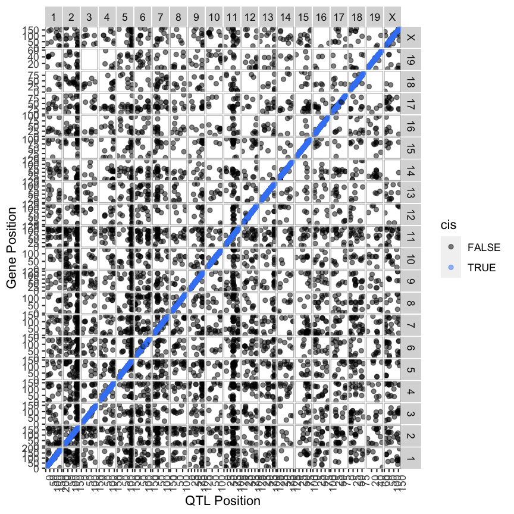
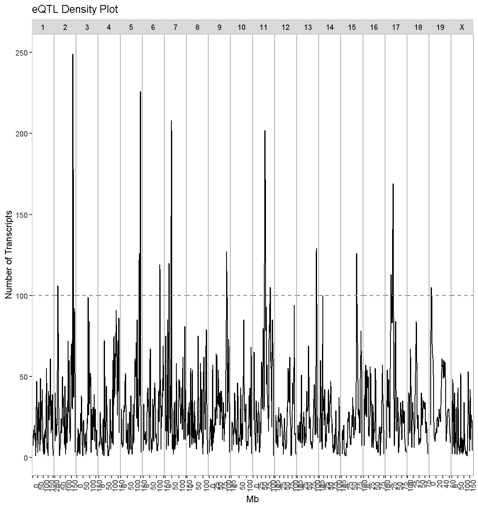
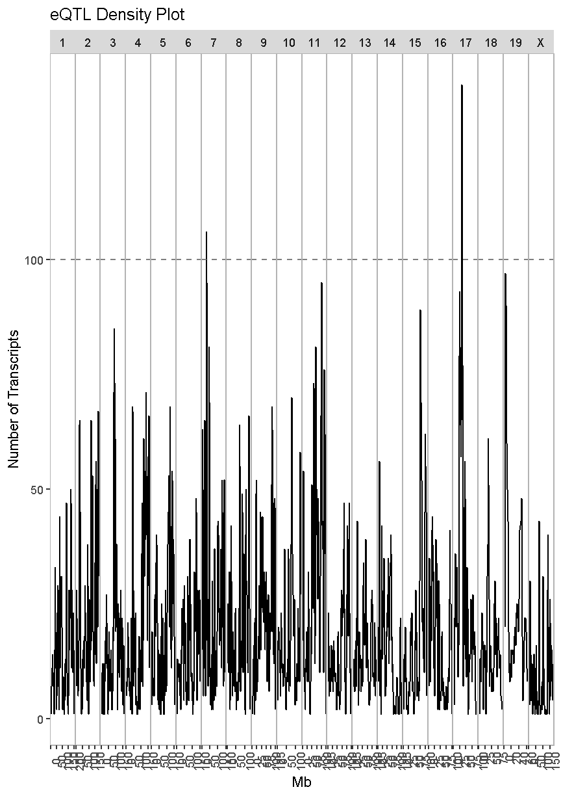
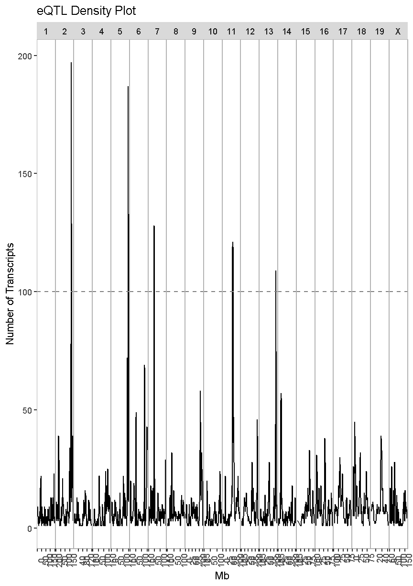

---
# Please do not edit this file directly; it is auto generated.
# Instead, please edit 08-full-transcriptome-map.md in _episodes_rmd/
title: "Transcriptome Map of cis and trans eQTL"
teaching: 10
exercises: 20
questions:
- "How do I create a full transcriptome map?"
objectives:
- 
keypoints:
- "."
source: Rmd
---

### Load Libraries  

~~~
library(tidyverse)
library(qtl2)
library(knitr)
library(RColorBrewer)
library(qtl2ggplot)

source("../code/gg_transcriptome_map.R")
~~~
{: .language-r}

## Load Data

Load in the RNA-seq eQTL mapping results.

~~~
##loading previous results
load("../data/dataset.islet.rnaseq.RData")
~~~
{: .language-r}

Next, we need to format the column names of our eQTL results to that the `ggtmap` function can use the results.

~~~
lod_summary = dataset.islet.rnaseq$lod.peaks

# Get gene positions.
ensembl <- get_ensembl_genes()
df <- data.frame(ensembl    = ensembl$gene_id, 
                 gene_chr   = seqnames(ensembl), 
                 gene_start = start(ensembl) * 1e-6, 
                 gene_end   = end(ensembl)   * 1e-6,
                 stringsAsFactors = F)

# Create eQTL table for transcriptome map function.
lod_summary <- lod_summary %>% 
                 rename(annot.id  = "ensembl",
                        chrom     = "qtl_chr",
                        pos       = "qtl_pos",
                        lod       = "qtl_lod") %>% 
                 left_join(df, by = "ensembl") %>% 
                 mutate(marker.id = str_c(qtl_chr, qtl_pos * 1e6, sep = "_"),
                        gene_chr  = factor(gene_chr, levels = c(1:19, "X")),
                        qtl_chr   = factor(qtl_chr, levels = c(1:19, "X"))) %>% 
                 mutate(cis = if_else(qtl_chr == gene_chr & abs(gene_start - qtl_pos) < 4, "cis", "trans"))

rm(df)
~~~
{: .language-r}

### Plot Transcriptome Map

In the previous lesson, we mapped the QTL locations of 50 genes. In this lesson, we will map the QTL positions of 39958 genes.

~~~
ggtmap(data = lod_summary %>% filter(qtl_lod >= 7.18), cis.points = TRUE, cis.radius = 4)
~~~
{: .language-r}

This transcriptome map is definitely a lot more crowded than the one in the previous lesson. Again, the gene locations are shown on the X-axis and the QTL locations are shown on the Y-axis.

> ## Challenge
> What patterns among the points do you see in the transcriptome map?
>
> > ## Solution
> > 
> > There are at least two patterns. One is the dense diagonal line of cis-eQTL. The other is the increased
> > density of QTL in vertical lines.
> {: .solution}
{: .challenge}

> ## Challenge
> What would a vertical band in the transcriptome map mean?
>
> > ## Solution
> > 
> > A vertical band indicates that one locus regulates the expression of many genes. 
> {: .solution}
{: .challenge}

> ## Challenge
> What would a horizontal band in the transcriptome map mean?
>
> > ## Solution
> > 
> > A horizontal band would mean that one gene has strong QTL on many chromosomes. While one gene might be regulated by more than one locus, it is unlikely that dozens of loci would have strong QTL for one gene. So a horizontal band would mean that there is a problem with the data. 
> {: .solution}
{: .challenge}

Look at the transcriptome map. How many vertical bands do you see and which chromosomes are they on?

### QTL Density Plot

In the transcriptome map above, we noticed vertical banding patterns in the eQTL, which indicate that one locus may regulate the expression of dozens of genes. How many genes are regulated by each locus and which genes are they? In order to address this question, we need to make a plot of the density of eQTL along the genome. This is like stacking up the eQTL onto the X-axis.

We have provided a function to do this in the "gg_transcriptome_map.R" file in the "code" directory of this lesson. The function is called `eqtl_density_plot` and takes the following arguments:

* data: data.frame (or tibble) with the following columns:
    * ensembl: (required) character string containing the Ensembl gene ID.
    * qtl_chr: (required) character string containing QTL chromsome.
    * qtl_pos: (required) floating point number containing the QTL position in Mb.
    * qtl_lod: (optional) floating point number containing the LOD score.
    * gene_chr:  (optional) character string containing transcript chromosome.
    * gene_start: (optional) character string containing transcript start postion in Mb.
    * gene_end:  (optional) character string containing transcript end position in Mb.
* lod_thr: numeric value that is the LOD above which QTL will be retained. Default = 7.

This function has been designed to use the same data structure as we used to create the transcriptome map. First, we will look at the overall QTL density for all peaks with LOD > 7.18.

~~~
eqtl_density_plot(data = lod_summary, lod_thr = 7.18)
~~~
{: .language-r}

~~~
`summarise()` has grouped output by 'qtl_chr'. You can override using
the `.groups` argument.
`summarise()` has grouped output by 'qtl_chr'. You can override using
the `.groups` argument.
`summarise()` has grouped output by 'qtl_chr'. You can override using
the `.groups` argument.
`summarise()` has grouped output by 'qtl_chr'. You can override using
the `.groups` argument.
~~~
{: .output}

There are clearly some loci that have an enrichment of eQTL. We have drawn a dashed line at "100" as an aribtrary cutoff as a potential cutoff to use when selecting peaks.

Compare this plot with the transcriptome map, in which we saw vertical bands of eQTL. Do the peaks in the eQTL density plot match the bands in the transcriptome map? 

Next, we will look at the locations of the cis-eQTL. We must also select a LOD threshold. We will use 7.18 since this is what was used in the Keller et al. paper.

~~~
eqtl_density_plot(data = filter(lod_summary, cis == "cis"), lod_thr = 7.18)
~~~
{: .language-r}

~~~
`summarise()` has grouped output by 'qtl_chr'. You can override using
the `.groups` argument.
`summarise()` has grouped output by 'qtl_chr'. You can override using
the `.groups` argument.
`summarise()` has grouped output by 'qtl_chr'. You can override using
the `.groups` argument.
`summarise()` has grouped output by 'qtl_chr'. You can override using
the `.groups` argument.
~~~
{: .output}

In the plot above, there are many loci that have many genes associated with their expression. Some loci have over 100 genes associated with them. For example, there is a locus on chromosome 17 that may regulate over 100 genes. In this case, we are looking at cis-eQTL, QTL which are co-located with the gene. What might this mean biologically? Perhaps there is a mutation which causes a region of chromatin to open, which leads to increased expression of a set of genes. This increased expression may have biological consequences. 

Next, we will create an eQTL density plot of the trans-eQTL. These are QTL for which the gene and QTL are far from each other.

~~~
eqtl_density_plot(data = filter(lod_summary, cis == "trans"), lod_thr = 7.18)
~~~
{: .language-r}

~~~
`summarise()` has grouped output by 'qtl_chr'. You can override using
the `.groups` argument.
`summarise()` has grouped output by 'qtl_chr'. You can override using
the `.groups` argument.
`summarise()` has grouped output by 'qtl_chr'. You can override using
the `.groups` argument.
`summarise()` has grouped output by 'qtl_chr'. You can override using
the `.groups` argument.
~~~
{: .output}

In this case, we see much taller peaks than in the cis-eQTL density plot and these peaks match the ones in the overall eQTL density plot. 

There are many potential explanations for a trans-eQTL band. There may be a polymorphism in a transcription factor which alters the expression of many other genes. Or there may be a polymorphism that alters an amino acid and prevents it from binding properly to another protein in a signalling cascade. Biologists are often interested in these trans-eQTL bands, which are called "eQTL hotspots". A set of over 100 genes with differential expression between  genotypes may help us to understand the biology behind variation in higher level phenotypes. It is also possible that one of the genes with a cis-eQTL under the eQTL hotspot regulates the expression of the remaining hotspot genes.

## Islet RNASeq eQTL Hotspots

### Select eQTL Hotspots

There are several decisions to make when selecting eQTL hotspots. What LOD threshold should you use to select the genes that comprise hotspots? What number of genes should you use as a threshold to call a peak an eQTL hotspot? In this case, the authors select a LOD of 7.18 and decided that 100 trans-regulated genes was a useful threshold. 

> TBD: Add references for eQTL module selection. Possibly augment lesson?

In order to identify eQTL hotspots, we will look at the density of trans-eQTL along the genome using the [density](https://www.rdocumentation.org/packages/stats/versions/3.6.2/topics/density) function. We will filter to retain QTL with LOD > 7.8 and will get the position on each chromosome with the highest density of eQTL.

~~~
qtl_dens = lod_summary %>%
             filter(qtl_lod > 7.18 & cis == 'trans') %>% 
             group_by(qtl_chr) %>% 
             summarize(dens_x = density(qtl_pos, adjust = 0.1)$x,
                       dens_y = density(qtl_pos, adjust = 0.1)$y) %>% 
             slice_max(dens_y, n = 1)
~~~
{: .language-r}

~~~
`summarise()` has grouped output by 'qtl_chr'. You can override using
the `.groups` argument.
~~~
{: .output}

~~~
qtl_dens
~~~
{: .language-r}

~~~
# A tibble: 20 × 3
# Groups:   qtl_chr [20]
   qtl_chr dens_x dens_y
   <fct>    <dbl>  <dbl>
 1 1         40.0 0.0178
 2 2        164.  0.0797
 3 3        100.  0.0213
 4 4        136.  0.0246
 5 5        147.  0.114 
 6 6        125.  0.0530
 7 7         45.7 0.117 
 8 8         34.0 0.0420
 9 9        108.  0.0581
10 10       121.  0.0384
11 11        71.5 0.162 
12 12       113.  0.0626
13 13       112.  0.129 
14 14        19.6 0.0890
15 15        76.3 0.0765
16 16        57.0 0.0448
17 17        31.3 0.0442
18 18        12.1 0.0616
19 19        37.8 0.159 
20 X         50.4 0.0256
~~~
{: .output}

In the table above, there is one row per chromosome. 'x' is the position on each chromosome with the highest density of eQTL. 'y' is the density, which we needed to obtain the 'x' position but is not used further.

Now that we have the location of maximum eQTL density on each chromosome, we will count the number of eQTL within +/- 2 Mb of the center.

~~~
hotspots = left_join(lod_summary, select(qtl_dens, qtl_chr, dens_x)) %>% 
             filter(qtl_lod > 7.18 & cis == 'trans') %>% 
             mutate(pos_diff = abs(dens_x - qtl_pos)) %>% 
             filter(pos_diff <= 2) %>% 
             select(-pos_diff) %>% 
             rename(dens_x = 'center')
~~~
{: .language-r}

~~~
Joining, by = "qtl_chr"
~~~
{: .output}

~~~
head(hotspots)
~~~
{: .language-r}

~~~
             ensembl   marker.id qtl_chr   qtl_pos   qtl_lod gene_chr
1 ENSMUSG00000037933 5_147253583       5 147.25358  8.581871       13
2 ENSMUSG00000037944 16_57539943      16  57.53994  7.496052       11
3 ENSMUSG00000037966 6_125504286       6 125.50429  9.288287       13
4 ENSMUSG00000037996 9_108975487       9 108.97549  8.870252        4
5 ENSMUSG00000038009 2_164027702       2 164.02770 13.722130       15
6 ENSMUSG00000038011 11_72996574      11  72.99657  8.085680        5
  gene_start  gene_end   cis    center
1   49.34158  49.38703 trans 147.17681
2   99.14420  99.15508 trans  57.03061
3   49.18748  49.19624 trans 125.27843
4   86.98312  87.23048 trans 108.41948
5   99.09317  99.10474 trans 163.96464
6  124.72508 124.83431 trans  71.47168
~~~
{: .output}

Now that we have a list of genes near the position of highest eQTL density on each chromosome, we can count the number of genes in each potential hotspot and retain the ones containing more than 100 genes.

~~~
hotspots = hotspots %>% 
             count(qtl_chr, center) %>% 
             filter(n >= 100)
kable(hotspots, caption = "Islet trans-eQTL hotspots")
~~~
{: .language-r}

Table: Islet trans-eQTL hotspots

|qtl_chr |    center|   n|
|:-------|---------:|---:|
|2       | 163.96464| 197|
|5       | 147.17681| 136|
|7       |  45.74287| 125|
|11      |  71.47168| 163|
|13      | 112.17218| 108|

### Chr 11 eQTL Hotspot

From this analysis, we have identified five eQTL hotspots. Due to time constraints, we will not examine all of them in depth. We will look at the chromosome 11 eQTL hotspot in greater depth. It contains 163 trans-eQTL. First, we will get all of the genes with an eQTL in within +/- 2 Mb of the chromosome 11 eQTL hotspot.

~~~
chr11_mid =  hotspots %>% 
               filter(qtl_chr == '11') %>% 
               pull(center)
chr11_eqtl = lod_summary %>% 
               filter(qtl_lod >  7.18 & 
                      qtl_chr == '11' & 
                      abs(chr11_mid - qtl_pos) < 2 &
                      !is.na(cis))
~~~
{: .language-r}

Next, we will filter to retain the cis-eQTL in the same interval. It is possible that one or more genes near 71.5 Mb on chromosome 11 have a cis-eQTL, which in turn alters the expression of the trans-eQTL genes.

~~~
chr11_cis = chr11_eqtl %>% 
              filter(cis == 'cis')
kable(chr11_cis, caption = 'Chr 11 cis-eQTL')
~~~
{: .language-r}

Table: Chr 11 cis-eQTL

|ensembl            |marker.id   |qtl_chr |  qtl_pos|    qtl_lod|gene_chr | gene_start| gene_end|cis |
|:------------------|:-----------|:-------|--------:|----------:|:--------|----------:|--------:|:---|
|ENSMUSG00000038046 |11_73111862 |11      | 73.11186|   9.418198|11       |   76.24371| 76.25062|cis |
|ENSMUSG00000038195 |11_71859513 |11      | 71.85951|  22.038342|11       |   75.51009| 75.51317|cis |
|ENSMUSG00000038268 |11_73171837 |11      | 73.17184|  73.706247|11       |   75.17594| 75.17884|cis |
|ENSMUSG00000038351 |11_73111862 |11      | 73.11186|  10.562423|11       |   74.84926| 74.89706|cis |
|ENSMUSG00000040483 |11_72314268 |11      | 72.31427|  52.999651|11       |   72.30163| 72.31373|cis |
|ENSMUSG00000040554 |11_72040688 |11      | 72.04069|  18.837109|11       |   72.02796| 72.03751|cis |
|ENSMUSG00000040599 |11_71418821 |11      | 71.41882|  38.560032|11       |   71.01961| 71.02737|cis |
|ENSMUSG00000040667 |11_71354568 |11      | 71.35457|  21.371028|11       |   70.94306| 70.96997|cis |
|ENSMUSG00000040746 |11_70750402 |11      | 70.75040|  40.707077|11       |   70.64723| 70.65142|cis |
|ENSMUSG00000040904 |11_71120660 |11      | 71.12066|  13.954750|11       |   70.23521| 70.23983|cis |
|ENSMUSG00000040938 |11_70616235 |11      | 70.61624|  21.419463|11       |   70.21275| 70.21642|cis |
|ENSMUSG00000041165 |11_72512588 |11      | 72.51259|  14.412941|11       |   69.82088| 69.82218|cis |
|ENSMUSG00000041329 |11_69796313 |11      | 69.79631|  13.450483|11       |   69.59974| 69.60594|cis |
|ENSMUSG00000041346 |11_69542556 |11      | 69.54256|  21.965771|11       |   69.56176| 69.58025|cis |
|ENSMUSG00000043602 |11_70750402 |11      | 70.75040|   8.038654|11       |   70.76421| 70.77293|cis |
|ENSMUSG00000044367 |11_70609170 |11      | 70.60917|  14.453236|11       |   70.21679| 70.22106|cis |
|ENSMUSG00000046731 |11_69924127 |11      | 69.92413|  24.173013|11       |   69.87826| 69.88141|cis |
|ENSMUSG00000047284 |11_72989681 |11      | 72.98968|   7.856942|11       |   69.90107| 69.91382|cis |
|ENSMUSG00000050675 |11_71354568 |11      | 71.35457|  43.000217|11       |   70.63912| 70.64204|cis |
|ENSMUSG00000053574 |11_72210521 |11      | 72.21052|  40.827446|11       |   72.21514| 72.21844|cis |
|ENSMUSG00000055670 |11_72601385 |11      | 72.60138|  14.770236|11       |   72.79623| 72.92712|cis |
|ENSMUSG00000057054 |11_69810287 |11      | 69.81029|  20.916548|11       |   70.68836| 70.70015|cis |
|ENSMUSG00000057135 |11_69978753 |11      | 69.97875|  11.966446|11       |   70.79093| 70.81259|cis |
|ENSMUSG00000057778 |11_72944065 |11      | 72.94406|  36.253118|11       |   72.77723| 72.79614|cis |
|ENSMUSG00000059796 |11_69592546 |11      | 69.59255|  24.995852|11       |   69.66694| 69.67242|cis |
|ENSMUSG00000060216 |11_71198629 |11      | 71.19863|  19.656292|11       |   70.43264| 70.44083|cis |
|ENSMUSG00000060600 |11_69978753 |11      | 69.97875|  56.825370|11       |   70.65720| 70.66251|cis |
|ENSMUSG00000069814 |11_73111862 |11      | 73.11186|  14.586188|11       |   74.61961| 74.64152|cis |
|ENSMUSG00000069830 |11_71120660 |11      | 71.12066| 130.829473|11       |   71.09224| 71.14470|cis |
|ENSMUSG00000069835 |11_69768364 |11      | 69.76836|  54.752195|11       |   69.62202| 69.62387|cis |
|ENSMUSG00000070390 |11_69978753 |11      | 69.97875|  11.205844|11       |   71.15310| 71.23073|cis |
|ENSMUSG00000070394 |11_69924127 |11      | 69.92413|   9.059992|11       |   69.83851| 69.83962|cis |
|ENSMUSG00000084139 |11_71793079 |11      | 71.79308|  16.754042|11       |   70.90926| 70.90964|cis |
|ENSMUSG00000085178 |11_69484146 |11      | 69.48415|  14.780695|11       |   69.40151| 69.40270|cis |
|ENSMUSG00000018286 |11_69829176 |11      | 69.82918|  12.644749|11       |   70.52537| 70.52786|cis |
|ENSMUSG00000018442 |11_71354568 |11      | 71.35457|  24.331853|11       |   71.00716| 71.01984|cis |
|ENSMUSG00000018446 |11_71937774 |11      | 71.93777|  13.821042|11       |   70.97784| 70.98303|cis |
|ENSMUSG00000018449 |11_71443287 |11      | 71.44329|  15.495242|11       |   70.97021| 70.97783|cis |
|ENSMUSG00000018451 |11_71120660 |11      | 71.12066|  66.532115|11       |   71.03194| 71.03351|cis |
|ENSMUSG00000018559 |11_69663280 |11      | 69.66328|   8.892792|11       |   69.98116| 69.99060|cis |
|ENSMUSG00000018565 |11_70728481 |11      | 70.72848|  10.131916|11       |   69.96822| 69.98252|cis |
|ENSMUSG00000018566 |11_69876397 |11      | 69.87640|  17.154645|11       |   69.94254| 69.94819|cis |
|ENSMUSG00000086976 |11_69810287 |11      | 69.81029|   9.754274|11       |   70.61121| 70.61321|cis |
|ENSMUSG00000087523 |11_71782692 |11      | 71.78269|   7.895661|11       |   70.65474| 70.65649|cis |
|ENSMUSG00000089876 |11_69484146 |11      | 69.48415|  14.365592|11       |   69.80360| 69.80562|cis |
|ENSMUSG00000018570 |11_69876397 |11      | 69.87640|  10.841222|11       |   69.89735| 69.90099|cis |
|ENSMUSG00000018740 |11_69505599 |11      | 69.50560|   9.305293|11       |   68.96813| 68.97437|cis |
|ENSMUSG00000018750 |11_70785072 |11      | 70.78507|  10.780532|11       |   69.76591| 69.78402|cis |
|ENSMUSG00000018752 |11_69484146 |11      | 69.48415|  19.739891|11       |   69.68258| 69.69610|cis |
|ENSMUSG00000018761 |11_69796313 |11      | 69.79631|  13.644976|11       |   69.65670| 69.66264|cis |
|ENSMUSG00000018765 |11_69810287 |11      | 69.81029|  11.424120|11       |   69.63299| 69.65330|cis |
|ENSMUSG00000018923 |11_71449172 |11      | 71.44917|  10.540510|11       |   70.45192| 70.45373|cis |
|ENSMUSG00000000320 |11_69844926 |11      | 69.84493|  29.387372|11       |   70.24146| 70.25535|cis |
|ENSMUSG00000093989 |11_71429405 |11      | 71.42941|  24.860846|11       |   70.23812| 70.23984|cis |
|ENSMUSG00000019461 |11_73196729 |11      | 73.19673|   7.312520|11       |   69.84638| 69.85206|cis |
|ENSMUSG00000097328 |11_69796313 |11      | 69.79631|  25.915259|11       |   69.68625| 69.69585|cis |
|ENSMUSG00000020783 |11_73079353 |11      | 73.07935|  20.382003|11       |   73.04778| 73.08932|cis |
|ENSMUSG00000020785 |11_73034987 |11      | 73.03499|  15.100649|11       |   73.01901| 73.04207|cis |
|ENSMUSG00000020787 |11_73002626 |11      | 73.00263|   9.314557|11       |   72.99910| 73.01520|cis |
|ENSMUSG00000020788 |11_73111862 |11      | 73.11186|   7.497799|11       |   72.96117| 72.99304|cis |
|ENSMUSG00000020794 |11_72040688 |11      | 72.04069|   9.550537|11       |   72.60728| 72.68648|cis |
|ENSMUSG00000020799 |11_72366456 |11      | 72.36646|  73.157007|11       |   72.34472| 72.36244|cis |
|ENSMUSG00000020801 |11_72210521 |11      | 72.21052|  28.775964|11       |   72.21172| 72.21559|cis |
|ENSMUSG00000020803 |11_71859513 |11      | 71.85951|  12.298288|11       |   72.20755| 72.21001|cis |
|ENSMUSG00000020808 |11_71782692 |11      | 71.78269|   7.709167|11       |   72.04203| 72.04737|cis |
|ENSMUSG00000020811 |11_71782692 |11      | 71.78269|  28.561910|11       |   71.74992| 71.78965|cis |
|ENSMUSG00000020817 |11_71354568 |11      | 71.35457|  11.510839|11       |   70.84478| 70.94311|cis |
|ENSMUSG00000020827 |11_70661194 |11      | 70.66119|  18.670941|11       |   70.56288| 70.61448|cis |
|ENSMUSG00000020828 |11_71354568 |11      | 71.35457|  25.935898|11       |   70.54006| 70.55811|cis |
|ENSMUSG00000020884 |11_70785072 |11      | 70.78507|  10.521628|11       |   70.05409| 70.05789|cis |
|ENSMUSG00000020886 |11_73046018 |11      | 73.04602|   9.613890|11       |   70.01694| 70.04752|cis |
|ENSMUSG00000001583 |11_69837051 |11      | 69.83705| 103.526684|11       |   69.85101| 69.85873|cis |
|ENSMUSG00000005198 |11_69796313 |11      | 69.79631|  10.102583|11       |   69.73400| 69.75864|cis |
|ENSMUSG00000005204 |11_69782339 |11      | 69.78234|  13.126534|11       |   69.67311| 69.68208|cis |
|ENSMUSG00000005947 |11_73079353 |11      | 73.07935|  16.341791|11       |   73.09058| 73.14745|cis |
|ENSMUSG00000005949 |11_73146945 |11      | 73.14695|  20.545167|11       |   73.18360| 73.19904|cis |

As you can see, there are 76 cis-eQTL genes under the chromosome 11 eQTL hotspot. This is a large number of candidate genes to screen. There may be more genes with non-synonymous, splice, or stop mutations under the eQTL hotspot as well. The Sanger Mouse Genomes website has been removed and we are uncertain if it will be replaced. There are two websites where you can find this information:

1. [Ensembl](http://nov2020.archive.ensembl.org/Mus_musculus/Info/Index): Once you search for a gene, you can select the "Variant Table" under "Genetic Variation" in the left navigation panel.
2. [Founder Variant Search](https://churchilllab.jax.org/foundersnps/search): You can use this site to search for variants in specific genes or genomic intervals.

Next, we will get the expression of the genes in the chromosome 11 eQTL hotspot. The expression data is a numeric matrix, so we will use the colnames to filter the genes.

~~~
chr11_genes = dataset.islet.rnaseq$expr[,chr11_eqtl$ensembl]
~~~
{: .language-r}

Next, we will join the eQTL and expression data and write it out to a file. This way you will have all of the data for the hotspot in one place.

~~~
chr11_expr = tibble(ensembl = colnames(chr11_genes),
              data.frame(t(chr11_genes)))
chr11_all = left_join(chr11_eqtl, chr11_expr, by = 'ensembl')

write_csv(chr11_all, file = file.path('../results/', 'chr11_eqtl_genes.csv'))
~~~
{: .language-r}

