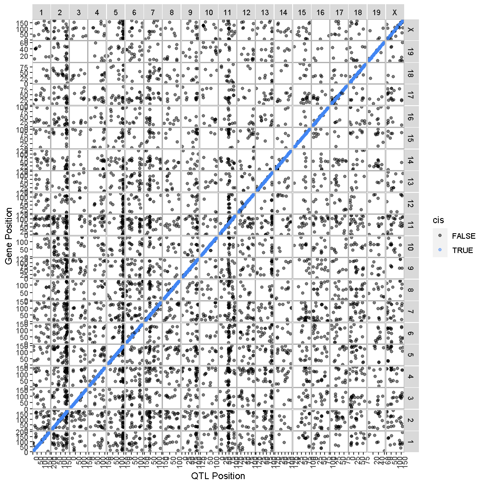

---
# Please do not edit this file directly; it is auto generated.
# Instead, please edit 08-full-transcriptome-map.md in _episodes_rmd/
title: "Transcriptome Map of cis and trans eQTL"
teaching: 10
exercises: 20
questions:
- "How do I create a full transcriptome map?"
objectives:
- 
keypoints:
- "."
source: Rmd
---

### Load Libraries  

~~~
library(tidyverse)
library(qtl2)
library(qtl2convert)
#library(GGally)
#library(broom)
library(knitr)
#library(corrplot)
library(RColorBrewer)
library(qtl2ggplot)

source("../code/gg_transcriptome_map.R")
~~~
{: .language-r}

## Load Data

Load in the RNA-seq eQTL mapping results.

~~~
##loading previous results
load("../data/dataset.islet.rnaseq.RData")
~~~
{: .language-r}

Next, we need to format the column names of our eQTL results to that the `ggtmap` function can use the results.

~~~
lod_summary = dataset.islet.rnaseq$lod.peaks

# Get gene positions.
ensembl <- get_ensembl_genes()
df <- data.frame(ensembl    = ensembl$gene_id, 
                 gene_chr   = seqnames(ensembl), 
                 gene_start = start(ensembl) * 1e-6, 
                 gene_end   = end(ensembl)   * 1e-6,
                 stringsAsFactors = F)

# Create eQTL table for transcriptome map function.
lod_summary <- lod_summary %>% 
                 rename(annot.id  = "ensembl",
                        chrom     = "qtl_chr",
                        pos       = "qtl_pos",
                        lod       = "qtl_lod") %>% 
                 left_join(df, by = "ensembl") %>% 
                 mutate(marker.id = str_c(qtl_chr, qtl_pos * 1e6, sep = "_"),
                        gene_chr  = factor(gene_chr, levels = c(1:19, "X")),
                        qtl_chr   = factor(qtl_chr, levels = c(1:19, "X"))) %>% 
                 mutate(cis = if_else(qtl_chr == gene_chr & abs(gene_start - qtl_pos) < 4, "cis", "trans"))

rm(df)
~~~
{: .language-r}

### Plot Transcriptome Map

In the previous lesson, we mapped the QTL locations of 50 genes. In this lesson, we will map the QTL positions of 39958 genes.

~~~
ggtmap(data = lod_summary %>% filter(qtl_lod >= 7.18), cis.points = TRUE, cis.radius = 4)
~~~
{: .language-r}

This transcriptome map is definitely a lot more crowded than the one in the previous lesson. Again, the gene locations are shown on the X-axis and the QTL locations are shown on the Y-axis. 

> ## Challenge
> What paterns among the points do you see in the transcriptome map?
>
> > ## Solution
> > 
> > There are at least two patterns. One is the dense diagonal line of cis-eQTL. The other is the increased
> > density of QTL in vertical lines.
> {: .solution}
{: .challenge}

> ## Challenge
> What would a horizontal band in the transcriptome map mean?
>
> > ## Solution
> > 
> > A horizontal band would mean that one gene has strong QTL on many chromosomes. While one gene might be regulated by more than one locus, it is unlikely that dozens of loci would have strong QTL for one gene. So a horizontal band would mean that there is a problem with the data. 
> {: .solution}
{: .challenge}

### QTL Density Plot

In the transcriptome map above, we noticed vertical banding patterns in the eQTL, which indicate that one locus may regulate the expression of dozens of genes. How many genes are regulated by each locus and which genes are they? In order to adress this question, we need to make a plot of the density of eQTL along the genome. This is like stacking up the eQTL onto the X-axis.

We have provided a function to do this in the "gg_transcriptome_map.R" file in the "code" directory of this lesson. The function is called `eqtl_density_plot` and takes the following arguments:

> data: data.frame (or tibble) with the following columns:
>       ensembl: (required) character string containing the Ensembl gene ID.
>       qtl_chr: (required) character string containing QTL chromsome.
>       qtl_pos: (required) floating point number containing the QTL position 
>                in Mb.
>       qtl_lod: (optional) floating point number containing the LOD score.
>       gene_chr:  (optional) character string containing transcript chromosome.
>       gene_start: (optional) character string containing transcript start 
>                 postion in Mb.
>       gene_end:  (optional) character string containing transcript end
>                position in Mb.
> lod_thr: numeric value that is the LOD above which QTL will be retained.
>          Default = 7.

This function has been designed to use the same data structure as we used to create the transcriptome map. First, we will look at the locations of the cis-eQTL. We must also select a LOD threshold. We will use 7.18 since this is what was used in the Keller et al. paper.

~~~
eqtl_density_plot(data = filter(lod_summary, cis == "cis"), lod_thr = 7.18)
~~~
{: .language-r}

~~~
`summarise()` has grouped output by 'qtl_chr'. You can override using the
`.groups` argument.
~~~
{: .output}

~~~
Warning: Expected 3 pieces. Additional pieces discarded in 652 rows [1, 2, 3, 4,
5, 6, 7, 8, 9, 10, 11, 12, 13, 14, 15, 16, 17, 18, 19, 20, ...].
~~~
{: .warning}

~~~
`summarise()` has grouped output by 'qtl_chr'. You can override using the
`.groups` argument.
~~~
{: .output}

~~~
Warning: Expected 3 pieces. Additional pieces discarded in 646 rows [1, 2, 3, 4,
5, 6, 7, 8, 9, 10, 11, 12, 13, 14, 15, 16, 17, 18, 19, 20, ...].
~~~
{: .warning}

~~~
`summarise()` has grouped output by 'qtl_chr'. You can override using the
`.groups` argument.
~~~
{: .output}

~~~
Warning: Expected 3 pieces. Additional pieces discarded in 640 rows [1, 2, 3, 4,
5, 6, 7, 8, 9, 10, 11, 12, 13, 14, 15, 16, 17, 18, 19, 20, ...].
~~~
{: .warning}

~~~
`summarise()` has grouped output by 'qtl_chr'. You can override using the
`.groups` argument.
~~~
{: .output}

~~~
Warning: Expected 3 pieces. Additional pieces discarded in 640 rows [1, 2, 3, 4,
5, 6, 7, 8, 9, 10, 11, 12, 13, 14, 15, 16, 17, 18, 19, 20, ...].
~~~
{: .warning}

> TBD: Add interpretion of plot.

Next, we will create an eQTL density plot of the trans-eQTL.

~~~
eqtl_density_plot(data = filter(lod_summary, cis == "trans"), lod_thr = 7.18)
~~~
{: .language-r}

~~~
`summarise()` has grouped output by 'qtl_chr'. You can override using the
`.groups` argument.
~~~
{: .output}

~~~
Warning: Expected 3 pieces. Additional pieces discarded in 612 rows [1, 2, 3, 4,
5, 6, 7, 8, 9, 10, 11, 12, 13, 14, 15, 16, 17, 18, 19, 20, ...].
~~~
{: .warning}

~~~
`summarise()` has grouped output by 'qtl_chr'. You can override using the
`.groups` argument.
~~~
{: .output}

~~~
Warning: Expected 3 pieces. Additional pieces discarded in 617 rows [1, 2, 3, 4,
5, 6, 7, 8, 9, 10, 11, 12, 13, 14, 15, 16, 17, 18, 19, 20, ...].
~~~
{: .warning}

~~~
`summarise()` has grouped output by 'qtl_chr'. You can override using the
`.groups` argument.
~~~
{: .output}

~~~
Warning: Expected 3 pieces. Additional pieces discarded in 615 rows [1, 2, 3, 4,
5, 6, 7, 8, 9, 10, 11, 12, 13, 14, 15, 16, 17, 18, 19, 20, ...].
~~~
{: .warning}

~~~
`summarise()` has grouped output by 'qtl_chr'. You can override using the
`.groups` argument.
~~~
{: .output}

~~~
Warning: Expected 3 pieces. Additional pieces discarded in 611 rows [1, 2, 3, 4,
5, 6, 7, 8, 9, 10, 11, 12, 13, 14, 15, 16, 17, 18, 19, 20, ...].
~~~
{: .warning}

Compare this plot with the transcriptome map, in which we saw vertical bands of eQTL. Do the peaks in the eQTL density plot match the bands in the transcriptome map?

~~~
tmp = lod_summary %>%
        filter(qtl_lod >= 7.18) %>%
        group_by(cis) %>%
        count()
kable(tmp, caption = "Number of cis- and trans-eQTL")
~~~
{: .language-r}

Table: Number of cis- and trans-eQTL

|cis   |     n|
|:-----|-----:|
|cis   | 12677|
|trans |  5617|
|NA    |   526|

~~~
rm(tmp)
~~~
{: .language-r}

## Islet RNASeq eQTL Hotspots

### Select eQTL Hotspots

Select trans-eQTL hotspots with more than 100 genes at the 7.18 LOD thresholds. Retain the maximum per chromosome.

~~~
hotspots = trans %>%
             group_by(qtl_chr) %>%
             filter(cnt >= 100) %>%
             summarize(center = median(mid)) %>%
             mutate(proximal = center - 2, distal = center + 2)
~~~
{: .language-r}

~~~
Error in group_by(., qtl_chr): object 'trans' not found
~~~
{: .error}

~~~
kable(hotspots, caption = "Islet trans-eQTL hotspots")
~~~
{: .language-r}

~~~
Error in kable(hotspots, caption = "Islet trans-eQTL hotspots"): object 'hotspots' not found
~~~
{: .error}

~~~
cis.hotspots = cis %>%
             group_by(qtl_chr) %>%
             filter(cnt >= 100) %>%
             summarize(center = median(mid)) %>%
             mutate(proximal = center - 2, distal = center + 2)
~~~
{: .language-r}

~~~
Error in group_by(., qtl_chr): object 'cis' not found
~~~
{: .error}

~~~
kable(cis.hotspots, caption = "Islet cis-eQTL hotspots")
~~~
{: .language-r}

~~~
Error in kable(cis.hotspots, caption = "Islet cis-eQTL hotspots"): object 'cis.hotspots' not found
~~~
{: .error}

Given the hotspot locations, retain all genes with LOD > 7.18 and trans-eQTL within +/- 4Mb of the mid-point of the hotspot.

~~~
hotspot.genes = as.list(hotspots$qtl_chr)
~~~
{: .language-r}

~~~
Error in h(simpleError(msg, call)): error in evaluating the argument 'x' in selecting a method for function 'as.list': object 'hotspots' not found
~~~
{: .error}

~~~
names(hotspot.genes) = hotspots$qtl_chr
~~~
{: .language-r}

~~~
Error in eval(expr, envir, enclos): object 'hotspots' not found
~~~
{: .error}

~~~
for(i in 1:nrow(hotspots)) {
  hotspot.genes[[i]] = lod_summary %>% 
                         filter(qtl_lod >= 7.18) %>%
                         filter(qtl_chr == hotspots$qtl_chr[i] & 
                           qtl_pos >= hotspots$proximal[i] & 
                           qtl_pos <= hotspots$distal[i] &
                           (gene_chr != hotspots$qtl_chr[i] |
                           (gene_chr == hotspots$qtl_chr[i] &
                            gene_start > hotspots$distal[i] + 1 &
                            gene_end < hotspots$proximal[i] - 1)))
  write_csv(hotspot.genes[[i]], file = paste0("../results/chr", names(hotspot.genes)[i], "_hotspot_genes.csv"))
}
~~~
{: .language-r}

~~~
Error in h(simpleError(msg, call)): error in evaluating the argument 'x' in selecting a method for function 'nrow': object 'hotspots' not found
~~~
{: .error}

Number of genes in each hotspot.

~~~
hotspots = data.frame(hotspots, count = sapply(hotspot.genes, nrow))
~~~
{: .language-r}

~~~
Error in data.frame(hotspots, count = sapply(hotspot.genes, nrow)): object 'hotspots' not found
~~~
{: .error}

~~~
kable(hotspots, caption = "Number of genes per hotspot")
~~~
{: .language-r}

~~~
Error in kable(hotspots, caption = "Number of genes per hotspot"): object 'hotspots' not found
~~~
{: .error}

~~~
cis.hotspot.genes = as.list(cis.hotspots$qtl_chr)
~~~
{: .language-r}

~~~
Error in h(simpleError(msg, call)): error in evaluating the argument 'x' in selecting a method for function 'as.list': object 'cis.hotspots' not found
~~~
{: .error}

~~~
names(cis.hotspot.genes) = cis.hotspots$qtl_chr
~~~
{: .language-r}

~~~
Error in eval(expr, envir, enclos): object 'cis.hotspots' not found
~~~
{: .error}

~~~
for(i in 1:nrow(cis.hotspots)) {
  cis.hotspot.genes[[i]] = lod_summary %>% 
                             dplyr::select(ensembl, marker.id, qtl_chr, qtl_pos, qtl_lod) %>%
                             filter(qtl_lod >= 7.18) %>%
                             filter(qtl_chr == cis.hotspots$qtl_chr[i] & 
                                    qtl_pos >= cis.hotspots$proximal[i] & 
                                    qtl_pos <= cis.hotspots$distal[i])
  write_csv(cis.hotspot.genes[[i]], file = paste0("../results/chr", names(cis.hotspot.genes)[i], "_cis_hotspot_genes.csv"))
}
~~~
{: .language-r}

~~~
Error in h(simpleError(msg, call)): error in evaluating the argument 'x' in selecting a method for function 'nrow': object 'cis.hotspots' not found
~~~
{: .error}

Number of genes in each cis-hotspot.

~~~
cis.hotspots = data.frame(cis.hotspots, count = sapply(cis.hotspot.genes, nrow))
~~~
{: .language-r}

~~~
Error in data.frame(cis.hotspots, count = sapply(cis.hotspot.genes, nrow)): object 'cis.hotspots' not found
~~~
{: .error}

~~~
kable(cis.hotspots, caption = "Number of genes per cis-hotspot")
~~~
{: .language-r}

~~~
Error in kable(cis.hotspots, caption = "Number of genes per cis-hotspot"): object 'cis.hotspots' not found
~~~
{: .error}

Get the expression of genes that map to each hotspot.

~~~
for(i in 1:length(hotspot.genes)) {
  tmp = data.frame(ensembl = hotspot.genes[[i]]$ensembl, t(expr.mrna[,hotspot.genes[[i]]$ensembl]))
  hotspot.genes[[i]] = left_join(hotspot.genes[[i]], tmp, by = "ensembl")
  write_csv(hotspot.genes[[i]], file = paste0("../results/chr", names(hotspot.genes)[i], "_hotspot_genes.csv"))
}
~~~
{: .language-r}

~~~
Error in eval(expr, envir, enclos): object 'hotspot.genes' not found
~~~
{: .error}

### Hotspot Gene Correlation

~~~
breaks = -100:100/100
colors = colorRampPalette(rev(brewer.pal(11, "Spectral")))(length(breaks) - 1)
for(i in 1:length(hotspot.genes)) {
  chr = names(hotspot.genes)[i]
  tmp = hotspot.genes[[i]] %>%
    dplyr::select(starts_with("DO")) %>%
    t() %>%
    as.matrix() %>%
    cor()
  dimnames(tmp) = list(hotspot.genes[[i]]$ensembl, hotspot.genes[[i]]$ensembl)
  side.colors = cut(hotspot.genes[[i]]$qtl_lod, breaks = 100)
  side.colors = colorRampPalette(rev(brewer.pal(9, "YlOrRd")))(length(levels(side.colors)))[as.numeric(side.colors)]
  names(side.colors) = rownames(tmp)

  heatmap(tmp, symm = TRUE, scale = "none", main = paste("Chr", chr, "Gene Correlation"), breaks = breaks, col = colors, RowSideColors = side.colors, ColSideColors = side.colors)
}
~~~
{: .language-r}

~~~
Error in eval(expr, envir, enclos): object 'hotspot.genes' not found
~~~
{: .error}

### Hotspot Principal Components

~~~
hotspot.pcs = as.list(names(hotspot.genes))
~~~
{: .language-r}

~~~
Error in h(simpleError(msg, call)): error in evaluating the argument 'x' in selecting a method for function 'as.list': object 'hotspot.genes' not found
~~~
{: .error}

~~~
names(hotspot.pcs) = names(hotspot.genes)
~~~
{: .language-r}

~~~
Error in eval(expr, envir, enclos): object 'hotspot.genes' not found
~~~
{: .error}

~~~
do.wave = pheno_clin[rownames(expr.mrna),"DOwave",drop=F]
~~~
{: .language-r}

~~~
Error in eval(expr, envir, enclos): object 'pheno_clin' not found
~~~
{: .error}

~~~
wave.col = as.numeric(as.factor(do.wave[,1]))
~~~
{: .language-r}

~~~
Error in h(simpleError(msg, call)): error in evaluating the argument 'x' in selecting a method for function 'as.factor': object 'do.wave' not found
~~~
{: .error}

~~~
#hotspot.genes.rns <- list()
for(i in 1:length(hotspot.genes)) {
  tmp = hotspot.genes[[i]] %>%
          dplyr::select(starts_with("DO")) %>%
          as.matrix() %>%
          t() %>%
          prcomp()
  hotspot.pcs[[i]] = tmp$x
  #rownames(hotspot.pcs[[i]]) <- gsub("\\.x","", rownames(hotspot.pcs[[i]]))
  #rownames(hotspot.pcs[[i]]) <- gsub("\\.y","", rownames(hotspot.pcs[[i]]))
  tmp = gather(data.frame(mouse = rownames(hotspot.pcs[[i]]), hotspot.pcs[[i]]), pc, value, -mouse)
  tmp$mouse <- gsub("\\.x","", tmp$mouse)
  tmp$mouse <- gsub("\\.y","", tmp$mouse)
  tmp = left_join(tmp, pheno_clin %>% dplyr::select(mouse, sex, DOwave, diet_days), by = "mouse")
  print(tmp %>%
    filter(pc %in% paste0("PC", 1:4)) %>%
    mutate(DOwave = factor(DOwave)) %>%
    ggplot(aes(DOwave, value, fill = sex)) +
    geom_boxplot() +
    facet_grid(pc~.) +
    labs(title = paste("Chr", names(hotspot.genes)[i], "Hotspot")))
}
~~~
{: .language-r}

~~~
Error in eval(expr, envir, enclos): object 'hotspot.genes' not found
~~~
{: .error}

