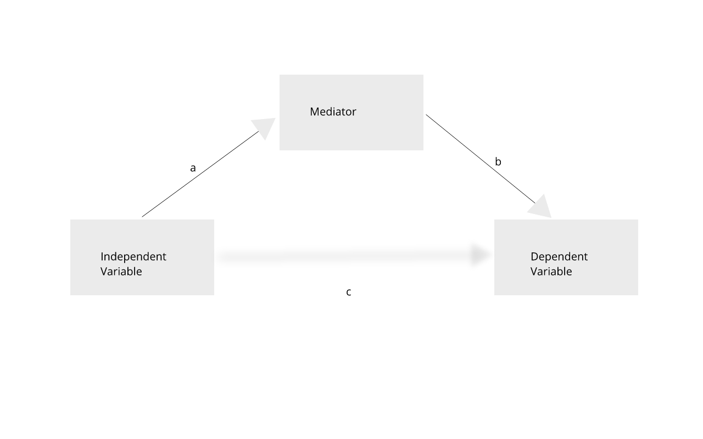
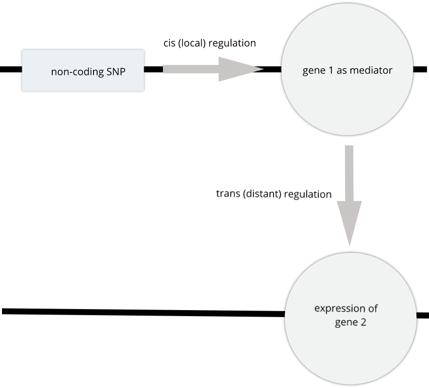
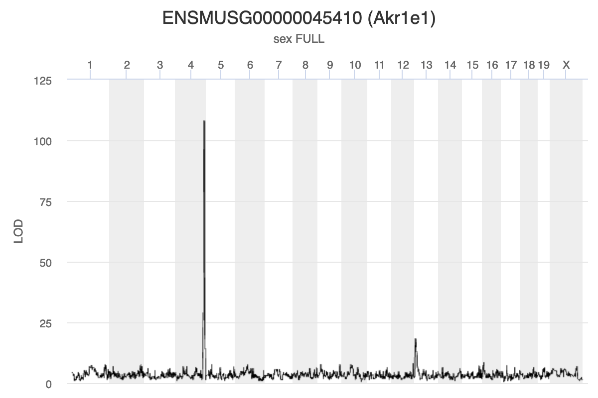
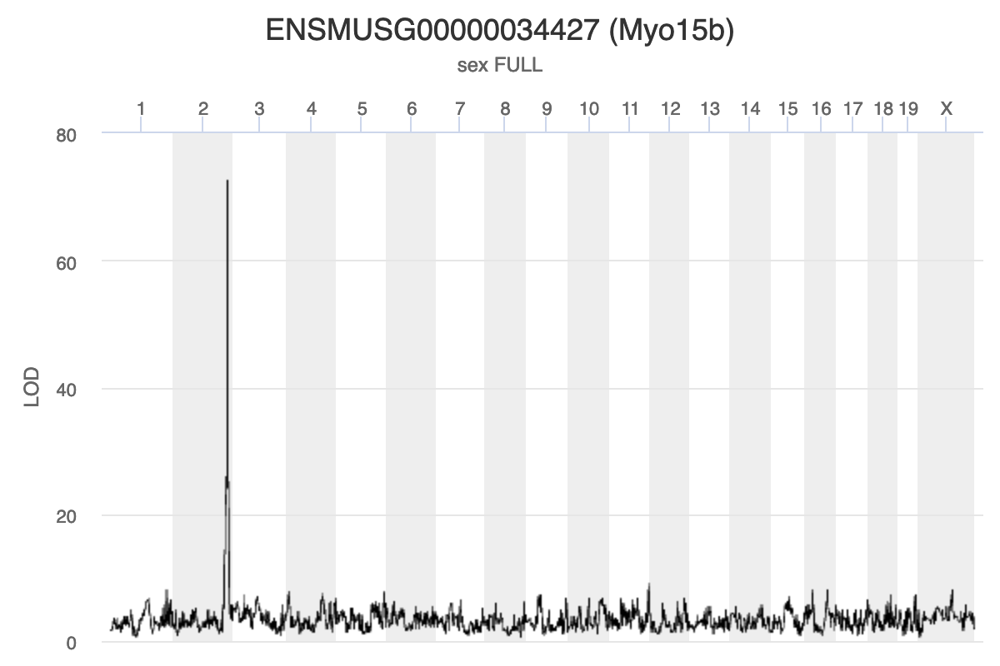
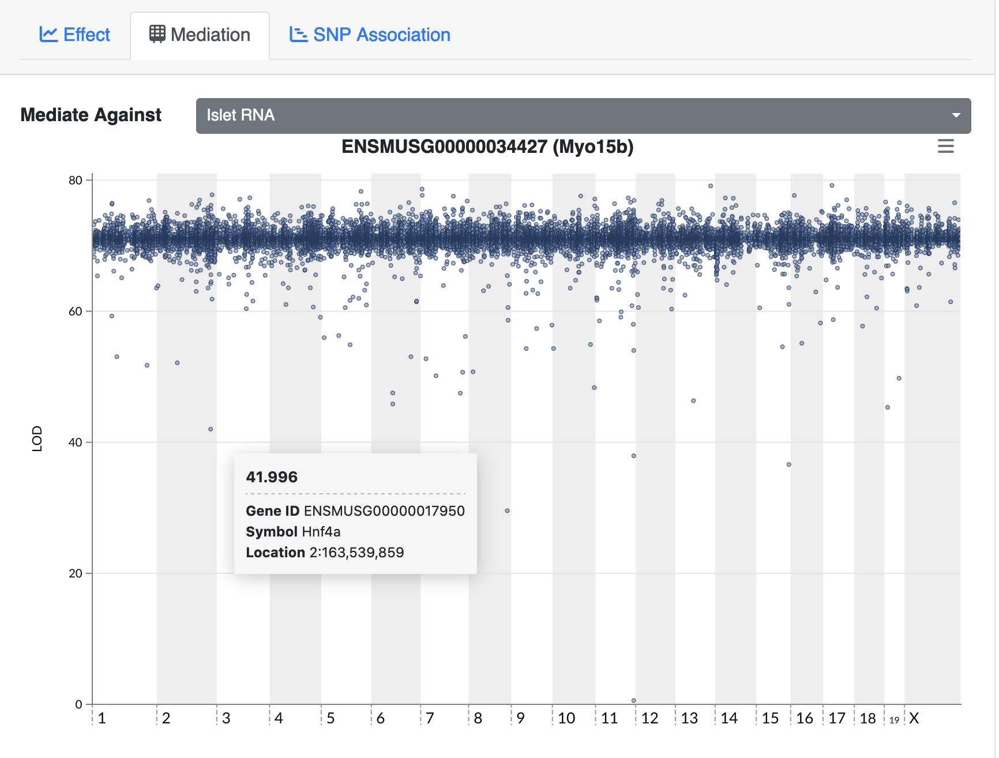

---
# Please do not edit this file directly; it is auto generated.
# Instead, please edit 11-mediation-analysis.md in _episodes_rmd/
source: Rmd
title: "Mediation Analysis"
teaching: 10
exercises: 2
questions:
- "What is mediation analysis?"
- "How is mediation analysis used in genetics and genomics?"
- "How do I explore causal relations with mediation analysis?"
objectives:
- "Describe mediation analysis as applied in genetics and genomics."
keypoints:
- "Mediation analysis investigates an intermediary between an independent variable and its effect on a dependent variable."
- "Mediation analysis is used in high-throughput genomics studies to identify molecular phenotypes, such as gene expression or methylation traits, that mediate the effect of genetic variation on disease phenotypes or other outcomes of interest." 
---

GWAS studies show that most disease-associated variants are found in non-coding
regions. This fact leads to the idea that regulation of gene expression is an
important mechanism enabling genetic variants to affect complex traits. 
Mediation analysis can identify a causal chain from genetic variants to 
molecular and clinical phenotypes. The graphic below shows complete mediation,
in which a predictor variable does not directly impact the response variable,
but does directly the mediator. The mediator has a direct impact on the 
response variable. We would observe the relationship between predictor and 
response, not knowing that a mediator intervenes in this relationship.

Mediation analysis is widely used in the social sciences 
including psychology. In biomedicine, mediation analysis has been employed to
investigate how gene expression mediates the effects of genetic variants on 
complex phenotypes and disease.

For example, a genetic variant (non-coding SNP) indirectly regulates expression 
of gene 2 through a mediator, gene 1. The SNP regulates expression of gene 1 in 
cis, and expression of gene 1 influences expression of gene 2 in trans.  

Instead of the expression of one gene impacting another, expression of gene 1 in
the graphic above could impact a physiological phenotype like blood glucose. 
Expression of gene 1 would mediate the relationship between the non-coding SNP
and the glucose phenotype.

Gene Akr1e1 is located on chromosome 13 in mouse. How would you interpret the 
LOD plot below? On which chromosome(s) would you expect to find the driver gene(s)? 
The SNP(s)?

Myo15b is located on chromosome 11. How would you interpret the following LOD
plot? On which chromosome(s) would you expect to find the driver gene(s)? The 
SNP(s)?

The [QTL Viewer for the Attie islet data](https://churchilllab.jax.org/qtlviewer/attie/islets#) integrates 
mediation into exploration of the data. Below, mediation analysis identifies
gene Hnf4a as the chromosome 2 gene that impacts Myo15b expression.

> ## Challenge: 
> Visit the Attie islet data QTL viewer:  
> https://churchilllab.jax.org/qtlviewer/attie/islets#
> 1. Select Islet RNA for the current data set.  
> 2. Type in a gene symbol to search for.  
> 3. Click on the highest peak in the LOD plot.  
> 4. Look at the Effects in the bottom right panel.  
> 5. Select the Mediation tab and click the LOD peak again.  
> 6. Hover over the dots in the mediation plot to discover genes that raise or
> lower the peak.
>
> > ## Solution
> >
> > 
> > 
> > 
> {: .solution}
{: .challenge}


