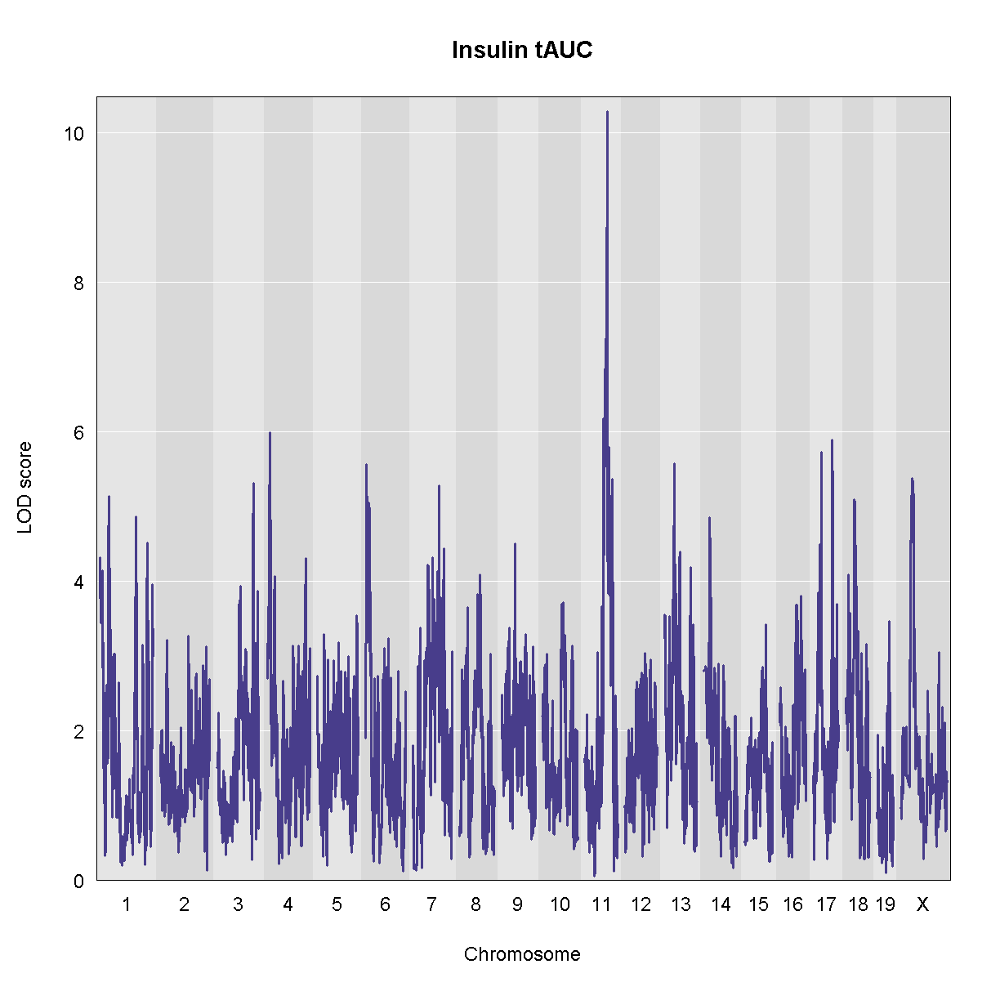
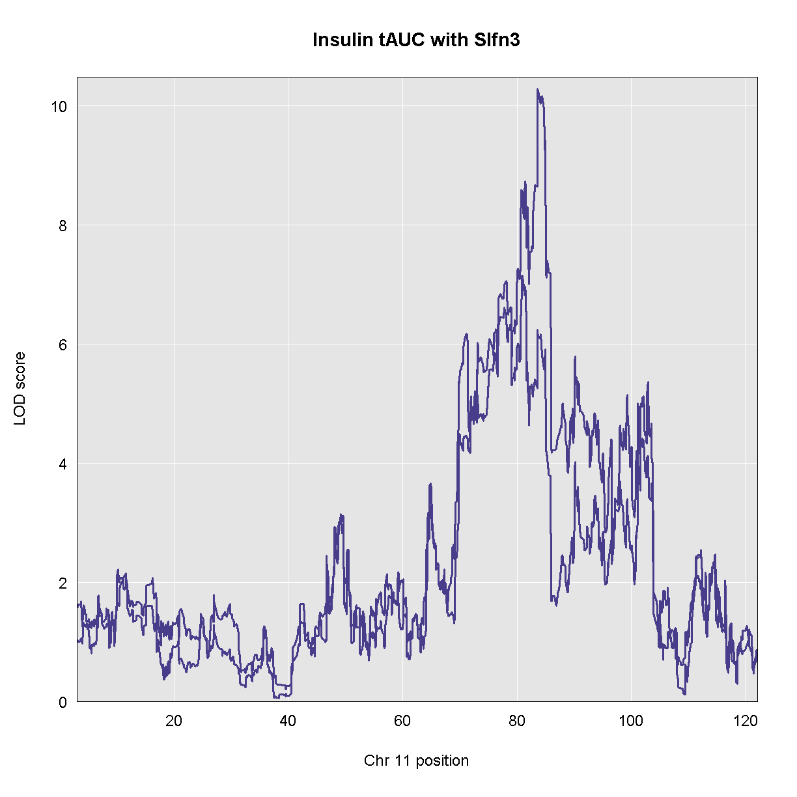

---
# Please do not edit this file directly; it is auto generated.
# Instead, please edit 11-mediation-analysis.md in _episodes_rmd/
source: Rmd
title: "Mediation Analysis"
teaching: 10
exercises: 2
questions:
- "What is mediation analysis?"
- "How is mediation analysis used in genetics and genomics?"
- "How do I explore causal relations with mediation analysis?"
objectives:
- "Describe mediation analysis as applied in genetics and genomics."
keypoints:
- "Mediation analysis investigates an intermediary between an independent variable and its effect on a dependent variable."
- "Mediation analysis is used in high-throughput genomics studies to identify molecular phenotypes, such as gene expression or methylation traits, that mediate the effect of genetic variation on disease phenotypes or other outcomes of interest." 
---

GWAS studies show that most disease-associated variants are found in non-coding
regions. This fact leads to the idea that regulation of gene expression is an
important mechanism enabling genetic variants to affect complex traits. 
Mediation analysis can identify a causal chain from genetic variants to 
molecular and clinical phenotypes. The graphic below shows complete mediation,
in which a predictor variable does not directly impact the response variable,
but does directly the mediator. The mediator has a direct impact on the 
response variable. We would observe the relationship between predictor and 
response, not knowing that a mediator intervenes in this relationship.

Mediation analysis is widely used in the social sciences 
including psychology. In biomedicine, mediation analysis has been employed to
investigate how gene expression mediates the effects of genetic variants on 
complex phenotypes and disease.

For example, a genetic variant (non-coding SNP) indirectly regulates expression 
of gene 2 through a mediator, gene 1. The SNP regulates expression of gene 1 in 
cis, and expression of gene 1 influences expression of gene 2 in trans.  

Instead of the expression of one gene impacting another, expression of gene 1 in
the graphic above could impact a physiological phenotype like blood glucose. 
Expression of gene 1 would mediate the relationship between the non-coding SNP
and the glucose phenotype.

Gene Akr1e1 is located on chromosome 13 in mouse. How would you interpret the 
LOD plot below? On which chromosome(s) would you expect to find the driver gene(s)? 
The SNP(s)?

Myo15b is located on chromosome 11. How would you interpret the following LOD
plot? On which chromosome(s) would you expect to find the driver gene(s)? The 
SNP(s)?

The [QTL Viewer for the Attie islet data](https://churchilllab.jax.org/qtlviewer/attie/islets#) integrates 
mediation into exploration of the data. Below, mediation analysis identifies
gene Hnf4a as the chromosome 2 gene that impacts Myo15b expression.

### Load Libraries  

~~~
library(knitr)
library(tidyverse)
library(qtl2)
library(intermediate)
~~~
{: .language-r}

## Load Functions

~~~
rankZ = function(x) {
  x = rank(x, na.last = "keep", ties.method = "average") / (sum(!is.na(x)) + 1)
  return(qnorm(x))
}
~~~
{: .language-r}

## Load Data

~~~
# expression data
load("../data/attie_DO500_expr.datasets.RData")

# data from paper
load("../data/dataset.islet.rnaseq.RData")

# phenotypes
load("../data/attie_DO500_clinical.phenotypes.RData")

# mapping data
load("../data/attie_DO500_mapping.data.RData")

# genotype probabilities
probs = readRDS("../data/attie_DO500_genoprobs_v5.rds")
~~~
{: .language-r}

> Example from package. This will be removed, but I needed it for now.

~~~
  # DOQTL liver protein expresion dataset
  data(Tmem68)
  
  # Let us mediate Tmem68 to other proteins
  trgt = matrix(Tmem68$target, ncol = 1, dimnames = list(names(Tmem68$target), 'Tmem68'))
  annot = Tmem68$annotation
  colnames(annot)[5] = 'MIDDLE_POINT'
  med <- mediation.scan(target     = trgt,
                        mediator   = Tmem68$mediator,
                        annotation = annot,
                        covar      = Tmem68$covar,
                        qtl.geno   = Tmem68$qtl.geno)
~~~
{: .language-r}

~~~
Scanning with 192 samples.
~~~
{: .output}

~~~
[1] 1000
[1] 2000
[1] 3000
[1] 4000
[1] 5000
[1] 6000
[1] 7000
[1] 8000
~~~
{: .output}

~~~
  # Interactive plot
  kplot(med)
~~~
{: .language-r}

## Searching for Candidate Genes

### Mapping the Phenotype

We will map the "Insulin tAUC" trait becuase it has a QTL on chromosome 11. First, we will rankZ transform the phenotypes because this helps to satisfy the model assumptions. We will map using sex, generation, and the number of days on the diet as additive covariates.

~~~
# NOTE: QTL is not nearly as large with untransformed phenotype.
pheno_rz = pheno_clin %>% 
             select(num_islets:weight_10wk) %>% 
             as.matrix()
pheno_rz = apply(pheno_rz, 2, rankZ)

covar$DOwave = factor(covar$DOwave)
addcovar = model.matrix(~sex + DOwave + diet_days, data = covar)[,-1]
ins_qtl = scan1(genoprobs = probs, 
                pheno     = pheno_rz[,'Ins_tAUC', drop = FALSE], 
                kinship   = K, 
                addcovar  = addcovar)
plot_scan1(ins_qtl, map, main = 'Insulin tAUC')
~~~
{: .language-r}

There is a large peak on chromosome 11. Let's look at the LOD score and the location. 

~~~
peaks = find_peaks(ins_qtl, map, threshold = 10, prob = 0.95)
peaks
~~~
{: .language-r}

~~~
  lodindex lodcolumn chr      pos      lod   ci_lo    ci_hi
1        1  Ins_tAUC  11 83.59467 10.27665 83.5791 84.95444
~~~
{: .output}

Let's also estimate the founder allele effects for insulin tAUC.

> TBD: This is slow. Precalculate and just show the plot?

~~~
chr = '11'
feff = scan1blup(genoprobs = probs[,chr], 
                 pheno     = pheno_rz[,'Ins_tAUC', drop = FALSE], 
                 kinship   = K[[chr]], 
                 addcovar  = addcovar)
plot_coefCC(feff, map, scan1_output = qtl, legend = 'bottomleft')
~~~
{: .language-r}

~~~
Error in plot_coef(x, map, columns = columns, col = col, scan1_output = scan1_output, : object 'qtl' not found
~~~
{: .error}

Looking at the founder allele effects above, we can see that A/J, BL6, 129, and NOD alleles contribute to higher insulin tAUC values. Ideally, we are looking for a gene with a pattern of allele effects that matches this pattern, or it's inverse.

> TBD: Plot founder allele effects for two genes, one with a similar pattern, one without.

## Searching for cis-eQTL under a physiological QTL

When we have a physiological QTL, we often start by looking for genes which contain missense, splice, or stop codon SNPs. This is a reasonable first approach to selecting candidate genes and may pay off. However, many QTL fall in intergenic regions, which suggests that the causal variant(s) may be in regulatory regions. These regulatory regions are not as well annotated as coding regions and it may be difficult to identify them from sequence alone. However, if you have gene expression data in a relevant tissue, you can look for genes in the QTL interval which have a cis-eQTL. If the pattern of founder allele effects for a candidate gene is similar to the allele effects of the physiological QTL, then this gene is a good candidate.

> TBD: Need a figure with physiological QTL effect & cis-eQTL effects.

We have a QTL for insulin tAUC that extends from 83.579099 Mb to 
84.95444 Mb. This support interval means that we expect the causal variant to be within this interval 95% of the time. We would like to select a set of candidate genes located near this QTL.  If the causal variant is a coding SNP, then the gene will be located within this interval. However, if the causal variant is a regulatory SNP, then the gene that it regulates may be up to 2 Mb away from the variant. This means that we should be searching for genes within 2 Mb of the edges of the support interval. 

> TBD: Is there a REF for the +/- 2 Mb distance?

First, we need to get the support interval and add 2 MB to each side.

~~~
ci = c(peaks$ci_lo - 2, peaks$ci_hi + 2)
~~~
{: .language-r}

Next, we filter the eQTL results to retain genes in this interval.

~~~
cis_eqtl = dataset.islet.rnaseq$lod.peaks %>% 
             filter(chrom == '11'  & 
                      pos >= ci[1] & 
                      pos <= ci[2])
~~~
{: .language-r}

There are 133 genes with cis-eQTL in this interval. That is a lot of genes! We could estimate the founder allele effects for each of the genes and stare at them pensively. Or we could add each gene to the QTL mapping model and see if the LOD score changes.

### Mapping the Phenotype with a Gene as as Covariate

In QTL mediation analysis, we are hypothesizing that there is a genomic variant which affects the expression of a gene, which in turn affects the physiological phenotype. 

> TBD: Add mediation figure here again?

There is a gene called *Slfn3* under the Insulin tAUC peak. Our hypothesis is that this gene may influence Insulin AUC becuase it has a cis-eQTL in the same location. In order to test this hypothesis, we will add the expression of this gene to the model as an additive covariate. If *Slfn3* explains some of the variance in Insulin tAUC, then the LOD should decrease. If it does not, then the LOD will not change much.

~~~
covar_gene = cbind(norm[rownames(addcovar), 'ENSMUSG00000018986'], addcovar)
slfn3_qtl = scan1(genoprobs = probs, 
                  pheno     = pheno_rz[,'Ins_tAUC', drop = FALSE], 
                  kinship   = K, 
                  addcovar  = covar_gene)

plot_scan1(ins_qtl,   map, chr = chr, main = 'Insulin tAUC with Slfn3')
plot_scan1(slfn3_qtl, map, chr = chr, color = 'blue', add = TRUE)
~~~
{: .language-r}

~~~
Warning in plot.xy(xy.coords(x, y), type = type, ...): "color" is not a
graphical parameter
~~~
{: .warning}

As you can see, the LOD decreased when we added the expression of *Slfn3* into the model. Let's see what the new LOD is on chromosome 11.

~~~
find_peaks(qtl, map, threshold = 6.5)
~~~
{: .language-r}

~~~
Error in align_scan1_map(scan1_output, map): object 'qtl' not found
~~~
{: .error}

The LOd decreased from 10.3 to 7.2. 

> DMG: STOPPED HERE

## Searching for Causal Genes

In mediation analysis, we don't know the causal gene in advance. We must fit a model like the one above for each gene that was measured. But this would involve mapping the trait across the entire genome for each gene. We don't need to do this to identify causal genes under the phenotype QTL. We only need to fit a model using each gene at the position of the phenotype QTL.

Mediation analysis requires five pieces of data and metadata:

1. Target: the phenotype that has a QTL for which we are seeking causal gene candidates.
2. Mediator: gene expression for genes that will be used in the mediation analysis.
3. Annotation: gene annotation data for the mediator genes.
4. Covar: a set of covariates to use in the model.
5. QTL.Geno: the genotype probabilities at the Target maximum QTL.

> ## Challenge: 
> Visit the Attie islet data QTL viewer:  
> https://churchilllab.jax.org/qtlviewer/attie/islets#
> 1. Select Islet RNA for the current data set.  
> 2. Type in a gene symbol to search for.  
> 3. Click on the highest peak in the LOD plot.  
> 4. Look at the Effects in the bottom right panel.  
> 5. Select the Mediation tab and click the LOD peak again.  
> 6. Hover over the dots in the mediation plot to discover genes that raise or
> lower the peak.
>
> > ## Solution
> >
> > 
> > 
> > 
> {: .solution}
{: .challenge}


